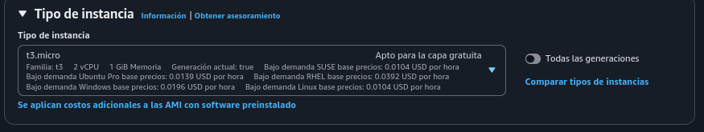
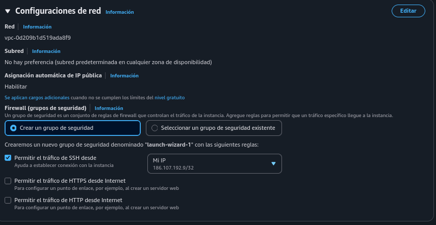
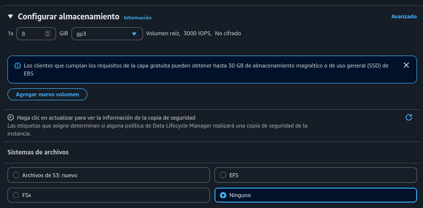
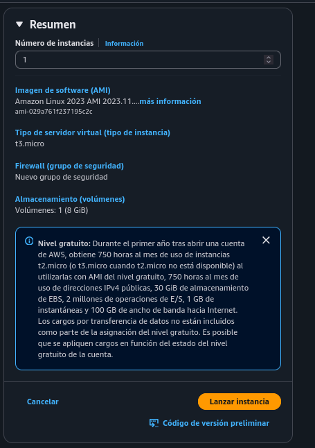
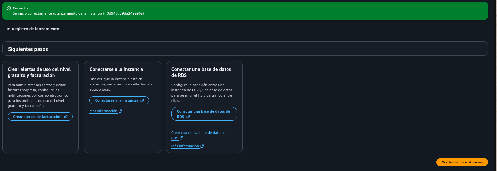
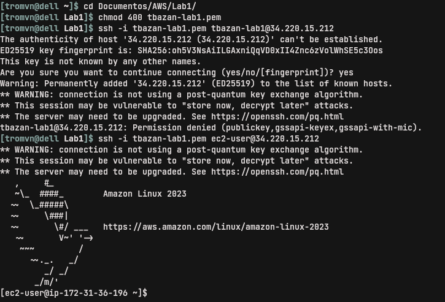
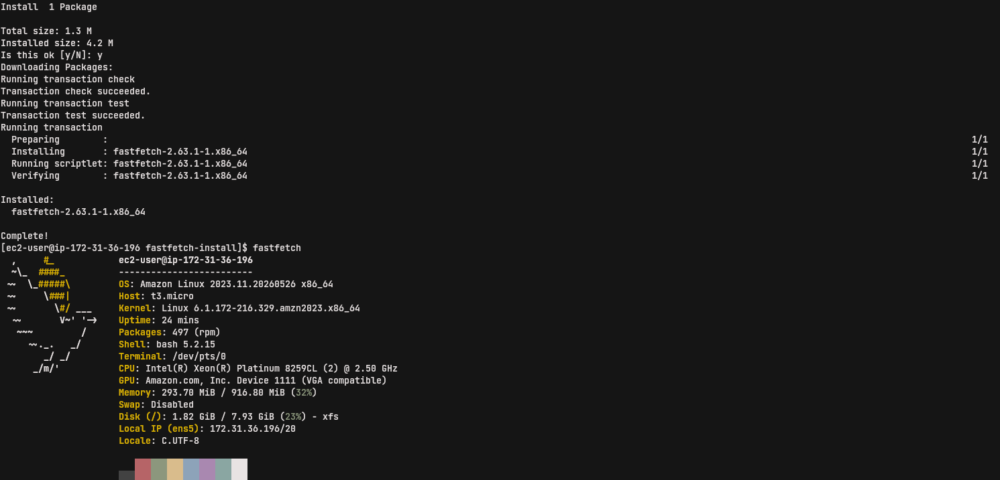

# Entorno de pruebas

## 1. Lanzar una instancia  


 
 
## 2. Elección de AMI

.png)

## 3. Tipo de instancia.png



## 4. Autenticación


Posteriormente, con la instancia ya lanzada, tomé en cuenta las sugerencias de la guía de Laboratorio para usuarios de mac y Linux, que cito a continuación:
 
 
### Acceso mediante SSH a cualquier instancia EC2 que lance

***Sugerencia**: Cuando lance instancias EC2 en el entorno de pruebas, cree una clave de SSH (archivo .pem) en el momento del lanzamiento y descárguela. A continuación, utilice esa clave para conectarse. En los siguientes pasos, se describe cómo utilizar la clave de SSH para conectarse a la instancia.


#### Usuarios de macOS y Linux

Estas instrucciones son específicas para usuarios de Mac/Linux.
​

    Abra una ventana de terminal y cambie el directorio cd al directorio que contiene el archivo *.pem de su instancia de Amazon EC2.

Por ejemplo, si su archivo *.pem se guardó en su directorio de Downloads (Descargas), ejecute este comando:

cd ~/Downloads

    Ejecute este comando para cambiar los permisos de la clave a fin de que sean de solo lectura:

Por ejemplo, si su archivo *.pem era labuser.pem

chmod 400 labsuser.pem

    Ejecute el siguiente comando (reemplace <public-ip> con la dirección de su instancia de Amazon EC2).
       De manera alternativa, regrese a la consola de EC2 y seleccione Instances (Instancias). Marque la casilla junto a la instancia a la que desea conectarse y en la pestaña Description (Descripción) copie el valor de IPv4 Public IP (Dirección IP pública IPv4).

Nota: Algunas versiones de Linux pueden utilizar un usuario diferente para iniciar sesión.

ssh -i labsuser.pem ec2-user@<public-ip>

    Escriba yes cuando se le pregunte si permite la primera conexión a este servidor SSH remoto.
       Como utiliza un par de claves para la autenticación, no se le pedirá una contraseña.
       Como utiliza un par de claves para la autenticación, no se le pedirá una contraseña.

 

## 5. Configuración de red




## 6. Configurar almacenamiento

No había mucho que hacer aquí.




## 7. Resumen y lanzar la instancia

Éste es el resumen de la configuración general de la instancia que será lanzada. Al "lanzar instancia" arrancamos la máquina virtual.




## 8. Aviso de lanzamiento correcto

Si todo sale bien:  




## Practicar y Explorar

"El entorno del laboratorio ya se encuentra listo para que lo explore. Una vez que haya terminado, proceda a la sección de finalizar laboratorio."

### 1. Entrando por SSH

En mi máquina local, entré al directorio donde guardé mi archivo .pem:

```
$ cd ruta/al/archivo.pem
```


le di permisos de lectura a mi usuario:

```
$ chmod 400 archivo.pem
```

y probé a entrar con esta sintaxis: 

```
$ ssh -i archivo.pem [nombre-de-instancia]@ip.de.instancia
```

Pero salió error y, luego de leer mejor la guía, noté que no debía conectar al [nombre-de-instancia], sino a un user genérico que crea la misma instancia [ec2-user]. Entonces:   
  
  
```
$ ssh -i archivo.pem ec2-user@ip.de.instancia
```

Y entramos!




### 2. Probando instalar fastfetch

Entendiendo qué gestor de paquetes usa Amazon Linux, busqué fastfetch en sus repositorios y no estaba, por lo que descargué el paquete directo desde su repo en github con wget e instalé con:   
  
  
```
sudo dnf localinstall fastfetch-linux-amd64.rpm
```


#### 2.1. Muestra de fastfetch  




## Conclusiones  
  
  A primera vista, la consola es abrumadora. Requiere lectura lenta y atenta para ir digiriendo. Con las guías y previas demostraciones, no fue tan abrumador, de todos modos. Con este primer acercamiento, intuyo que la estructura o comportamiento de los otros servicios tendrá una que otra similitud. En fin, puedo decir que fue una buena primera experiencia.
