# Introducción a la imagen de máquina de Amazon (AMI) de Amazon Linux

Este laboratorio está diseñado para reforzar su conocimiento sobre la funcionalidad básica de la interfaz de línea de comandos y brindar una base sólida a partir de la cual puede continuar aprendiendo sobre nuevos comandos y capacidades dentro del intérprete de comandos de Linux.

## Situación

En este laboratorio, se utiliza Secure Shell (SSH) para acceder a la imagen de máquina de Amazon (AMI) de Amazon Linux dentro de los laboratorios de Vocareum. A continuación, usará el comando man para acceder a las páginas de manual.
Objetivos

Después de completar este laboratorio, podrá hacer lo siguiente:

1. Usar SSH para acceder a una AMI de Amazon Linux dentro de los laboratorios de Vocareum.

2. Entender el propósito del comando man.

3. Demostrar las características de búsqueda de las páginas de man.

4. Examinar los encabezados de las páginas de man.

___ 

### Tarea 1: conectarse a una instancia de EC2 de Amazon Linux mediante SSH.

Obtener credenciales. Copio la IP y, como estoy en Linux, descargo el archivo .pem.

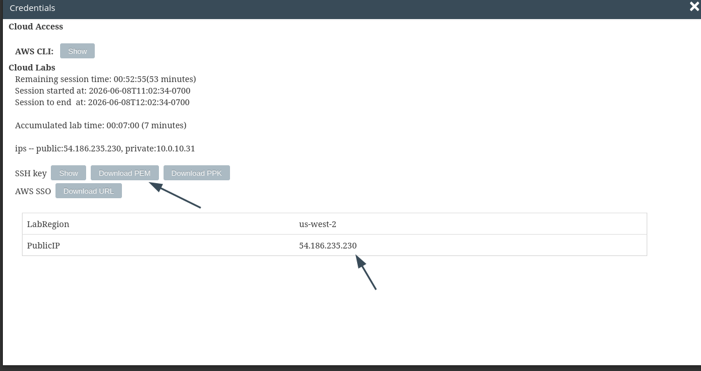

**nota: por defecto el nombre del archivo es labsuser.pem y yo lo cambio a lab-[n°-de-lab].pem para guardarlo en su respectiva carpeta**

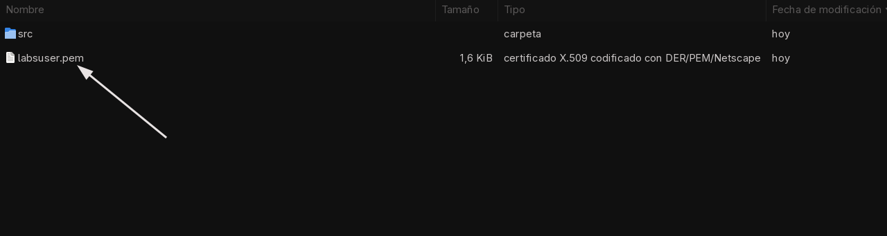

Aquí detallo la conexión por SSH:

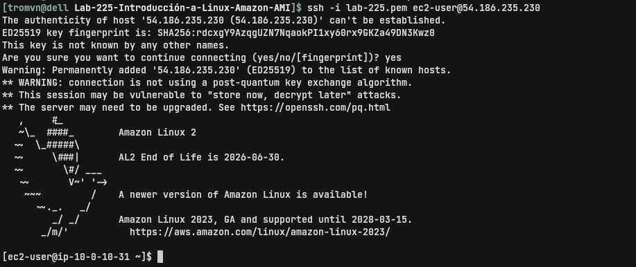

### Tarea 2: explorar las páginas de man de Linux

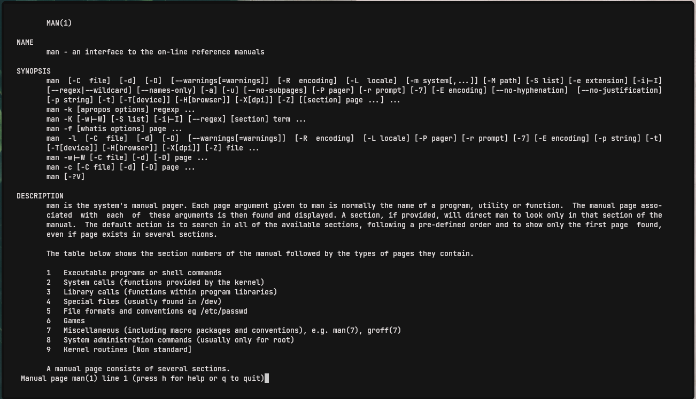

Tuve problemas para navegar, quizás por la terminal que usé, así que seguí explorando desde mi máquina local. 

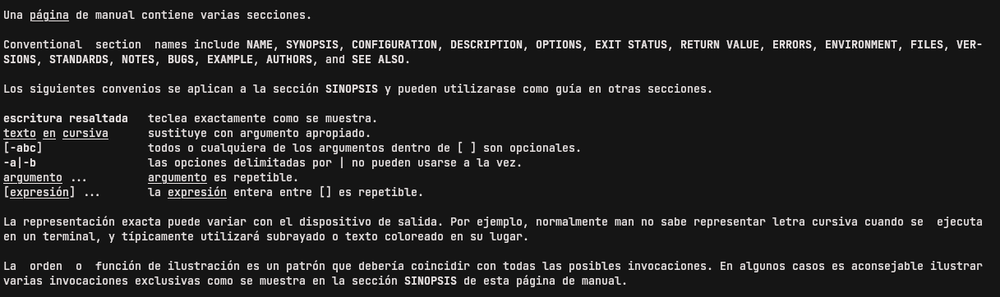

___

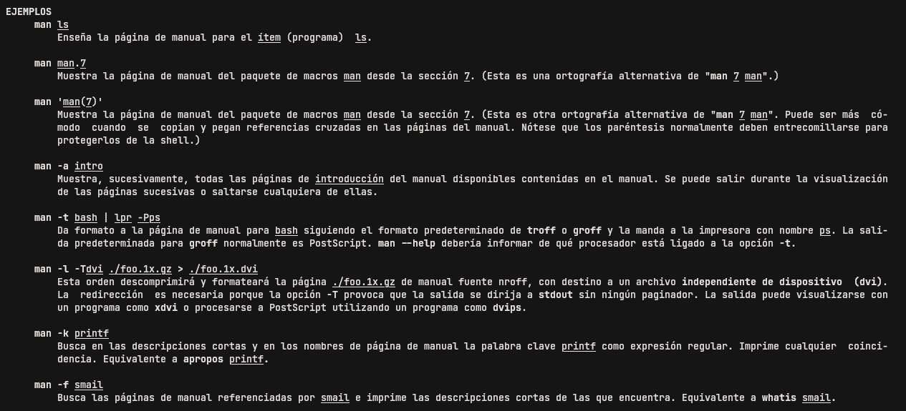 

___

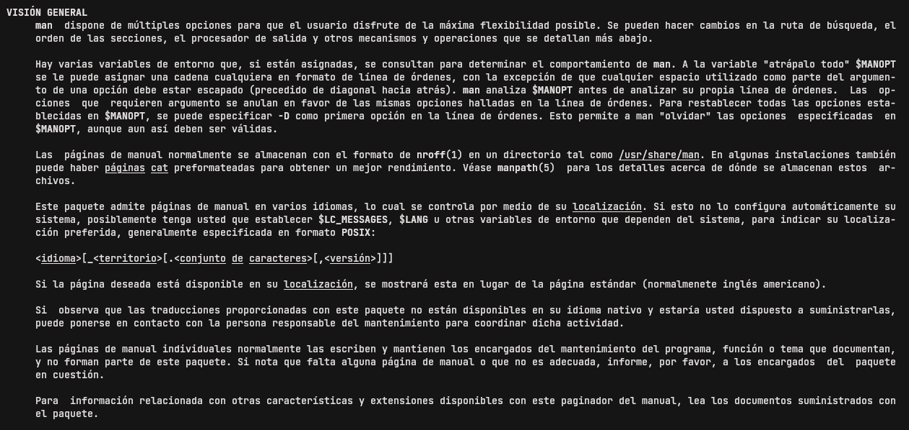

___

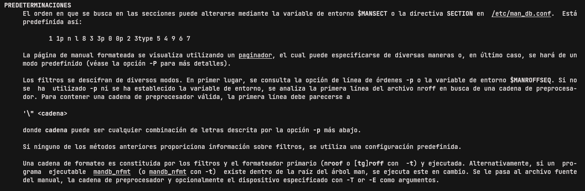

___

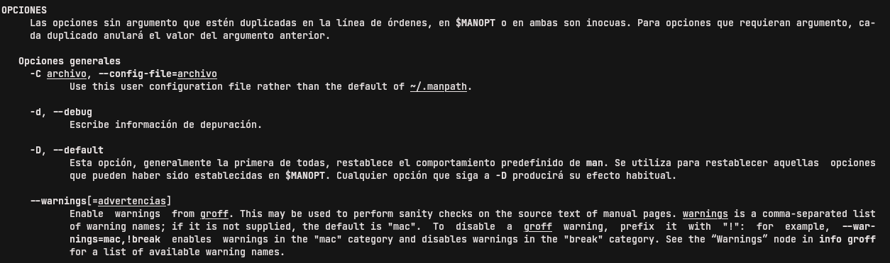

___

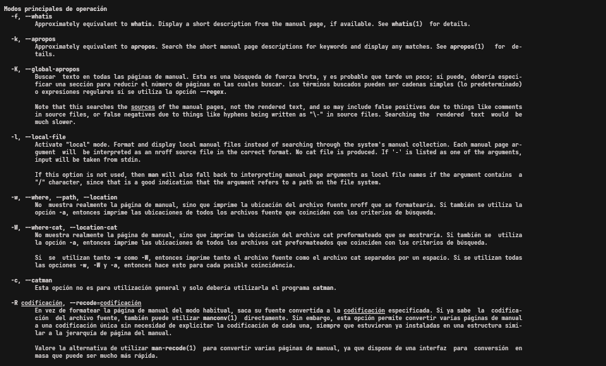

___

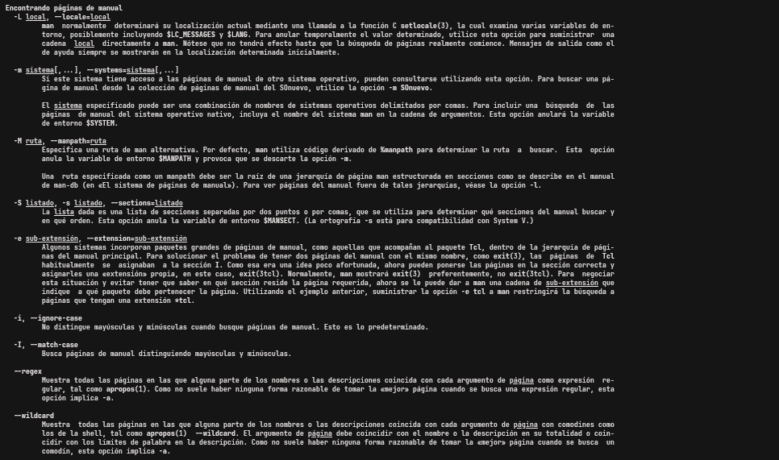

___

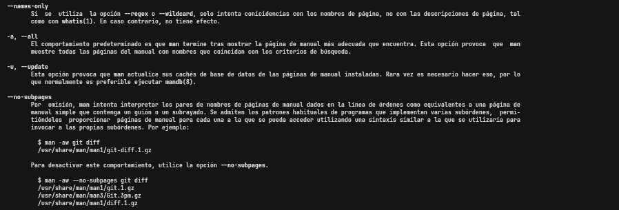

___

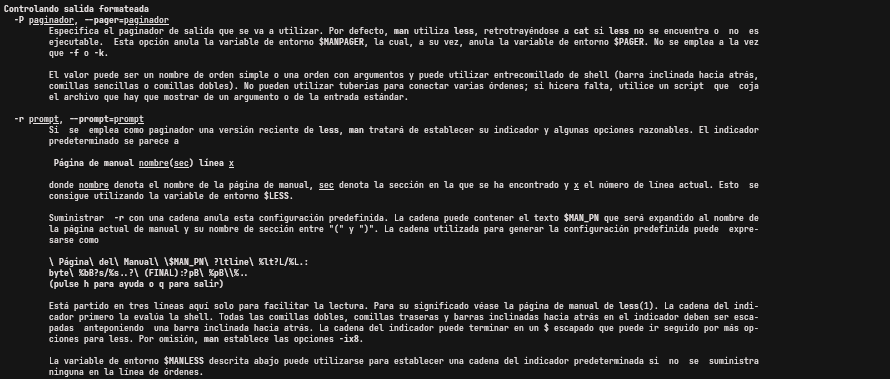

___

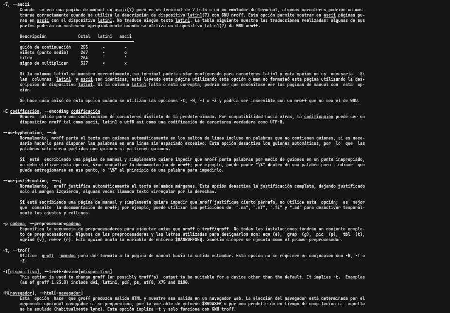

___

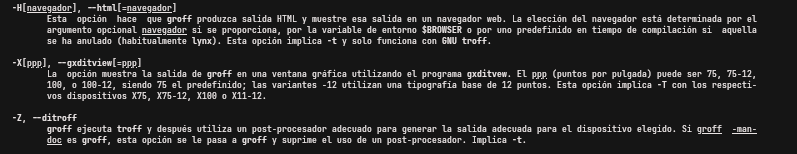

___

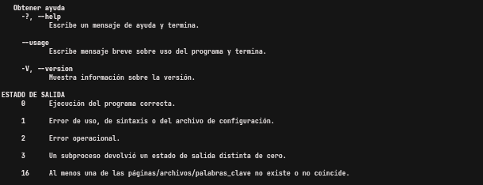

___

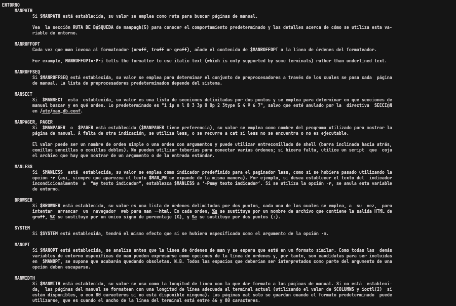

___

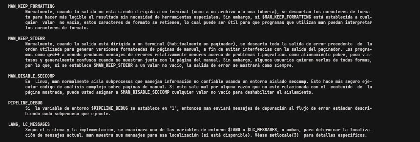

___

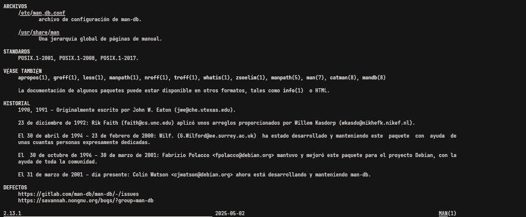
