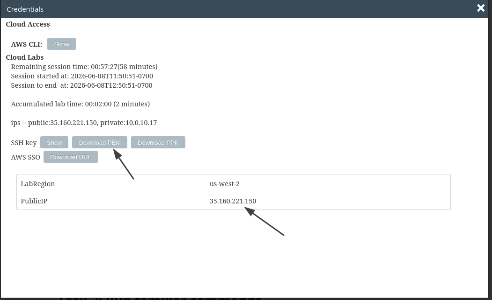
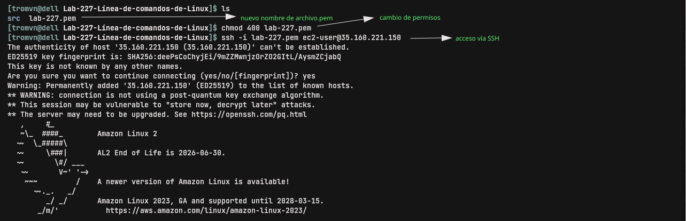
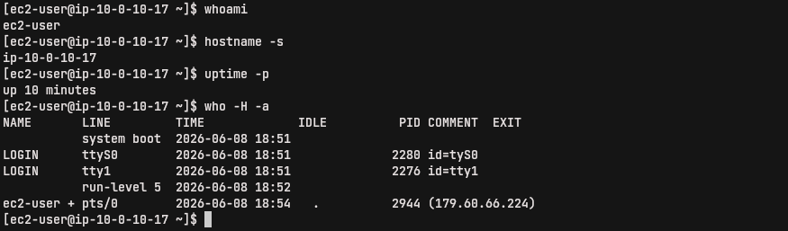
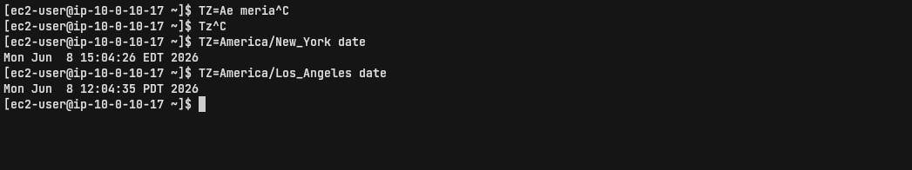
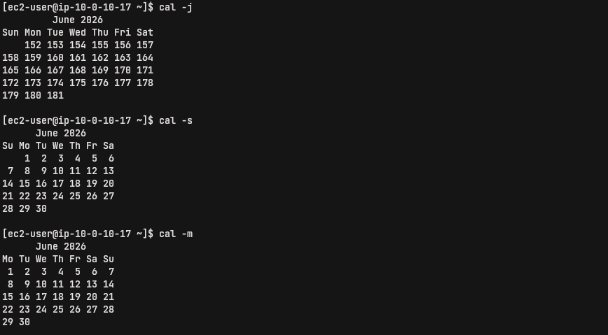
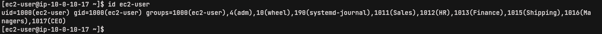
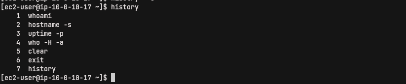
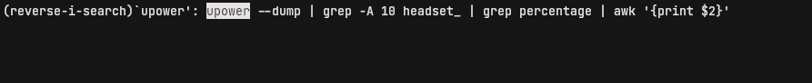
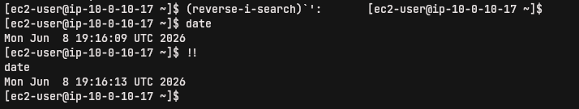

# Línea de comandos de Linux

## Objetivos

En este laboratorio, hará lo siguiente:

1. Ejecutar comandos para aprender sobre su sistema y sesión actual.
2. Buscar y ejecutar comandos bash anteriores

### Tarea 1: conectarse a una instancia de EC2 de Amazon Linux mediante SSH.

Obtener credenciales. Copio la IP y, como estoy en Linux, descargo el archivo .pem.

**nota: por defecto el nombre del archivo es labsuser.pem y yo lo cambio a lab-[n°-de-lab].pem para guardarlo en su respectiva carpeta**

Aquí detallo la conexión por SSH:

### Tarea 2: ejecutar comandos familiares

En este ejercicio, ejecutará algunos comandos para aprender, a grandes rasgos, sobre el sistema y la sesión que utiliza.

Nuevamente tuve problemas con la terminal, así que avancé con algunas dificultades en la escritura de comandos. Pero pude entender los conceptos

### Tarea 3: mejorar el flujo de trabajo mediante el historial y la búsqueda

Aquí se muestran algunos comandos, porque salí y entré a la instancia varias veces
  

Tuve que probar reverse en local

