# Administración de usuarios y grupos

## Objetivos

En este laboratorio, hará lo siguiente:

1. Crear usuarios nuevos con una contraseña predeterminada.
2. Crear grupos y asignar los usuarios correspondientes.
3. Iniciar sesión con diferentes usuarios.

### Tarea 1: conectarse a una instancia de EC2 de Amazon Linux mediante SSH.

Obtener credenciales. Copio la IP y, como estoy en Linux, descargo el archivo .pem.

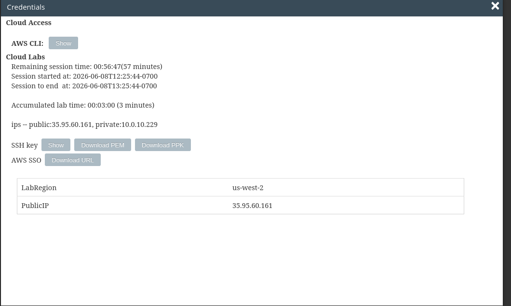

**nota: por defecto el nombre del archivo es labsuser.pem y yo lo cambio a lab-[n°-de-lab].pem para guardarlo en su respectiva carpeta**

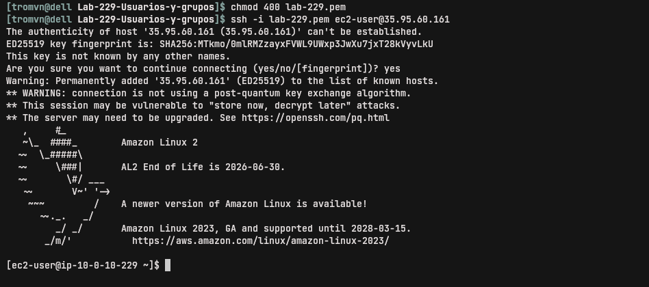

Aquí detallo la conexión por SSH:


### Tarea 2: crear usuarios

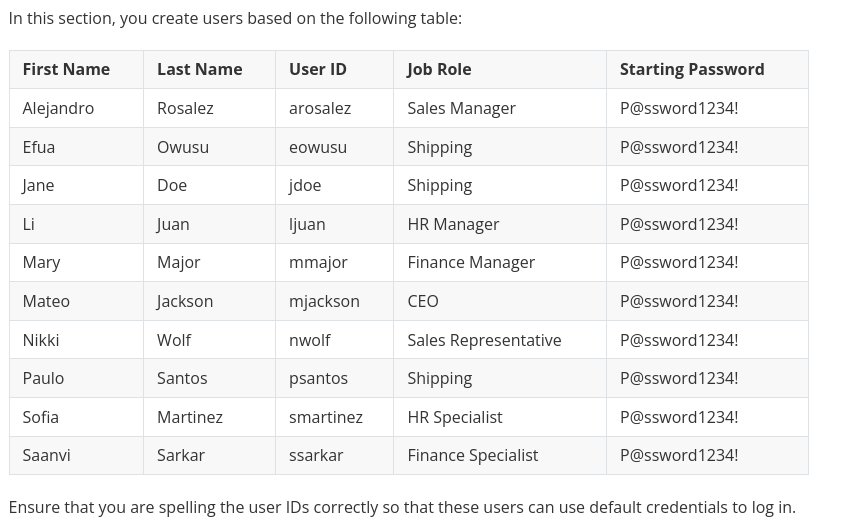
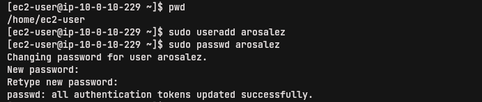

Después me di cuenta que podría haber hecho alias más cortos.
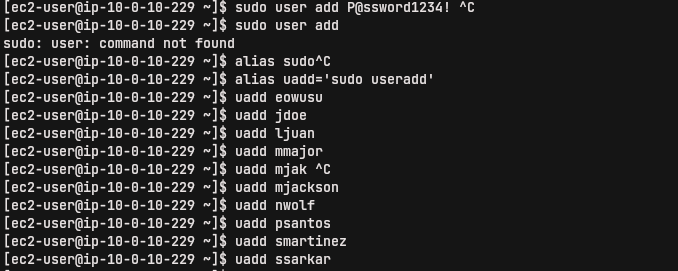

Lo mismo aquí

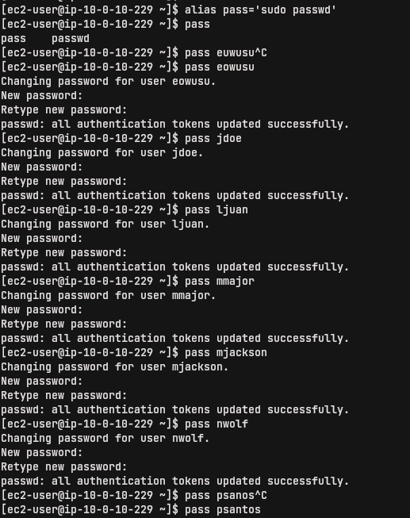

crear un alias. 

```
$ alias u='sudo useradd'  
$ alias p='sudo passwd'
```

Luego, simplemente creaba todos los usuarios con: `$ u [username]`

Y después sus claves: `$ p [username`, pegando con ctrl+shift+v la sugerida en la guía, previamente copiada con ctrl+shift+c
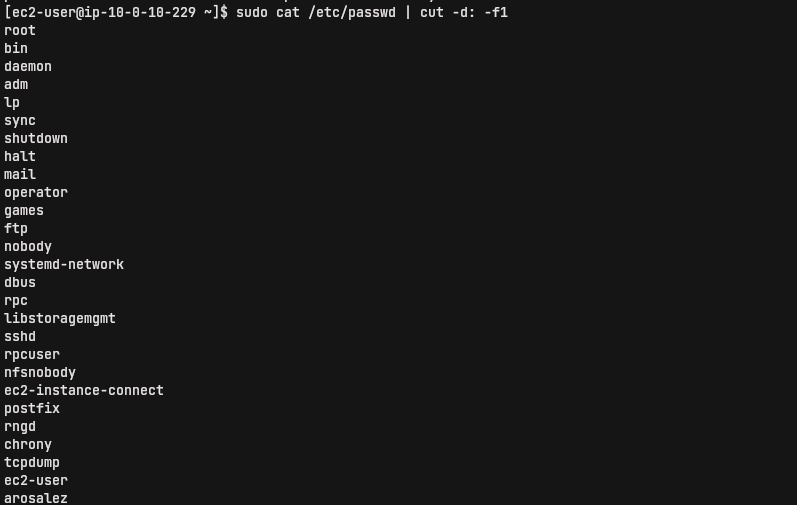

### Tarea 3: crear grupos

En esta sección, creará grupos de usuarios y agregará usuarios a los grupos.

    Sales (Ventas)
    
    HR (RR. HH.)
    
    Finance (Finanzas)
    
    Personnel (Personal)
    
    CEO (Director ejecutivo)
    
    Shipping (Envíos)
    
    Managers (Gerentes)

1. Crear Sales


2. En lugar de cat, prefería usar tail, para tener mejor visual de la terminal

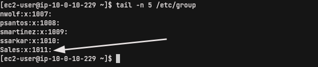

3. Agregando el resto de grupos


4. Comprobando grupos

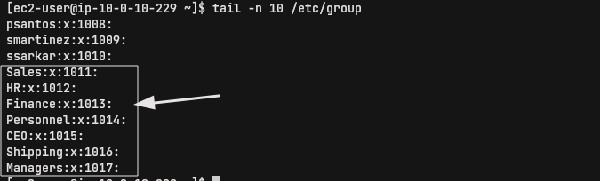

5. Agregar usuario a un grupo

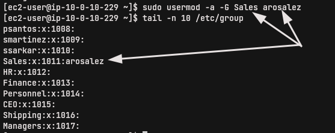

6. Agregando y comprobando

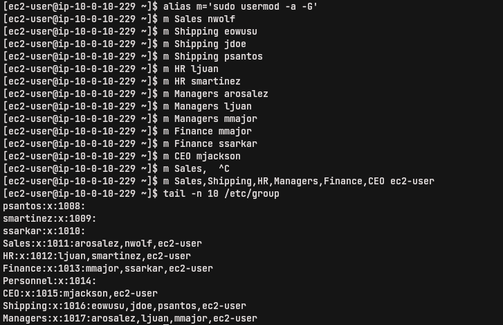

### Tarea 4: Iniciar sesión con los nuevos usuarios

1. Cambiando de usuario y permisos denegados

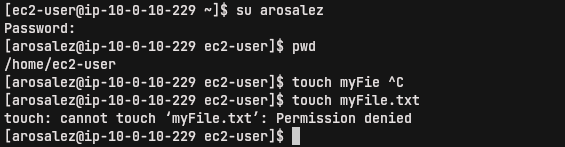

2. Comprobando que este usuario no está registrado en sudoers, es decir, no tiene permiso para elevar o escalar privilegios

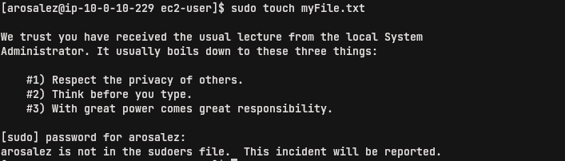

3. Mirar el log que reporta sudo

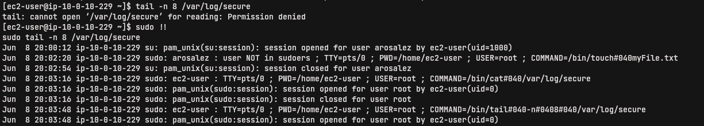

#### Impresiones

Me gustó mucho este lab, ya que mi experiencia de usuario en Linux es de uso individual y doméstico, por lo que nunca tuve la necesidad de administrar usuarios y grupos. Fue muy entretenido.
