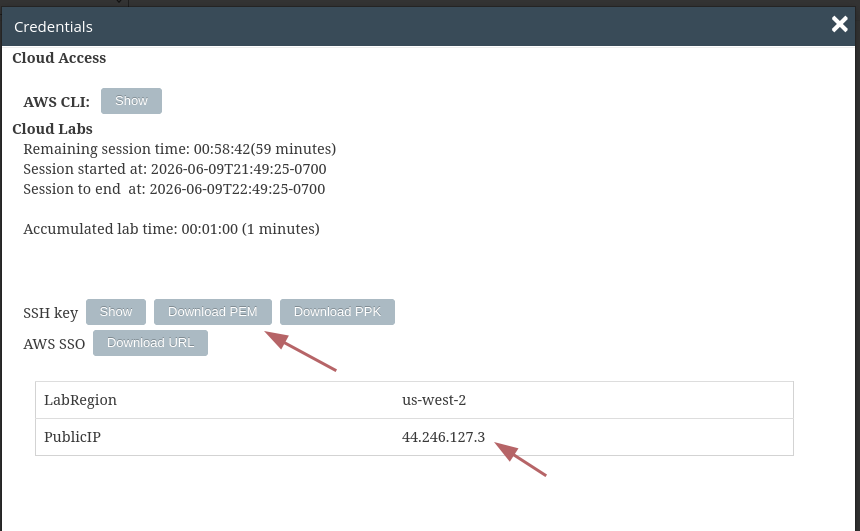
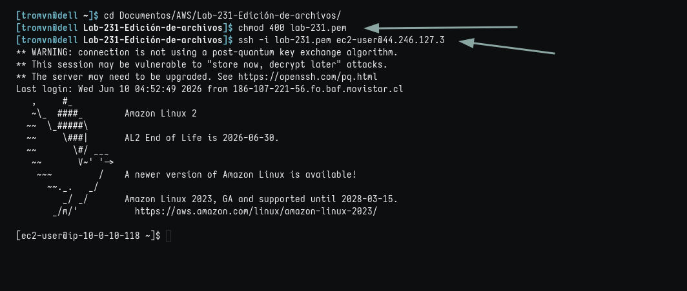
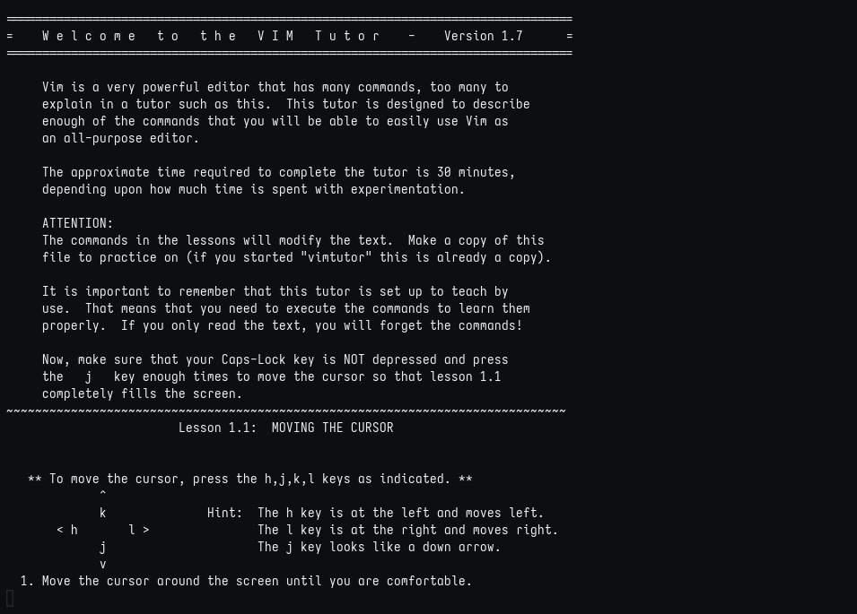
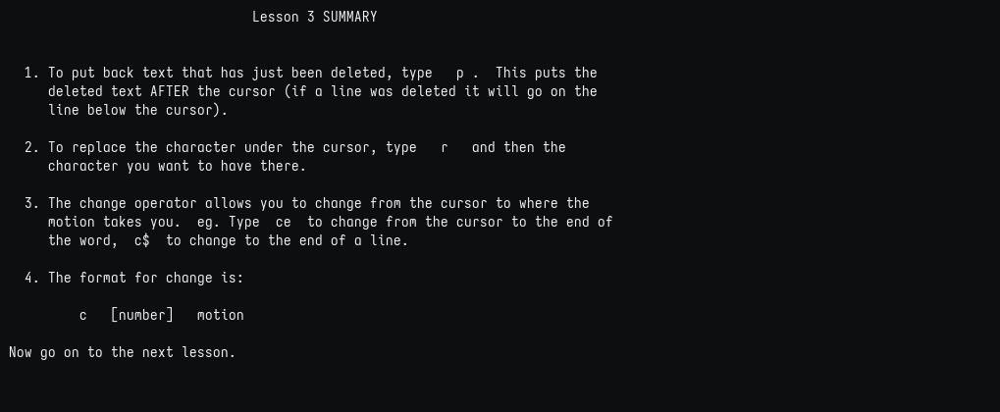
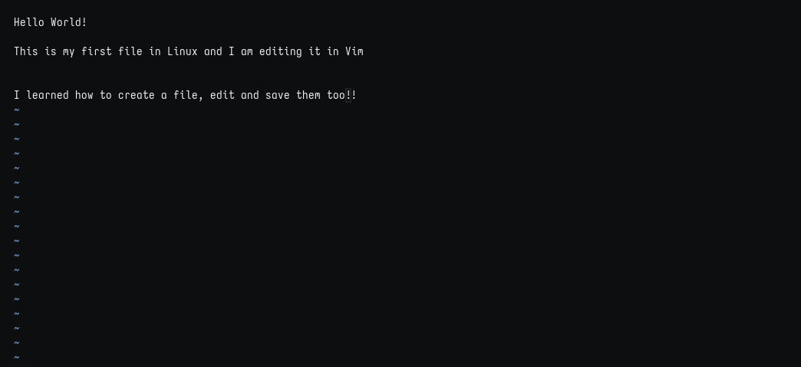
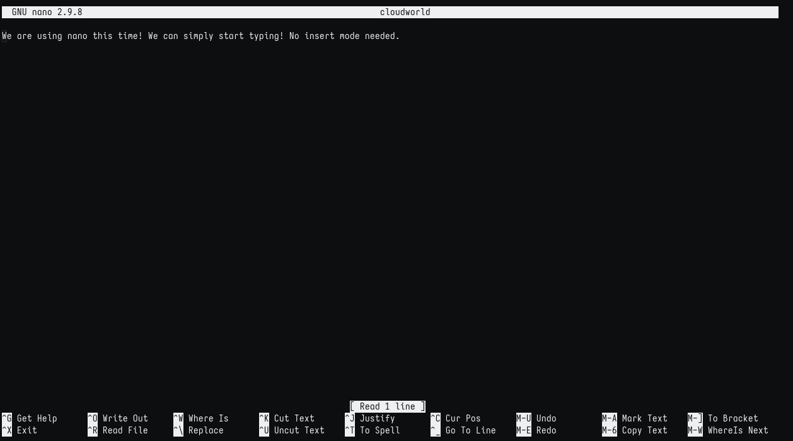

# Edición de archivos

## Objetivos

Después de completar este laboratorio, podrá hacer lo siguiente:

1. Utilizar el archivo ejecutable vimtutor para llevar a cabo las tareas 1 a 4.
2. Copiar el contenido del archivo /var/log/secure y editar con nano.

### Tarea 1: conectarse a una instancia de EC2 de Amazon Linux mediante SSH.

1. Obtener credenciales. Copio la IP y, como estoy en Linux, descargo el archivo .pem.



**nota: por defecto el nombre del archivo es labsuser.pem y yo lo cambio a lab-[n°-de-lab].pem para guardarlo en su respectiva carpeta**


2. Aquí detallo la conexión por SSH:



### Tarea 2: ejercicio ejecutar el tutorial de Vim

```
En este ejercicio, deberá ejecutar el ./vimtutor y seguir las instrucciones del archivo para las tareas 1 a 4. Vimtutor es una aplicación que le enseña los aspectos básicos para usar Vim, que es uno de los editores de texto de Linux."
```

1. Vimtutor!
   

2. Lesson 3 lograda
   

### Tarea 3: ejercicio editar un archivo en Vim



### Tarea 4: ejercicio editar un archivo en nano

1. Usando nano



#### Impresiones

Me gusta mucho vim, aunque sé que es difícil. Vimtutor es un juegazo. Nano es muy práctico para ediciones rápidas y también muy intuitivo.