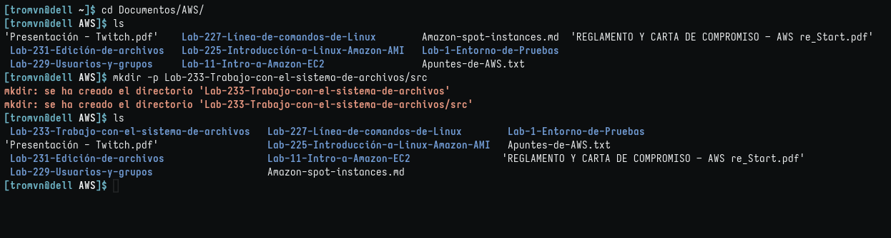
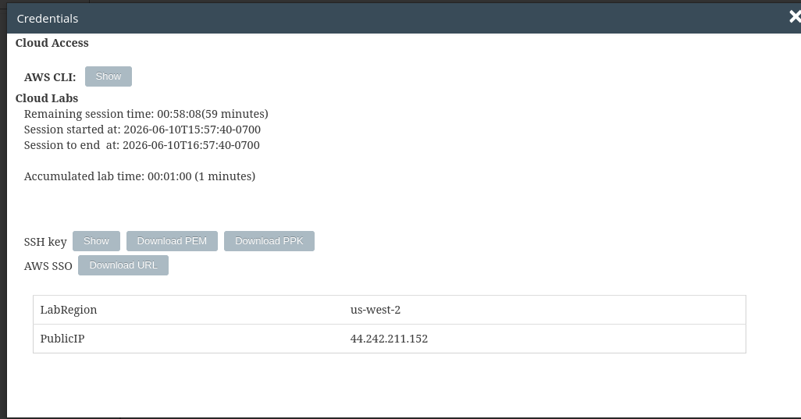
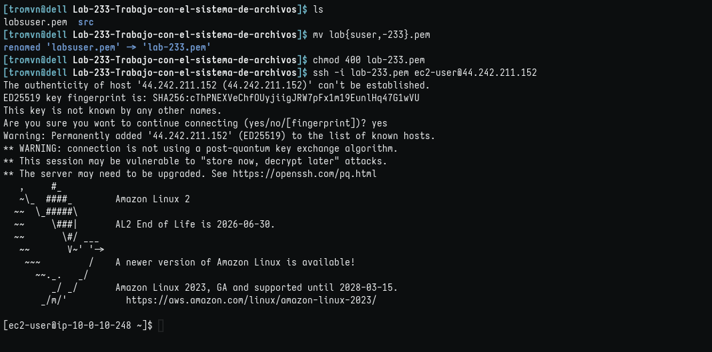
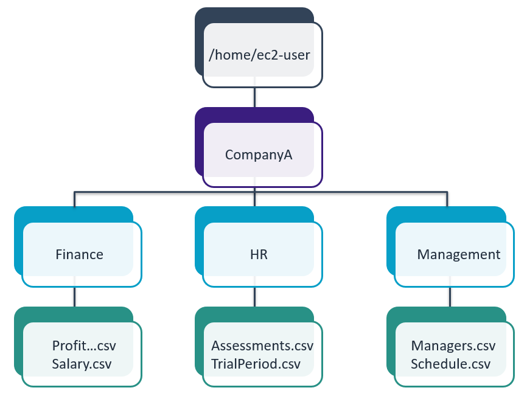
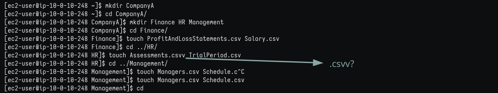
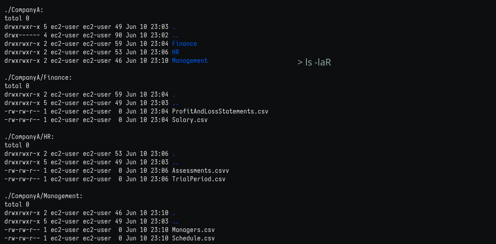
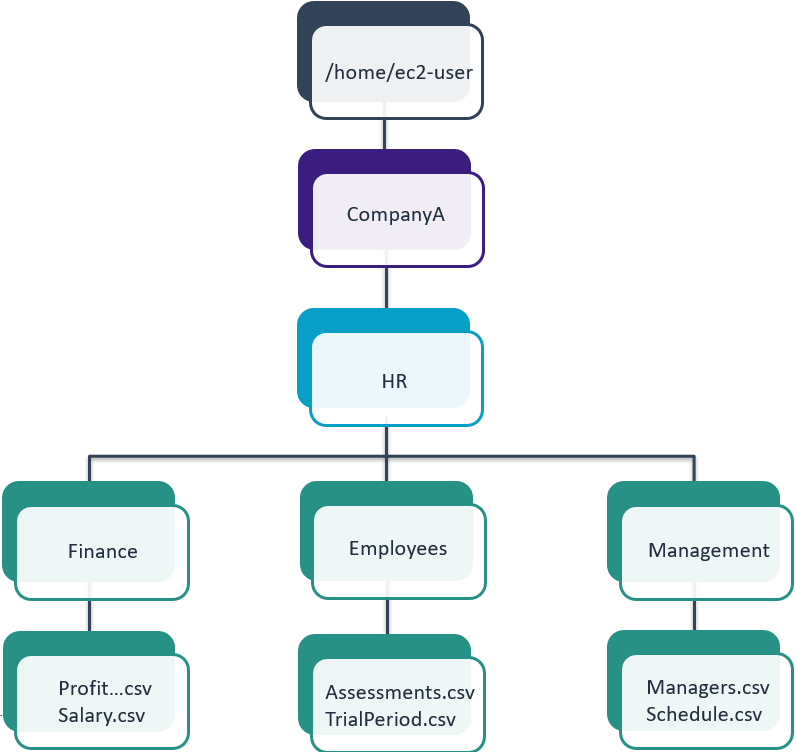
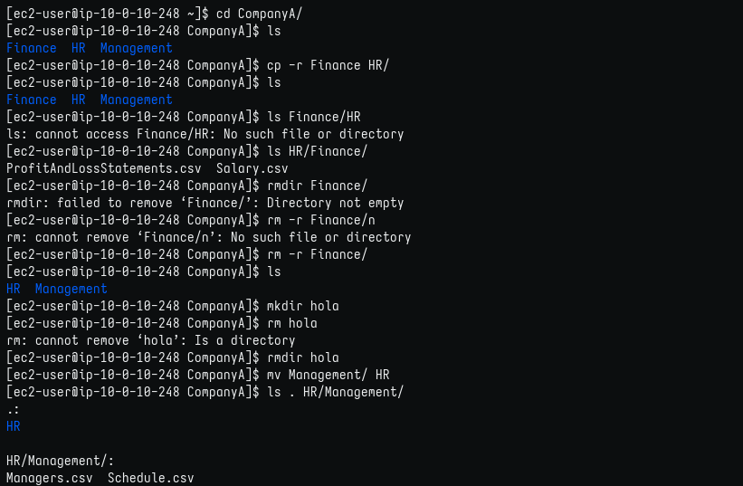
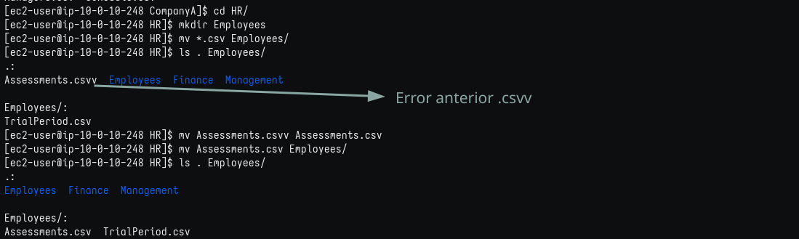

# Trabajo con el sistema de archivos

```
Nota

  En las dos sesiones de laboratorio anteriores, recibió información básica   sobre Linux y las sesiones actuales. A partir de ahora, comenzará una pequeña aventura en la que combinará todos sus conocimientos previos para consolidar y reforzar sus capacidades. Puede revisar las sesiones de laboratorio anteriores para completar las que faltan.
```

## Objetivos

En este laboratorio, hará lo siguiente:

1. Crear una estructura de carpetas que se provee en esta sesión de laboratorio.
2. Crear archivos
3. Copiar y trasladar archivos y directorios
4. Eliminar archivos y directorios

### Tarea 1: conectarse a una instancia de EC2 de Amazon Linux mediante SSH.

1. Creando directorios del lab. 
   

2. Obtener credenciales. Copio la IP y, como estoy en Linux, descargo el archivo .pem.
   

**nota: por defecto el nombre del archivo es labsuser.pem y yo lo cambio a lab-[n°-de-lab].pem para guardarlo en su respectiva carpeta**

2. Aquí detallo la conexión por SSH:
   

### Tarea 2: crear una estructura de carpetas

- Estrucutra de referencia
  
1. Directorios y archivos (Aquí, una duda con ese .csvv)
   

2. Corroborar
   

### Tarea 3: eliminar y reorganizar carpetas

Unas semanas más tarde, le piden que reorganice el contenido de la siguiente manera:


1. Reorganizar
   
- Continuación
  

#### Impresiones

Aprendí algunos comandos y formas nuevas. También corroboré el funcionamiento de rm, mv y cp con los directorios, por ejemplo, mv no necesira -r para mover directorios con subdirectorios, en cambio, cp y rm sí para copiar y eliminar respectivamente.
