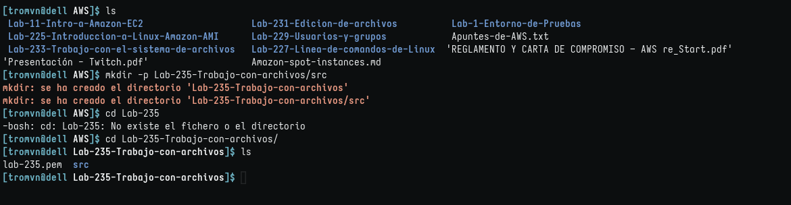
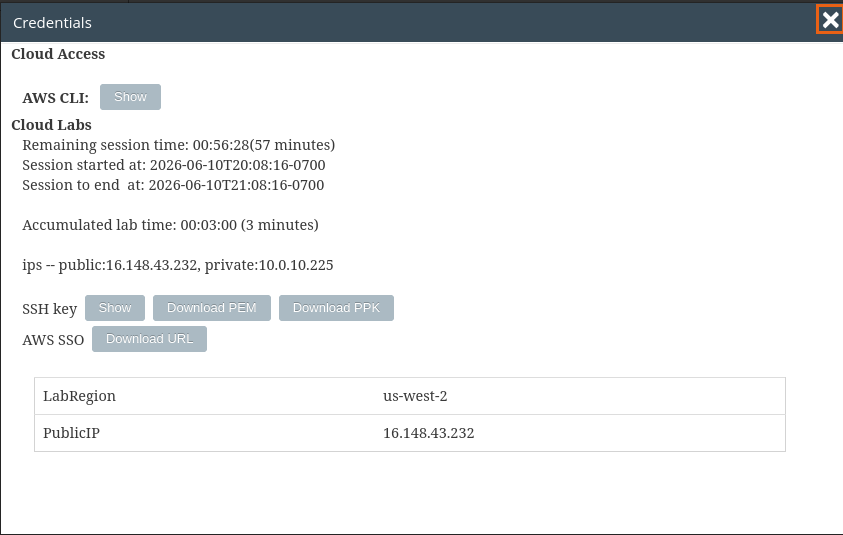
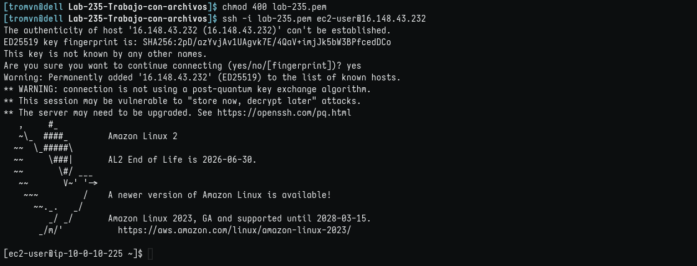
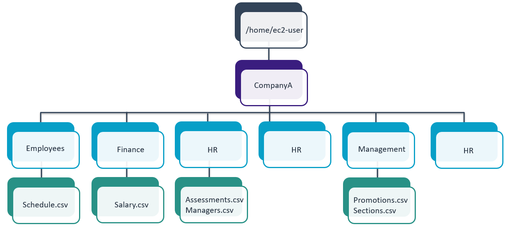
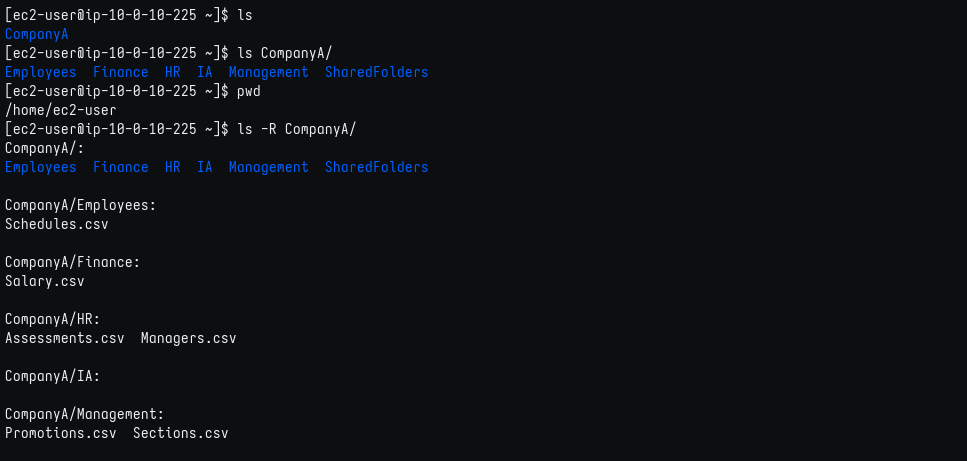
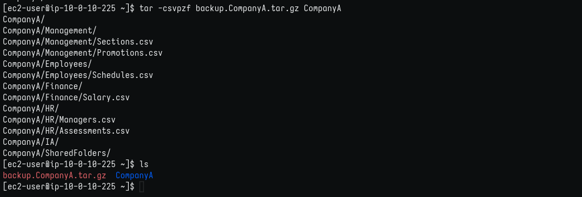
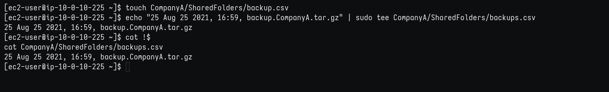
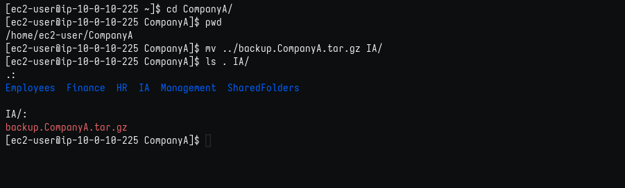

# Trabajo con archivos

## Objetivos

En este laboratorio, hará lo siguiente:

1. Usar tar para crear un archivo de respaldo de toda la estructura de carpetas.
2. Registrar la creación del archivo de respaldo en un archivo con fecha, hora y nombre.
3. Transferir el archivo de respaldo a otra carpeta.

### Tarea 1: conectarse a una instancia de EC2 de Amazon Linux mediante SSH.

1. Creando directorios del lab.
   

2. Obtener credenciales. Copio la IP y, como estoy en Linux, descargo el archivo .pem.
   

**nota: por defecto el nombre del archivo es labsuser.pem y yo lo cambio a lab-[n°-de-lab].pem para guardarlo en su respectiva carpeta**

2. Aquí detallo la conexión por SSH:
   

### Tarea 2: crear un respaldo

En esta tarea, creará un respaldo de una estructura de archivos completa. 

El entorno de trabajo tiene la siguiente estructura de carpetas:

1. Revisar directorios.
   

2. Comprimir y revisar
   

### Tarea 3: registrar el respaldo

En esta tarea, creará un archivo para registrar la fecha, la hora y el nombre del archivo de respaldo tar que creó. Este archivo indica cuándo se crearon los respaldos y podría ser útil para evitar crear respaldos innecesarios en el futuro.

1. Crear log y revisar
   

### Tarea 4: Trasladar el archivo de respaldo

En esta tarea, se transfiere el archivo de respaldo a la carpeta IA (Acceso poco frecuente). En una situación real, podría seguir estos pasos para que otro usuario o equipo que no tenga acceso a la carpeta donde creó el archivo de respaldo pueda acceder al archivo.

1. Mover backup
   

#### Impresiones

Debería hacer más backups en algún servidor local y no confiar tanto en las nubes de almacenamiento. Quién sabe.
