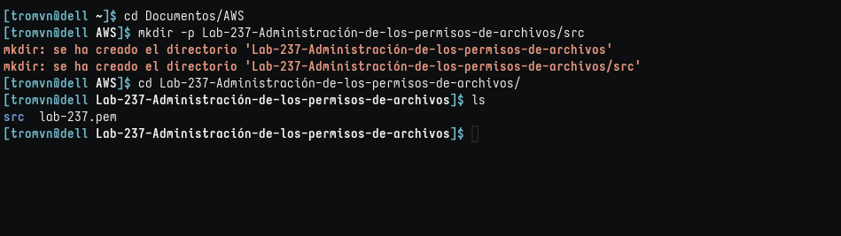
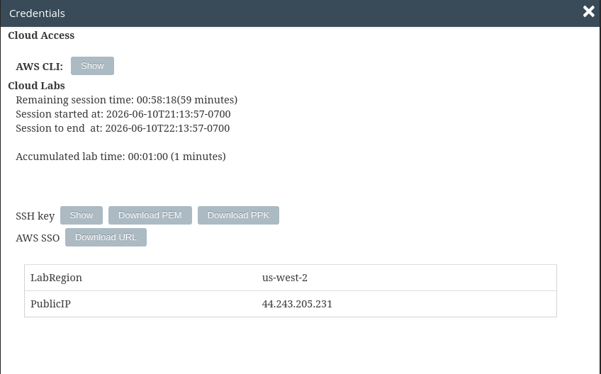
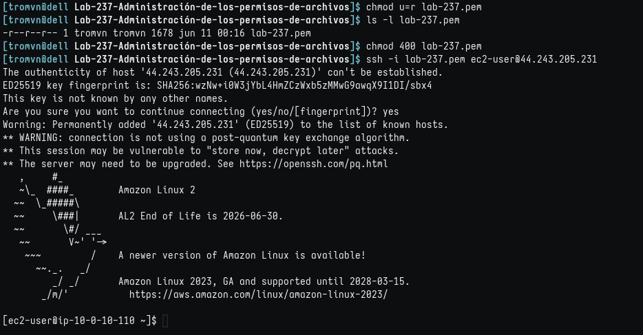
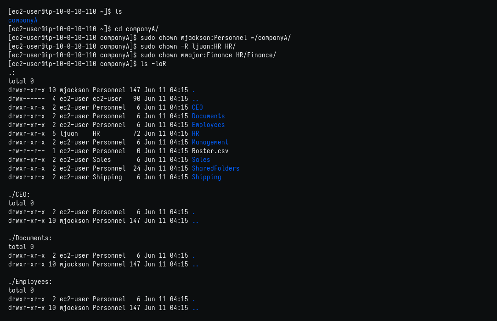
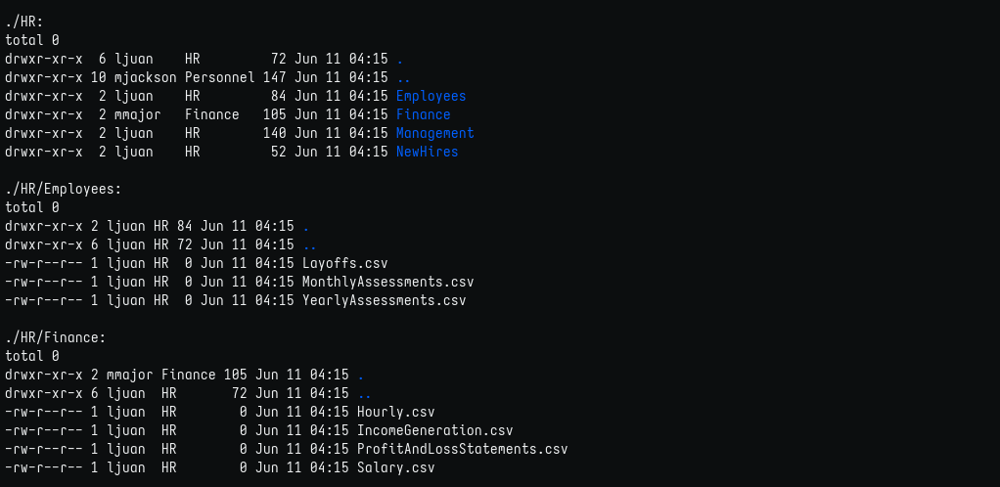
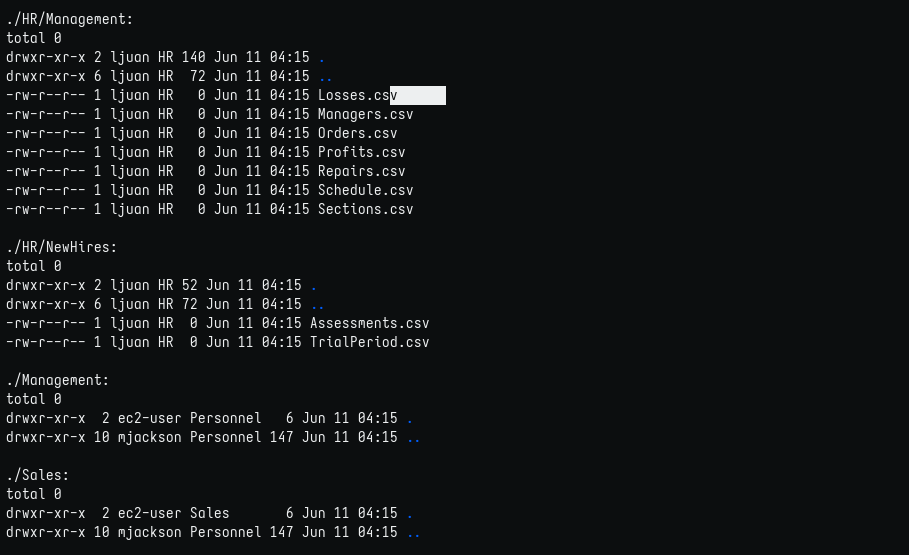
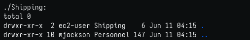
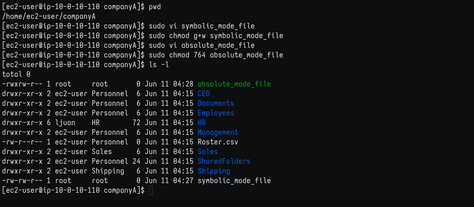
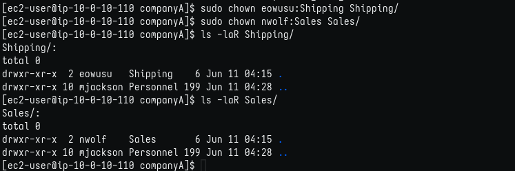

# Administración de permisos de archivos

## Objetivos

En este laboratorio, hará lo siguiente:

1. Cambiar todos los permisos de carpetas y archivos para que coincidan con la estructura de grupo correspondiente.
2. Modificar los permisos de archivo para un usuario.
3. Actualizar la estructura de carpetas de la empresa.

### Tarea 1: conectarse a una instancia de EC2 de Amazon Linux mediante SSH.

1. Creando directorios del lab.
   

2. Obtener credenciales. Copio la IP y, como estoy en Linux, descargo el archivo .pem.
   

**nota: por defecto el nombre del archivo es labsuser.pem y yo lo cambio a lab-[n°-de-lab].pem para guardarlo en su respectiva carpeta**

2. Aquí detallo la conexión por SSH:
   

### Tarea 2: Cambiar la propiedad de los archivos y las carpetas

En este ejercicio, tendrá que cambiar la siguiente propiedad:

1. Cambiando propietarios
   
- Continuación
  

- Continuación
  

- Continuación 
  
   

### Tarea 3: cambiar los modos de permiso

En esta tarea, se cambian los modos de permiso. Los permisos se crean y se cambian con el comando chomd.

Recuerde que, con el comando chmod, se cambian los permisos de sus archivos. Hay dos modos: simbólico y absoluto. En el modo simbólico, se utilizan tanto letras como símbolos para manipular los permisos. En el modo absoluto, solo se utilizan números para representar los permisos. 

1. Cambiando permisos
   

### Tarea 4: asignar permisos

En este ejercicio, se asignan los permisos correspondientes a las carpetas Shipping (Envíos) y Sales (Ventas).

1. Asignando y verificando permisos
   

#### Impresiones

Así como la administración de usuarios y grupos es importante en cuanto a organización, administrar premisos lo es en cuanto a seguridad, aunque ambos conceptos se complementan y, de hecho, son interdependientes para un buen funcionamiento de un servidor.
