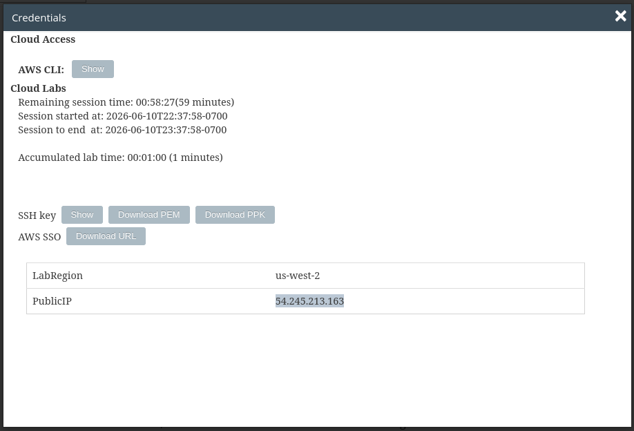
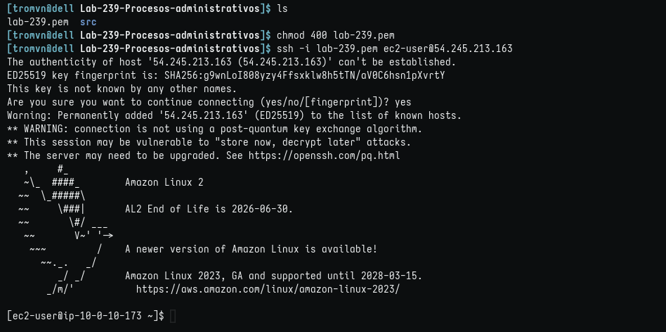
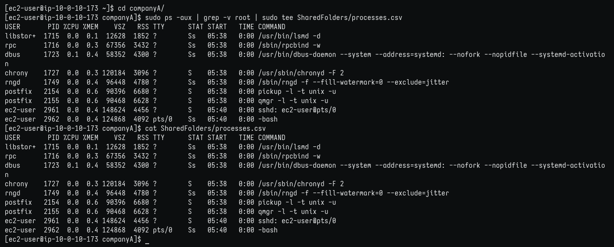
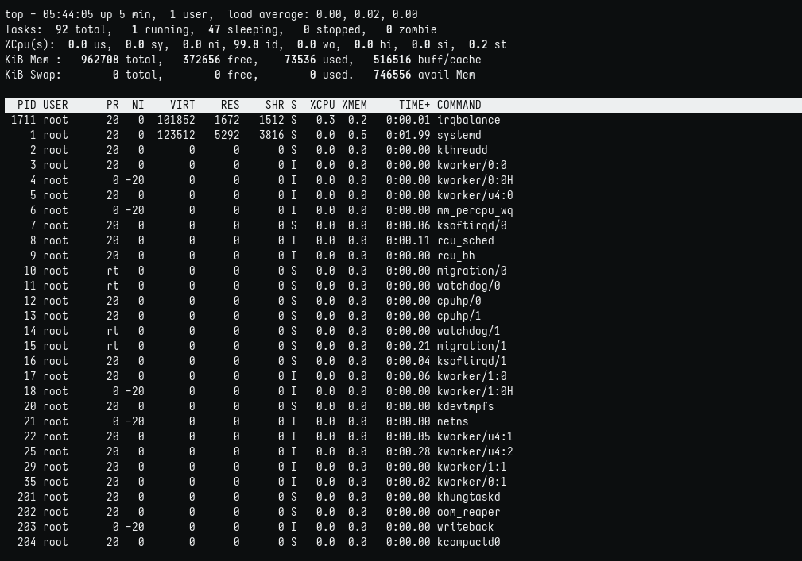
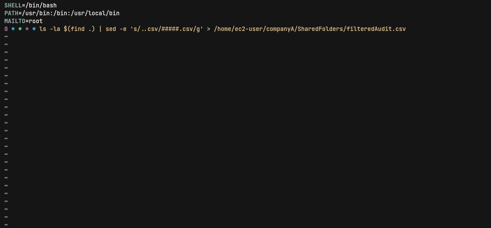
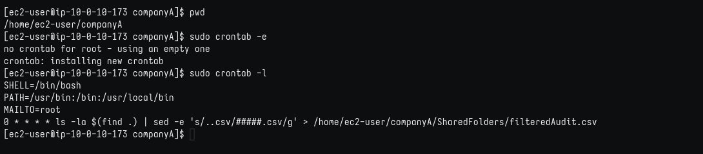

# Administración de procesos
 
## Objetivos

En este laboratorio, hará lo siguiente:

1. Crear un archivo de registro nuevo para listas de procesos.
2. Utilizar el comando top.
3. Establecer una tarea repetitiva que ejecute los comandos de auditoría anteriores una vez al día.

### Tarea 1: conectarse a una instancia de EC2 de Amazon Linux mediante SSH.

1. Obtener credenciales. Copio la IP y, como estoy en Linux, descargo el archivo .pem.


**nota: por defecto el nombre del archivo es labsuser.pem y yo lo cambio a lab-[n°-de-lab].pem para guardarlo en su respectiva carpeta**

2. Aquí detallo el directorio y la conexión por SSH:

 

### Tarea 2: ejercicio crear una lista de procesos

En este ejercicio, se crea un archivo de registro a partir del comando ps. Ese archivo de registro debe agregarse a la sección SharedFolders (Carpetas compartidas):

1. Creando el log en el directorio SharedFolders


### Tarea 3: ejercicio enumerar los procesos mediante el comando top

1. Ejecutando top



### Tarea 4: ejercicio Crear un trabajo cron

En este ejercicio, creará un trabajo cron que generará un archivo de auditoría con ##### para cubrir todos los archivos csv:

    Nota:
    Es posible que deba utilizar sudo para realizar este ejercicio si no es un usuario raíz.

Recuerde que cron es un comando que ejecuta una tarea de forma regular a una hora determinada. Este comando mantiene la lista de tareas que se deben ejecutar en un archivo crontab, que se crea en esta tarea. Se crea un trabajo que genera el archivo de auditoría con ##### para cubrir todos los archivos.csv. Al ingresar el comando crontab -e, se accede a un editor en el que puede ingresar una lista de pasos de lo que ejecutará el cron daemon. En el archivo crontab, se incluyen seis campos: minutos, hora, día del mes (DOM), mes (MON), día de la semana (DOW) y comando (CMD). Estos campos también se pueden señalar con asteriscos. Una vez que este comando se ejecuta, puede verificar su trabajo.

1. Editando crontab (olvidé la captura, así que desde local)
```
$ crontab -e
```



2. Verificando crontab
```
$ crontab -l # Para mostrar el contenido del archivo
```




#### Impresiones

No me he lanzado a usar crontab, intentaré usarlo en mi cotidiano con cosas simples, como actualizar repositorios y paquetes, por ahora.