---

title: "Lab 241: Administración de servicios"
parent: Entrega 2
nav_order: 1

---

# Lab 241: Administración de servicios: supervisión

## Objetivos

En este laboratorio, hará lo siguiente:

1. Verificar el estado del servicio httpd para asegurarse de que se está ejecutando y que puede realizar una conexión http con la dirección IP del host local.
2. También aprenderá a supervisar la instancia de EC2 de Amazon Linux 2
   * Utilizando el comando top de Linux
   * Utilizando AWS CloudWatch

### Tarea 1: conectarse a una instancia de EC2 de Amazon Linux mediante SSH.

Como en labs anteriores, descargo desde "details" la ip y el archivo .pem, le coloco el nombre del lab: labxxx.pem y accedo por SSH con el comando:

```bash
$ chmod 400 labxxx.pem
$ ssh -i labxxx.pem ec2-user@ip-from-details 

# Responder 'yes' en la 1ra conexión.
```

### Tarea 2: comprobar el estado del servicio httpd.

1. Comprobando estado del servicio

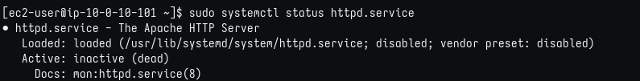

2. Arrancar y volver a comprobar

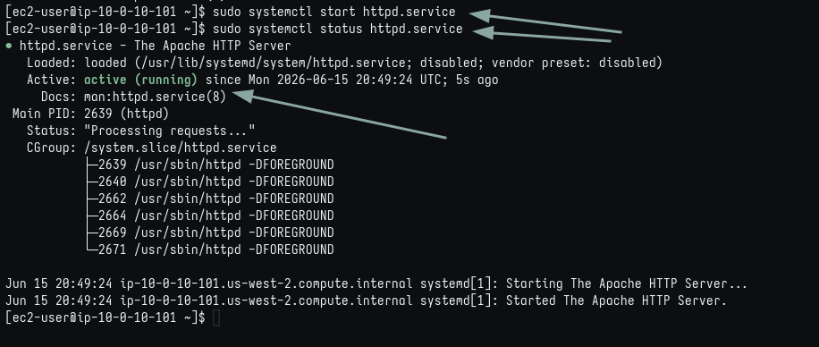

3. Comprobar web activa en navegador

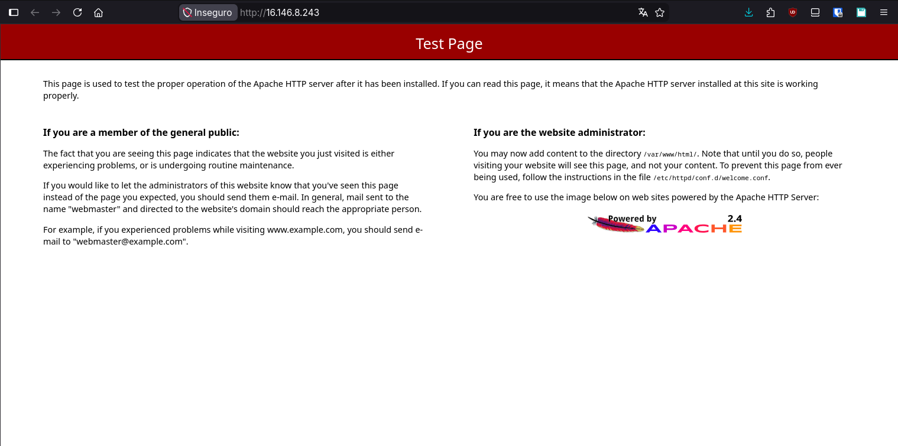

4. Detener servicio

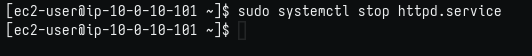

### Tarea 3: supervisar una instancia de EC2 de Linux

1. Ejecutar top
   
   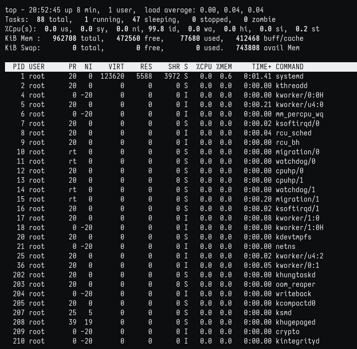

2. Ejecutar script y top
   
   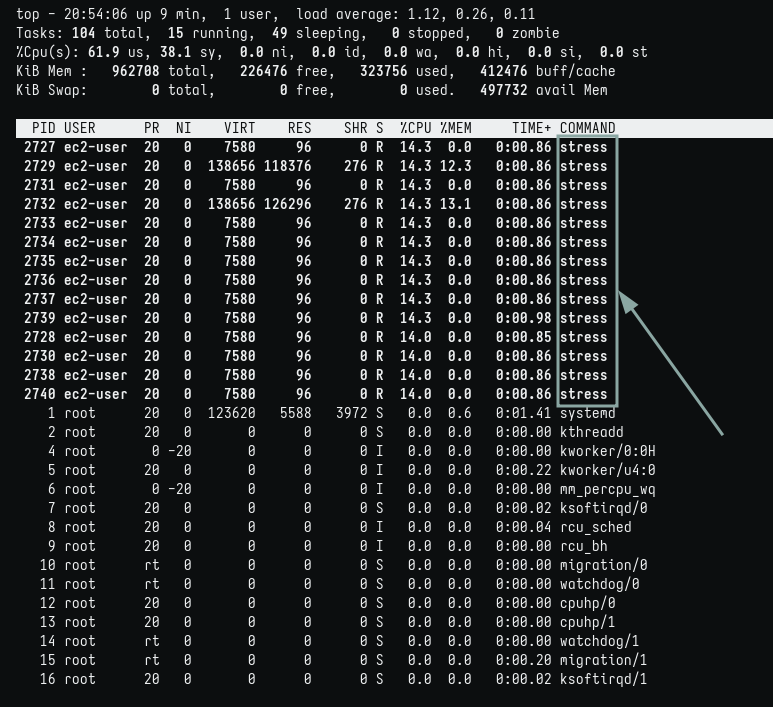

3. Buscando CloudWatch
   
   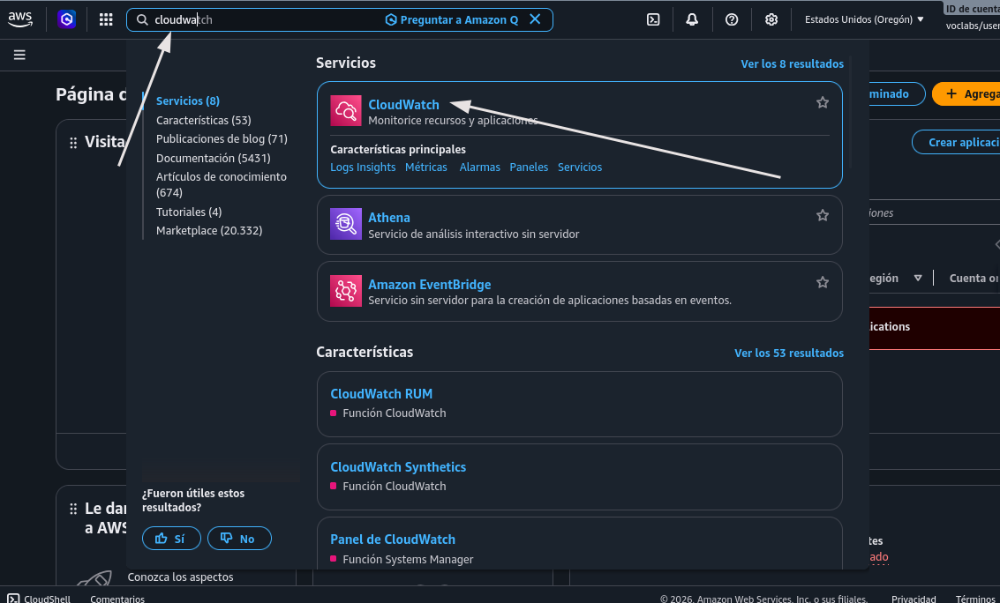

4. Navegando en CloudWatch
   
   

5. CPU de EC2 y otros widgets
   
   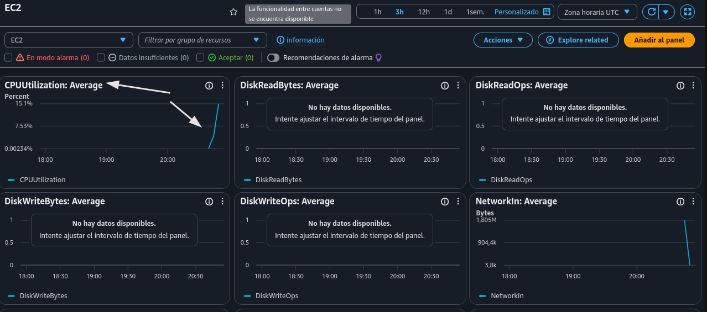

6. No entendí bien esta parte de la guía, en que debía configurar la actualización de 5 minutos a 1 segundo. Buscando, di con que había que configurar la alarma.
   
   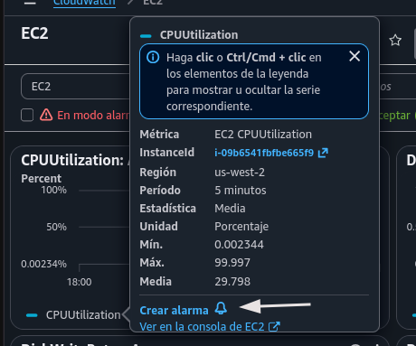

7. Configurando alarma
   
   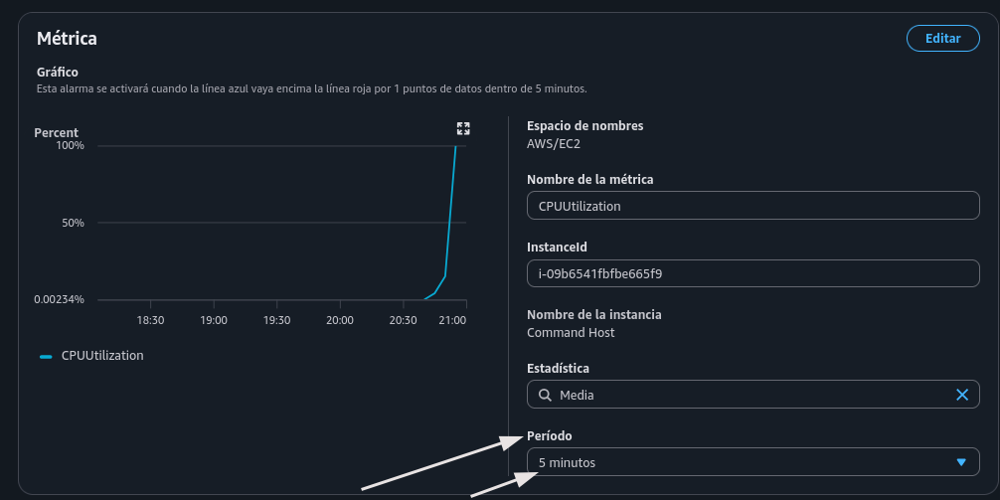
   
   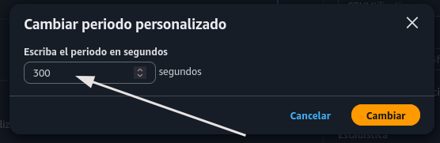
   
   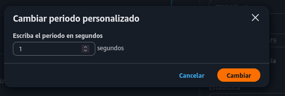

8. Resultado, cambió el gráfico, aunque no entiendo del todo. Quizás debiera probar por más tiempo.
   
    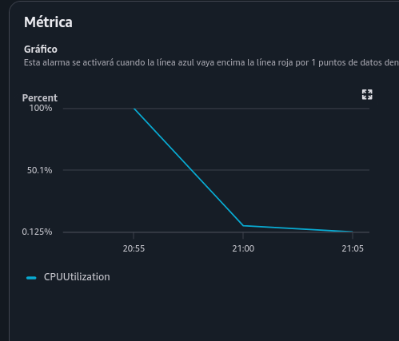
