# Lab 243: Administración de software

## Objetivos

En este laboratorio, hará lo siguiente:

1. Actualizar la máquina de Linux mediante el administrador de paquetes.
2. Recuperar o revertir a una versión anterior un paquete previamente actualizado mediante el administrador de paquetes.
3. Instalar la Interfaz de la línea de comandos de AWS (AWS CLI)

### Tarea 1: conectarse a una instancia de EC2 de Amazon Linux mediante SSH.

Como en labs anteriores, descargo desde "details" la ip y el archivo .pem, le coloco el nombre del lab: labxxx.pem y accedo por SSH con el comando: 

```bash
$ chmod 400 labxxx.pem
$ ssh -i labxxx.pem ec2-user@ip-from-details 

# Responder 'yes' en la 1ra conexión.
```

### Tarea 2: actualizar la máquina de Linux

1. Consulta de paquetes
   
    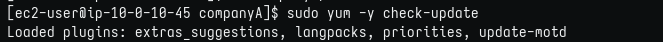

2. Actualizar repositorios de seguridad
   
    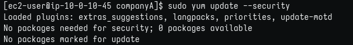

3. Actualizar paquetes
   
    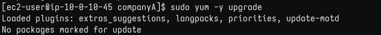

4. Instalación de httpd
   
    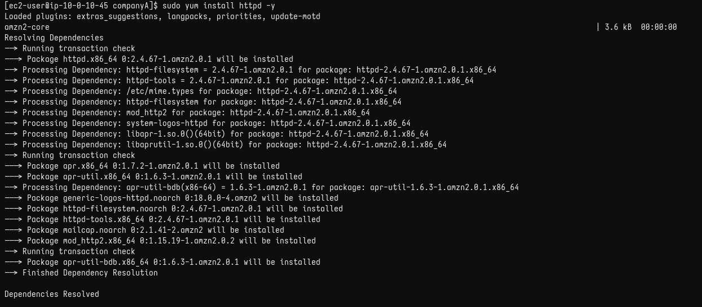
   
    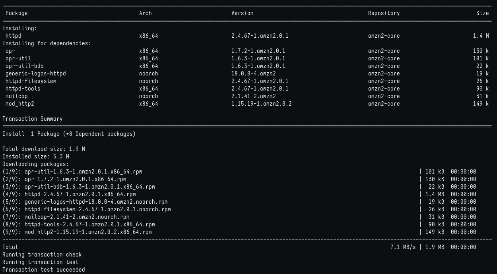
   
    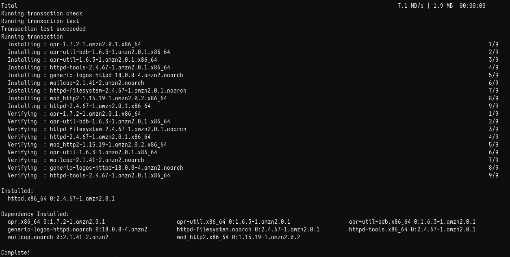

### Tarea 3: restaurar un paquete

1. Historial de yum
   
    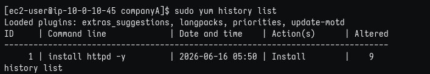

2. Detalle de paquete en historial de yum
   
    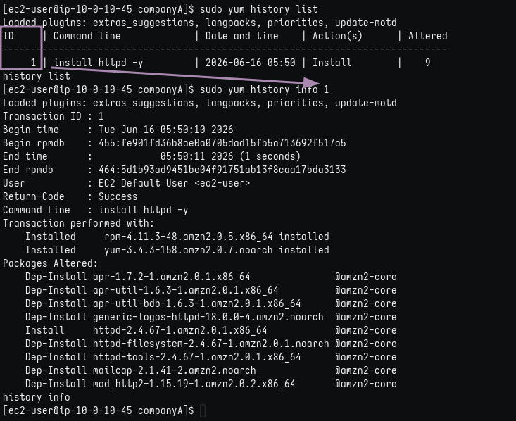

3. Deshacer instalación del paquete con ID 1 en el historial
   
    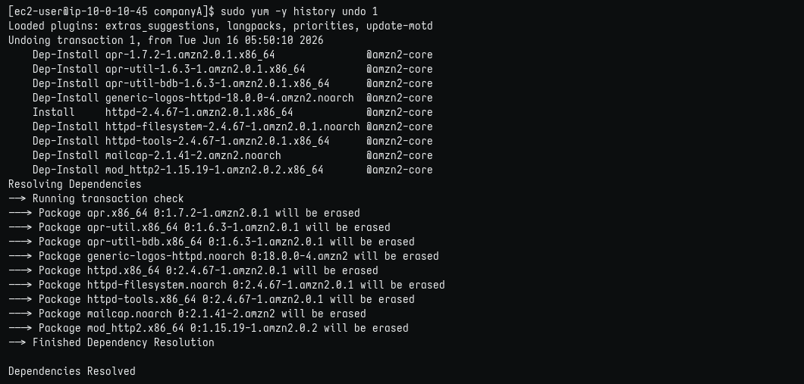
   
    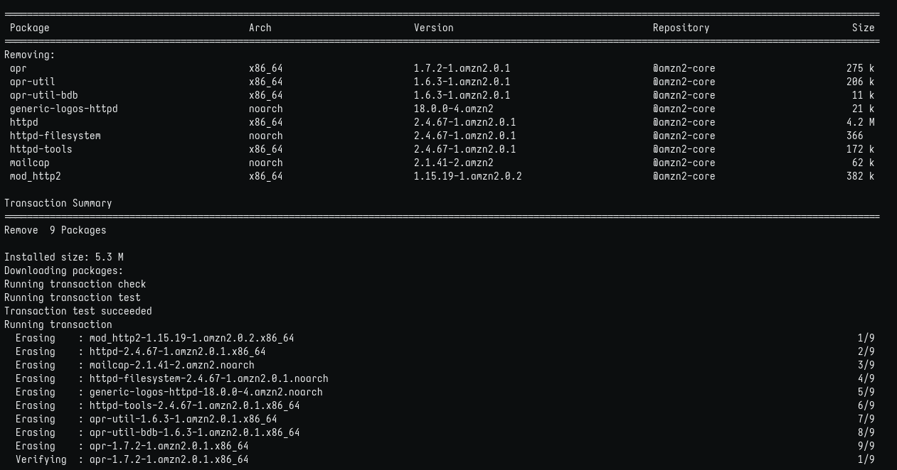
   
    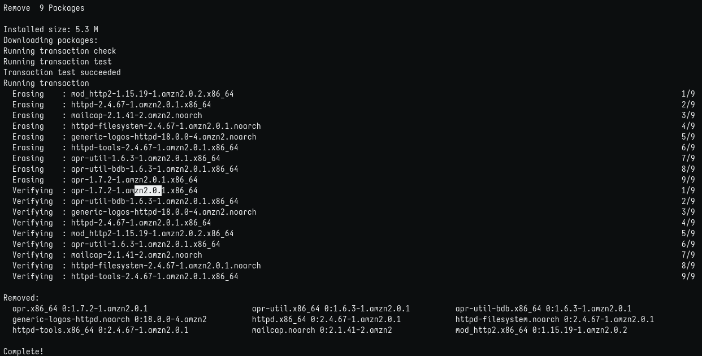

### Tarea 4: instalar la AWS CLI en Red Hat Linux

1. Revisar versión de python. Aquí entendí que python refiere a python2, entonces especifico python3
   
    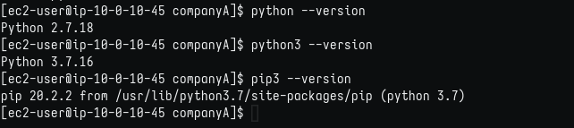

2. Descargar paquete con curl
   
    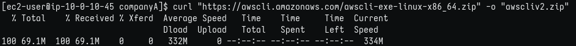

3. Descomprimir con unzip
   
    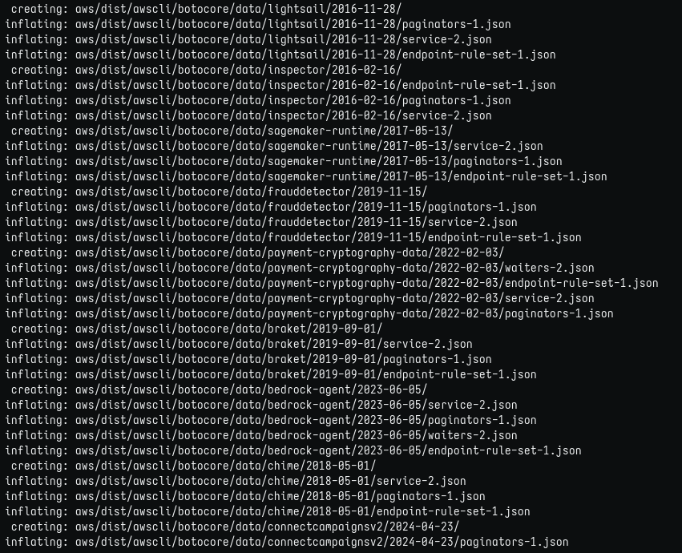

4. Ejecutar script de instalación
   
    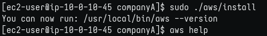

### Tarea 5: configurar la AWS CLI para conectarse a la cuenta de AWS

1. help de aws cli
   
    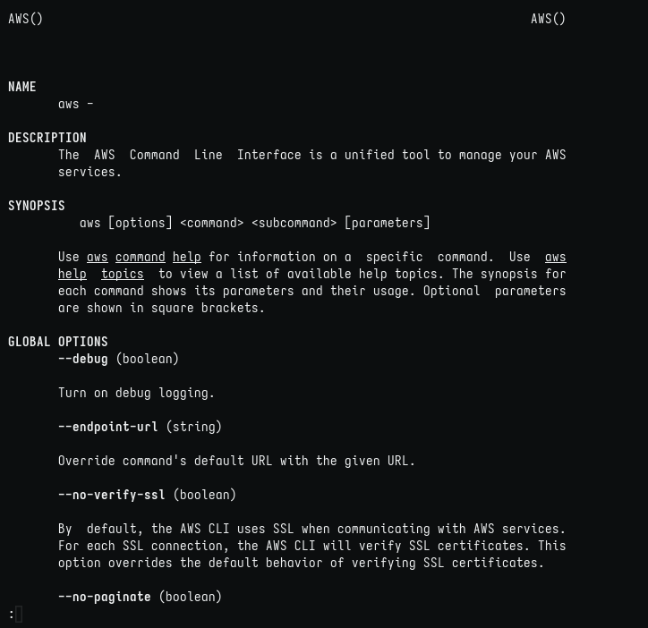

2. Mostrar credenciales
   
    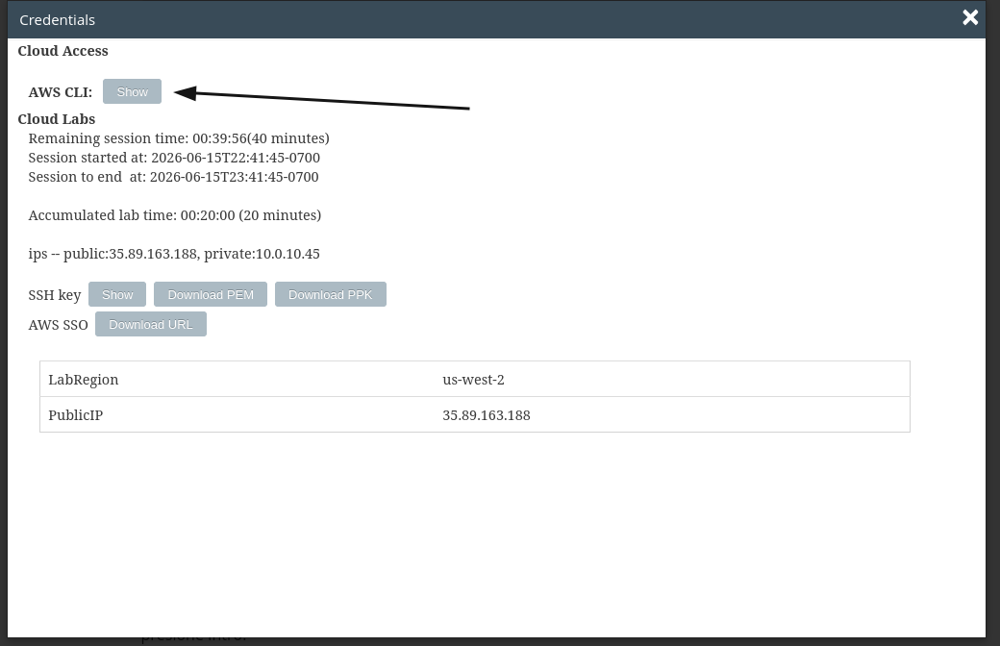
   
    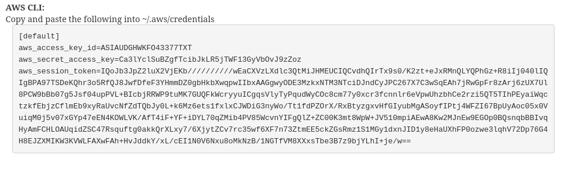

3. Crear archivo credentials. Desde aquí cometí un error por crear el directorio .aws dentro de companyA
   
    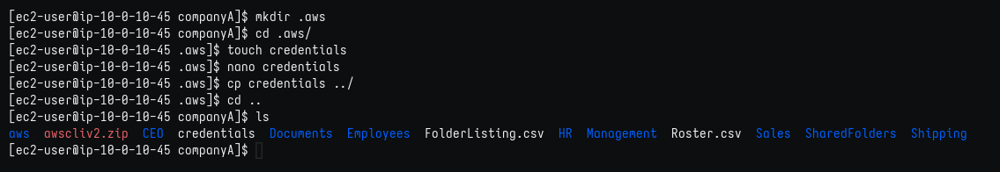

4. Pegar credenciales en .aws/credentials
   
    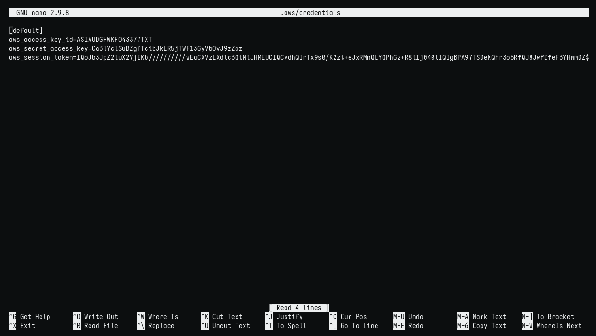

5. Cargar credenciales en aws cli (vista de cómo llenar los cuatro campos)
   
    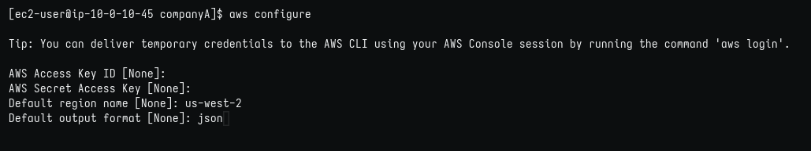
   
   * Aquí, credenciales inválidas
     
        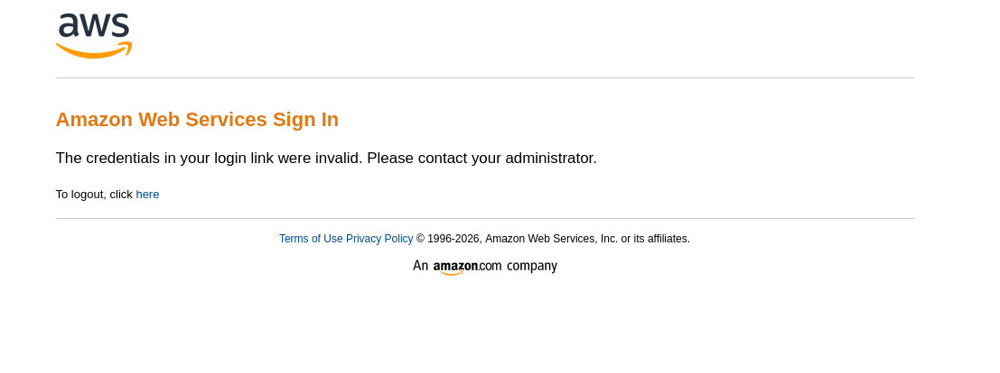 
     
     Entendí que creé el directorio y archivo .aws/credentials dentro de companyA/ 
     Procedí del siguiente modo: 
     
     ```
     [ec2-user@ip-10-0-10-45 companyA]$ mv .aws/ ..   
     mv: cannot move '.aws/' to '../.aws': File exists # Es decir, ya existía el directorio desde la instalación y no lo noté.  
     [ec2-user@ip-10-0-10-45 companyA]$ rm -r .aws/ # Simplementé eliminé el directorio  
     [ec2-user@ip-10-0-10-45 companyA]$ cd ../.aws # Para dirigirme a $HOME/.aws y desde ahí repetir los pasos 3 a 5.
     ```

6. Entrar en consola AWS y buscar EC2
   
    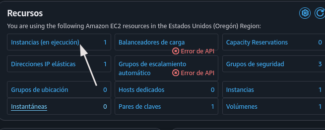

7. Copiar ID de la instancia
   
    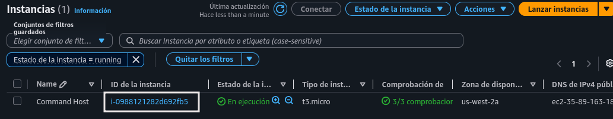

8. ID copiada
   
    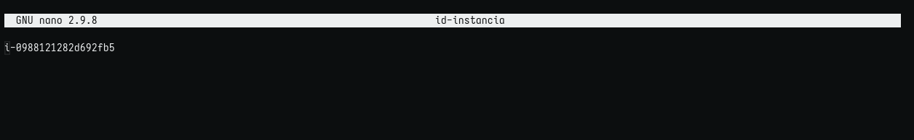

9. Configurar tipo de la instancia en JSON
   
    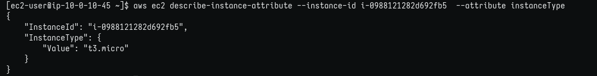