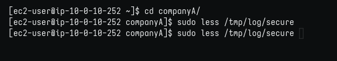
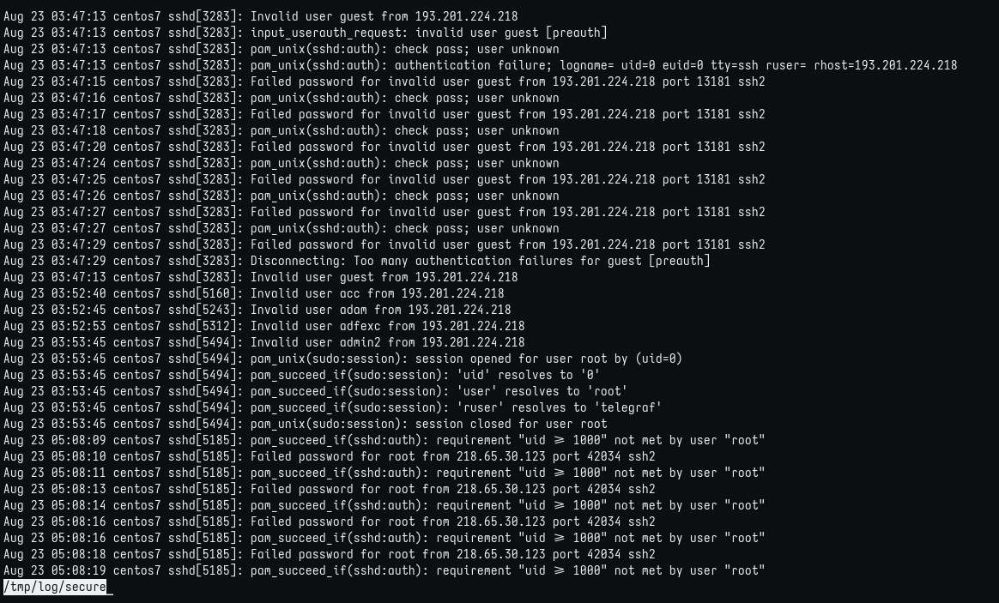
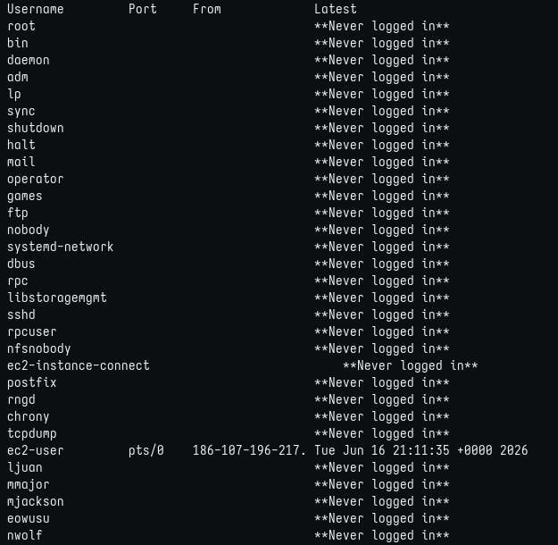
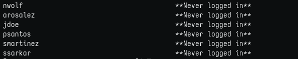

# Lab 245: Administración de archivos de registro

## Objetivos

En este laboratorio, hará lo siguiente:

* Revisar lastlog y los resultados de registro seguros de la máquina de Linux.

### Tarea 1: conectarse a una instancia de EC2 de Amazon Linux mediante SSH.

Como en labs anteriores, descargo desde "details" la ip y el archivo .pem, le coloco el nombre del lab: labxxx.pem y accedo por SSH con el comando: 

```bash
$ chmod 400 labxxx.pem
$ ssh -i labxxx.pem ec2-user@ip-from-details 

# Responder 'yes' en la 1ra conexión.
```

### Tarea 2: revisar archivos de registro seguros

1. Revisando logs
   
    
   
    

2. Usando lastlog
   
    
   
    

### Desafío adicional

¿Qué información se puede extraer para algunos de los propósitos de su empresa?

```
Por lo que pude ver en el log, hubo varios intentos fallidos de usuarios
desconocidos desde la IP ``193.201.224.218``, con intentos de usuarios no
registrados o igualmente inválidos. 

Luego, intentos fallidos de acceso a root desde IP ``218.65.30.123``, y 
toca preguntarse ¿qué miembro de equipo querría acceder a root, con qué fin
```