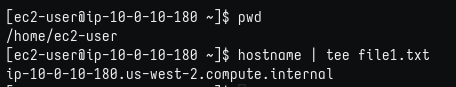
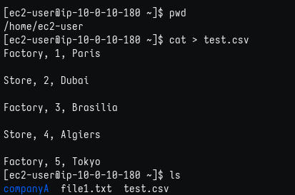
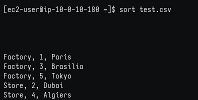
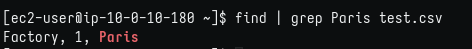
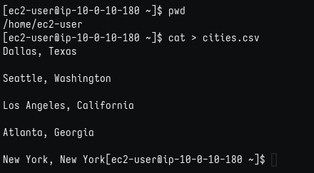
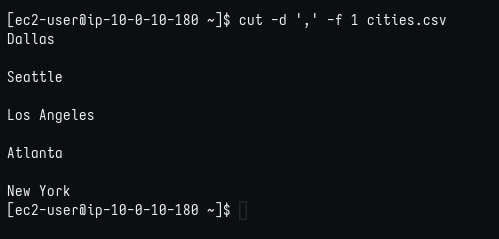
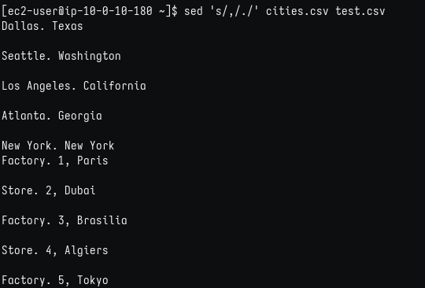

# Lab 247: Trabajo con comandos

## Objetivos

En este laboratorio, hará lo siguiente:

1. Usar el comando tee para dirigir el resultado a un archivo.
2. Usar el comando sort para reorganizar los contenidos de un archivo .csv.
3. Usar el comando cut para editar los contenidos de un archivo.
4. Usar el comando sed.
5. Usar el operador de barra vertical.

### Tarea 1: conectarse a una instancia de EC2 de Amazon Linux mediante SSH.

Como en labs anteriores, descargo desde "details" la ip y el archivo .pem, le coloco el nombre del lab: labxxx.pem y accedo por SSH con el comando: 

```bash
$ chmod 400 labxxx.pem
$ ssh -i labxxx.pem ec2-user@ip-from-details 

# Responder 'yes' en la 1ra conexión.
```

### Tarea 2: utilizar el comando tee

1. Comando tee para copiar el contenido de la salida de 'hostname' al archivo file1.txt
   
    

2. Listar contenido del directorio actual y comprobar que exista file1.txt
   
    

3. Crear y editar archivo test.csv con cat
   
    

4. Ordenar archivo en la salida estándar
   
    

5. Comando find para buscar en el directorio actual (sin opciones la salida son todos los archivos encontrados en el directorio actual con sus rutas), luego filtra la salida con grep buscando 'Paris' en test.csv (si existe dentro de la búsqueda).
   
    

6. Crear y editar archivo cities.csv con cat
   
    

### Tarea 4: utilizar el comando cut

1. Filtrar la salida con cut, de modo que el carácter ',' sea el separador de dos campos y que se muestre el primer campo (de izq a der)
   
    

### Desafío adicional:

Utilice solo el comando sed para hacer todos los cambios en una línea. (Se puede utilizar la cadena de comandos con la barra vertical [|]).|).)

Recuerde que el comando sed se usa principalmente para reemplazar parte del texto en un archivo por otro texto.

sed 's/word being replaced/replacement word/' file name

 El comando sed busca en el texto del archivo una ocurrencia de la primera cadena y reemplazará cualquier coincidencia por la segunda.

1. Logré buscar el carácter ',' que primero aparece en cada línea y reemplazarlo por '.'
   
    