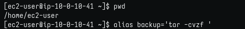
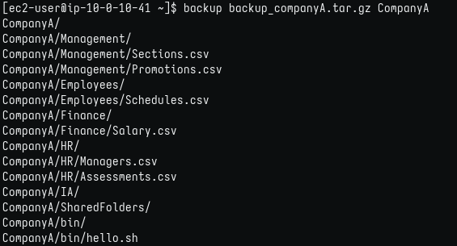
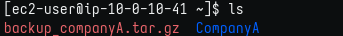
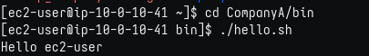
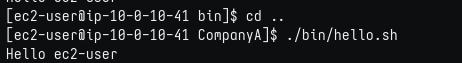
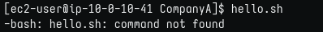
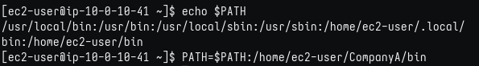
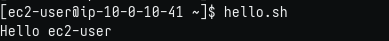

# Lab 249: El intérprete de comandos Bash

## Objetivos

En este laboratorio, hará lo siguiente:

1. Crear y trabajar con un alias para hacer un respaldo de una carpeta completa. 
2. Trabajar en la variable PATH y agregar en ella una nueva carpeta.

### Tarea 1: conectarse a una instancia de EC2 de Amazon Linux mediante SSH.

Como en labs anteriores, descargo desde "details" la ip y el archivo .pem, le coloco el nombre del lab: labxxx.pem y accedo por SSH con el comando:

```bash
$ chmod 400 labxxx.pem
$ ssh -i labxxx.pem ec2-user@ip-from-details 

# Responder 'yes' en la 1ra conexión.
```

### Tarea 2: crear un alias para una operación de respaldo

    * Recuerde que tar es un comando que se utiliza para crear o extraer un archivo que contiene archivos y carpetas. 
    
        -f archiva los archivos (tar también puede archivar dispositivos).
    
        -v es la opción de modo detallado para mostrar lo que se ingresa al archivo.
    
        -z comprime el archivo en el formato .gzip.
    
        tar -cf funcionaría perfectamente pero no mostraría lo que está adentro del archivo y no lo comprimiría.

1. Creando alias
   
    

2. Salida del comando tar (backup)
   
    

3. Comprobando el archivo comprimido
   
    

### Tarea 3: Explorar y actualizar la variable del entorno PATH

1. Me dirijo al directorio bin y trato de ejecutar el script, desde la misma ubicación y especificando la ruta
   
    

2. Trato de ejecutar nuevamente el script, ahora un nivel arriba, pero especifico la ruta 
   
    

3. Último intento, un nivel arriba también, pero esta vez sin especificar la ruta
   
    

4. Agregar ruta del script a la variable de entorno PATH
   
    

5. Comprobando, y ahora es posible ejecutar el script desde cualquier ubicación, sin especificar su ruta ya que está en la variable de entorno PATH, por lo que la shell reconocerá a qué archivo se refiere.
   
    