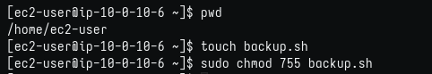
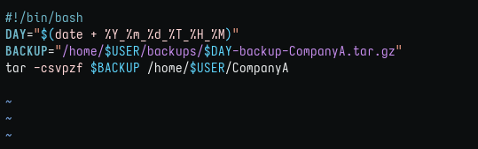
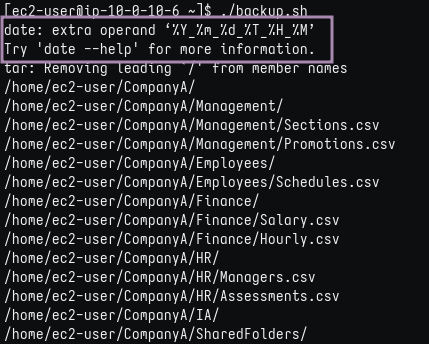
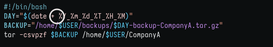
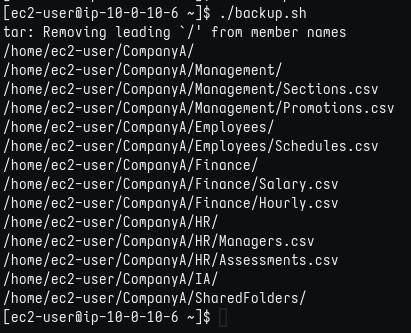
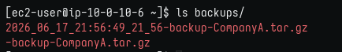

# Lab 251: Scripts del intérprete de comandos bash

## Objetivos

En este laboratorio, hará lo siguiente:

* Crear un script de bash que automatizará el respaldo de una carpeta.

### Tarea 1: conectarse a una instancia de EC2 de Amazon Linux mediante SSH.

Como en labs anteriores, descargo desde "details" la ip y el archivo .pem, le coloco el nombre del lab: labxxx.pem y accedo por SSH con el comando: 

```bash
$ chmod 400 labxxx.pem
$ ssh -i labxxx.pem ec2-user@ip-from-details 

# Responder 'yes' en la 1ra conexión.
```

### Tarea 2: escribir un script del intérprete de comandos

1. Crear archivo 'backup' y darle permisos (755)
   
    

2. Editar script en vi
   
    

3. Tuve un error en el output
   
    

4. Descubrí el error y corregí
   
    

5. Output esperado
   
    

6. Se creó el backup
   
    