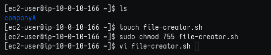
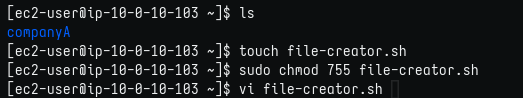
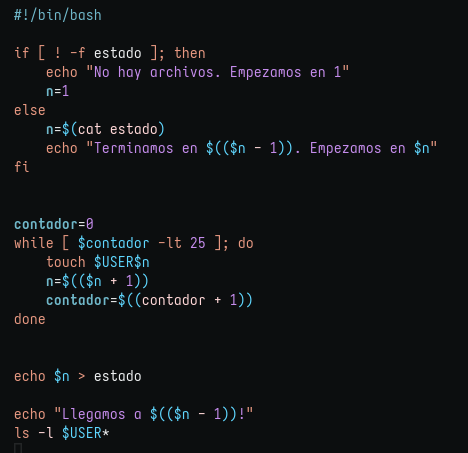
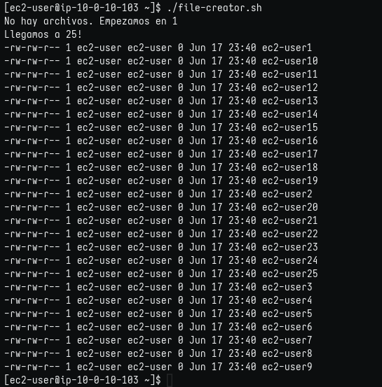
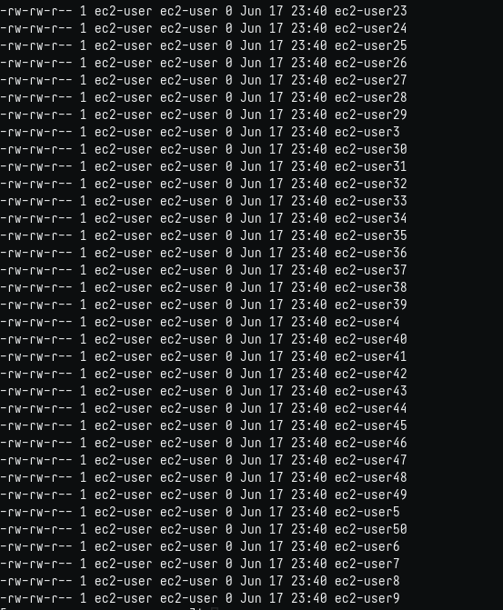
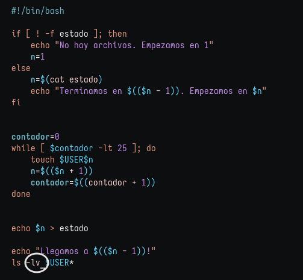
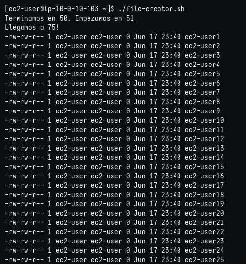
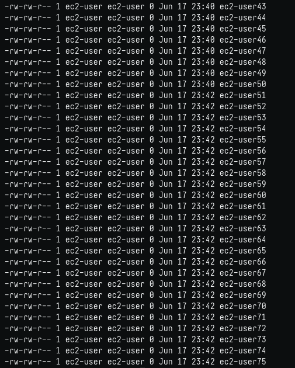

# Lab 253: Laboratorio de desafíos: ejercicio de scripting del intérprete de comandos bash

## Objetivos

En este desafío, hará lo siguiente:

* Crear un directorio.

### Tarea 1: conectarse a una instancia de EC2 de Amazon Linux mediante SSH.

Como en labs anteriores, descargo desde "details" la ip y el archivo .pem, le coloco el nombre del lab: labxxx.pem y accedo por SSH con el comando:

```bash
$ chmod 400 labxxx.pem
$ ssh -i labxxx.pem ec2-user@ip-from-details 

# Responder 'yes' en la 1ra conexión.
```

### El desafío:

    Escriba un script bash y tenga en cuenta los siguientes requisitos:

        Cree 25 archivos vacíos (0 KB). (Consejo: use el comando touch).

        Los nombres de los archivos deben ser <yourName><number>, <yourName><number+1>, <yourName><number+2> y así sucesivamente.

        Diseñe el script de manera que cada vez que lo ejecute, este cree el siguiente lote de 25 archivos con números crecientes comenzando por el último número o número máximo que ya existe.

        No fije la codificación de estos números. Necesita generarlos con el empleo de la automatización.

    Pruebe el script. Muestre una lista larga del directorio y su contenido para confirmar que el script creó los archivos previstos.

1. Crear archivo file-creator.sh y dar permisos (755). No logré crear el script a tiempo.

	

2. Segundo intento (notarlo en el cambio de ip)

	

3. Código: La lógica fue muy entretenida de descubrir, pero faltaban recursos de sintaxis por lo que tuve que investigar bastante. Al final del código agregué un comando 'ls' para listar automáticamente.

	

4. Primer output: no el orden que esperaba

	
	
	
5. Descubrí la opción -v (version) que toma los número como orden natural, y lo agregué al código

	

6. Output que quería! Cada vez que ejecuto el script: 
	1. avisa en qué número terminamos y dónde empezaremos
	2. avisa a qué número llegamos
	3. lista por orden numérico todos los archivos creados.
	
	
	