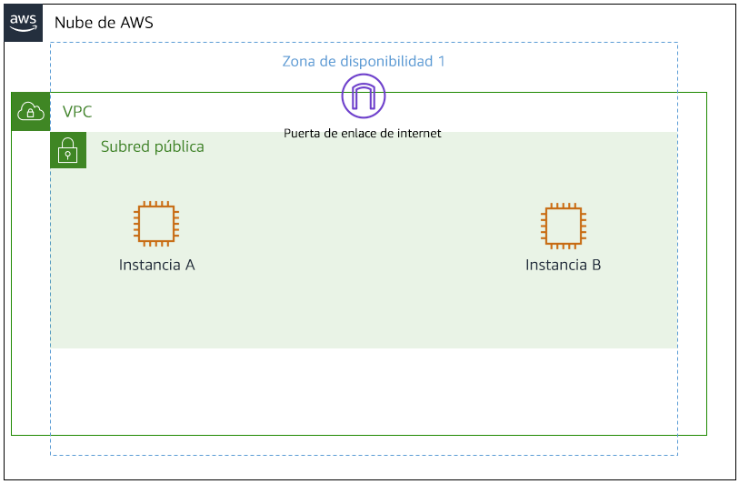
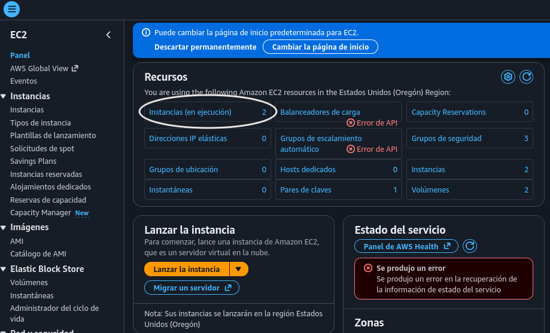
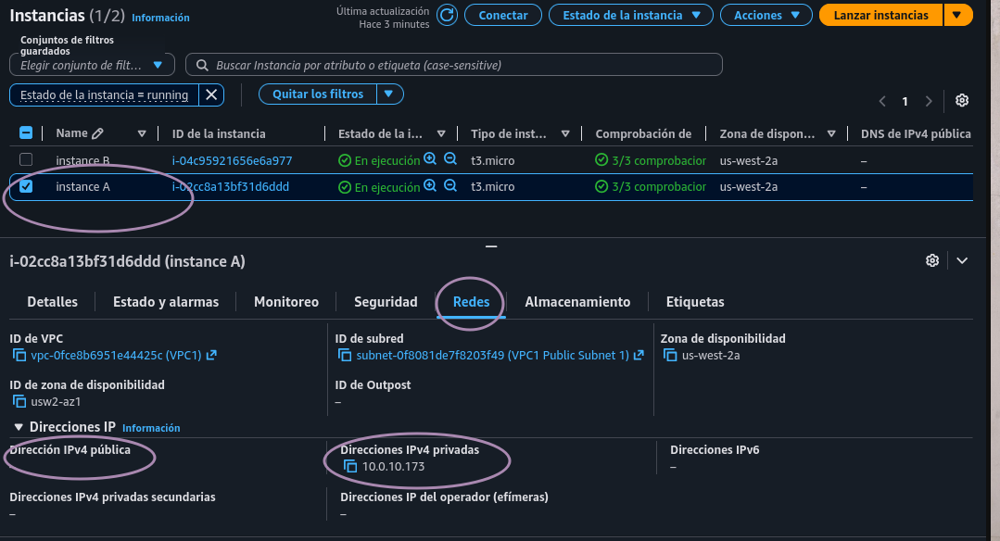
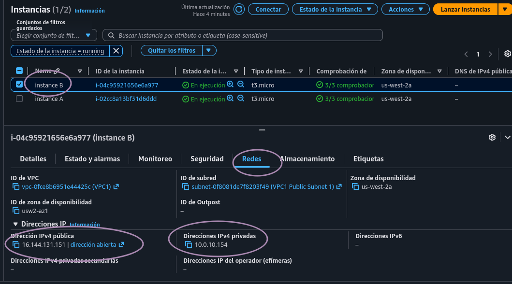
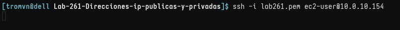
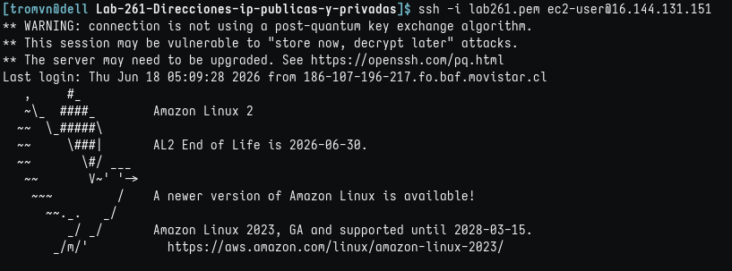

# Lab 261: Protocolos de Internet: Direcciones IP públicas y privadas

## Objetivos

En este laboratorio, realizará lo siguiente:

1. Resumir e investigar la situación del cliente
2. Analizar las diferencias entre una dirección de IP pública y una privada
3. Desarrollar una solución al problema del cliente planteado en este laboratorio
4. Resumir y describir los hallazgos (actividad grupal)

## Situación

Usted es un ingeniero de soporte en la nube en Amazon Web Services (AWS). Durante su turno, un cliente de una empresa Fortune 500 solicita asistencia por un problema de redes dentro de su infraestructura de AWS. A continuación, figuran el correo y un archivo adjunto de su arquitectura:
Ticket del cliente

    ¡Hola, equipo de soporte en la nube!
    
            En la actualidad, tenemos una nube virtual privada (VPC) con un 
    intervalo de CIDR de 10.0.0.0/16. En esta VPC, tenemos dos instancias de 
    Amazon Elastic Compute Cloud (Amazon EC2): la instancia A y la instancia B.
    Aunque ambas están en la misma subred y tienen las mismas configuraciones
    con los recursos de AWS, la instancia A no puede acceder a Internet y la 
    instancia B sí. Creo que está relacionado con las instancias de EC2, pero
    no estoy segura. También tenía una pregunta sobre el uso de un rango 
    público de direcciones IP como 12.0.0.0/16 para una VPC que me gustaría 
    lanzar. ¿Causaría algún problema? Adjunto nuestra arquitectura como referencia.
    
    Gracias.
    Jess
    Administrador de la nube

La arquitectura del cliente, que consta de una VPC, una puerta de enlace de Internet, una subred pública con la instancia A y una subred pública con la instancia B

 

### Tarea 1: Investigar el entorno del cliente

En la situación, Jess, que es la clienta que solicita asistencia, tiene dos instancias de EC2 en una VPC. La instancia A no puede conectarse a Internet y la instancia B sí puede hacerlo, aunque están configuradas de la misma manera dentro de la VPC. En el momento la arquitectura de AWS del cliente parece en buen estado porque una de sus instancias trabaja. Jess sospecha que el problema puede ser la configuración de la instancia.

También tiene una pregunta sobre el uso de un rango público de direcciones IP para la VPC nueva y preguntó si podría proporcionar más información al respecto.

en la actualidad tiene una VPC con el mismo CIDR de 10.0.0.0/16 con dos instancias, instancia A y la instancia B, con las mismas configuraciones que el cliente. Cuando se solucionan problemas de redes y AWS, puede aplicar un método de solución de problemas en el que comienza desde arriba y avanza hacia el fondo o viceversa. Comience a solucionar problemas desde el fondo y avance hacia arriba en capas y use un ejemplo como el modelo de interconexión de sistemas abiertos (OSI). La instancia de EC2 se encuentra en el fondo de esta arquitectura. Aunque la arquitectura de la nube no es de manera directa comparable con el modelo de interconexión de sistemas abiertos (OSI), el siguiente es un ejemplo de cómo se relacionan el modelo de interconexión de sistemas abiertos (OSI) y la nube.
     Modelo de interconexión de sistemas abiertos (OSI)    Infraestructura de AWS
Capa 7    Aplicación (cómo lo ve el usuario final)    Aplicación
Capa 6    Presentación (traductor entre capas)    Servidores web, servidores de aplicación
Capa 5    Sesión (establecimiento de sesión, seguridad)    Instancias de EC2
Capa 4    Transporte (TCP, control de flujo)    Grupo de seguridad. NACL
Capa 3    Red (paquetes que contienen direcciones IP)    Tablas de enrutamiento, IGW, subredes
Capa 2    Enlace de datos (marcos que contienen direcciones MAC físicas)    Tablas de enrutamiento, IGW, subredes
Capa 1    Físico (cables, bits y voltios de transmisión física)    Regiones, zonas de disponibilidad

Tabla: Este es un ejemplo de cómo la infraestructura de AWS y sus recursos tienen similitudes con el modelo de interconexión de sistemas abiertos (OSI). Esta información puede ser beneficiosa para la resolución de problemas.

#### Flujo de trabajo

1. Entrar en la consola, EC2
   
    

2. Copie y pegue los nombres y las direcciones IP de ambas instancias en un editor de texto para referencia futura. 
   
   * Elegir instancia A
     
       
   
   * Instancia B
     
       
   
   * Impresiones: pude notar que instancia A no tenía ip pública y sospeché que ése era el origen del problema del cliente. 

### Tarea 2: conectarse a una instancia de EC2 de Amazon Linux mediante SSH.

    Pregunta: ¿Pudo usar SSH para conectarse a ambas instancias? ¿Por qué sí o por qué no?

1. Intento de conexión a instancia A
   
   * IP privada
     
       

2. Intento de conexión a instancia B
   
   * IP privada
     
       
   
   * IP pública
     
       
* Impresiones: Ambos intentos de conexión a IP privadas dejaban la orden lanzada. En cambio, la IP pública funcionaba sin problemas. 

### Tarea 3: enviar la respuesta al cliente

Hola, Jess

    Puedo entrar a B porque, primero, tiene ip pública. Segundo, SG de la instancia permite al menos mi entrada, o bien de cualquier ip, asimismo NACL. Tercero, la tabla de enrutamiento está debidamente asociada a la subred que aloja a A y B. Cuarto, la tabla de enrutamiento dirige los paquetes a internet o a mi ip (cualquiera es válida). Quinto, la vpc está asociada a IGW (y por ello route table puede lo tomar como target). 

Si todo esto es así, bastaría con generar una ip elástica y asociarla a la instancia A.

Si la instancia A comparte exactamente la misma subred y el mismo Security Group (o uno con las mismas reglas de SSH) que la instancia B, el camino de red ya está construido y validado por la instancia B. En el momento en que le asocies una IP Elástica a la instancia A, el Internet Gateway (IGW) sabrá cómo traducir los paquetes entrantes hacia la IP privada de A, y la Tabla de Enrutamiento ya sabe cómo sacar las respuestas de A hacia internet. Podrás conectar por SSH de inmediato.

Cuando lanzas cualquier instancia EC2 en AWS, la asignación de una IP pública automática al nacer o iniciarse depende exclusivamente de dos factores: 

1. Entendemos que una instancia, obligatoriamente, debe ser asociada a una subred y que ésta tiene una propiedad llamada "Auto-assign public IPv4" (Asignar automáticamente dirección IPv4 pública). Esta propiedad significa que la subred le da a toda instancia iniciada dentro de ella una IP pública. 

2. Cuando vas a crear una instancia, la asocias a la subred y luego se te pregunta algo similar, si acaso quieres que tu instancia se auto-asigne una IP pública al iniciarse y tienes tres opciones: acoplarte a la configuración de la subred (esté habilitada o deshabilitada la autoasignación), habilitarla o deshabilitarla. Las dos últimas opciones son independientes de la configuración de la subred. 

Es importante tener en cuenta que, una vez creas la instancia, no es posible modificar esta configuración, por lo que hay dos posibilidades: a) la opción que elegiste fue 'deshabilitar' o b) heredaste la configuración de la subred y ésta estaba 'deshabilitada', y esto significa que creaste la instancia B con la opción 'habilitar', independiente de la config. de la subred. 

Si fue a), la única opción sería asignar una IP elástica a la instancia A, lo que no está mal, ya que será una IP fija y no cambiará cada vez que reinicies la instancia. Es bastante útil. 

Si fue b), es posible cambiar la configuración de la subred.

Respecto al uso de de un rango público de direcciones ip como 12.0.0.0/16 para una vpc, no es recomendable, salvo que la empresa sea dueña legítima de ese rango y usar el servicio BYOIP (Bring Your Own IP). Primero que nada, asignar un rango público no vuelve públicas des IPs de las instancias. En la configuración base en AWS de una VPC, la IP asignada es tratada como privada (en este caso, destino: 12.0.0.0/16, target: local), por lo que sí o sí tendrás que configurar la tabla de enrutamiento e IGW para salir a internet con una IP elástica o dinámica. El otro problema es que los servidores de internet confundirán la IP del VPC con IPs públicas idénticas que ya están siendo usadas en internet. O bien, el VPC al conectar con una IP 12.x.x.x, la tabla de enrutamiento verá que coincide con el rango del propio VPC y pensará que ese servidor vive dentro del propio VPC, volviéndolo inaccesible. 