---

title: "Lab 262: Direcciones IP estáticas y dinámicas"
parent: Entrega 2
nav_order: 9

---

# Lab 262: Protocolos de Internet: direcciones estáticas y dinámicas

## Situación

Usted es un ingeniero de soporte en la nube en Amazon Web Services (AWS). Durante su turno, un cliente de una empresa Fortune 500 solicita asistencia por un problema de redes dentro de su infraestructura de AWS. A continuación, se encuentran el correo y un archivo adjunto de su arquitectura:
Ticket del cliente

    ¡Hola, equipo de soporte en la nube!
    
    Tenemos problemas con una de nuestras instancias EC2. La IP cambia cada 
    vez que iniciamos y detenemos esta instancia, que se llama Instancia 
    pública. Esto hace que nada funcione, ya que se necesita una dirección IP
    estática. No estamos seguros de por qué la IP cambia en esta instancia a 
    una IP aleatoria cada vez. ¿Podrían investigarlo? Adjunto nuestra 
    arquitectura. Dígame si tiene alguna pregunta.
    
    Un saludo cordial,
    Bob, administrador de la nube

##### Diagrama de arquitectura

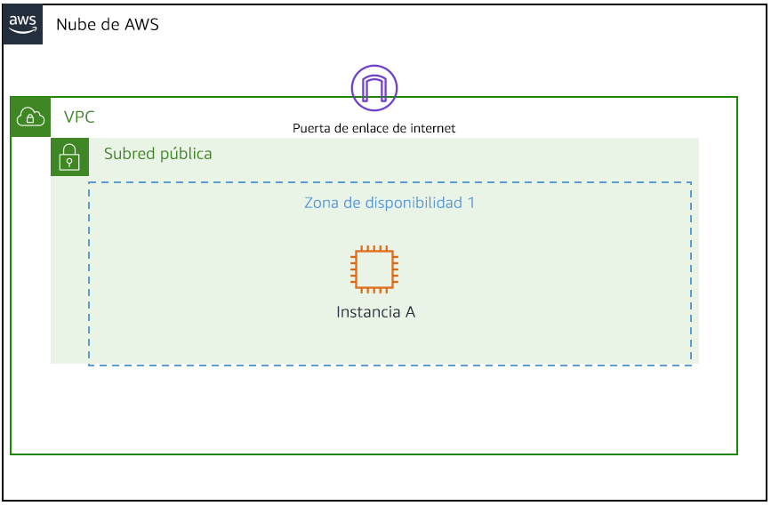

## Objetivos

En esta sesión de laboratorio, hará lo siguiente:

1. Resumir la situación del cliente
2. Analizar la diferencia entre direcciones IP asignadas de manera estática y dinámica mediante las instancias EC2
3. Asignar una IP persistente (estática) a una instancia de EC2
4. Desarrollar una solución para el problema de los clientes analizado en esta sesión de laboratorio. Después de desarrollar una solución, resumir y describir las conclusiones.

### Tarea 1: investigar el entorno del cliente

1. Lanzar una instancia 'test instance' replicando el entorno del cliente
   
    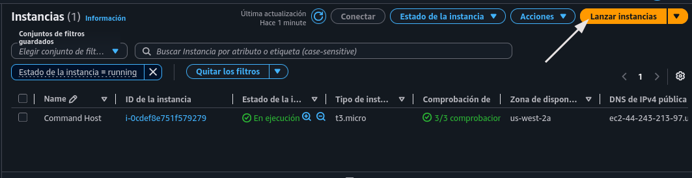
   
    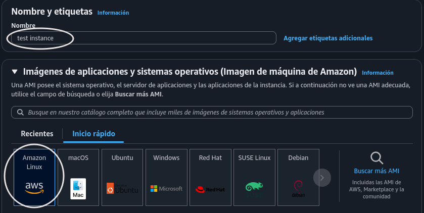
   
    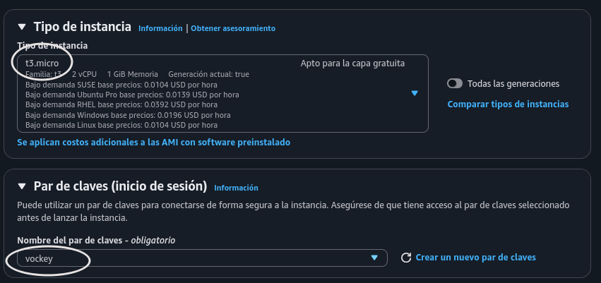
   
    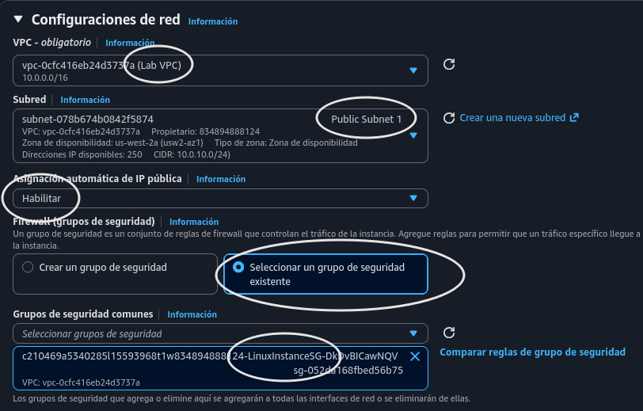
   
    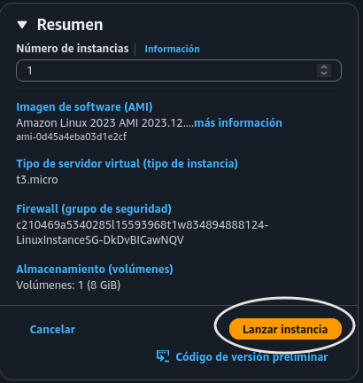
   
    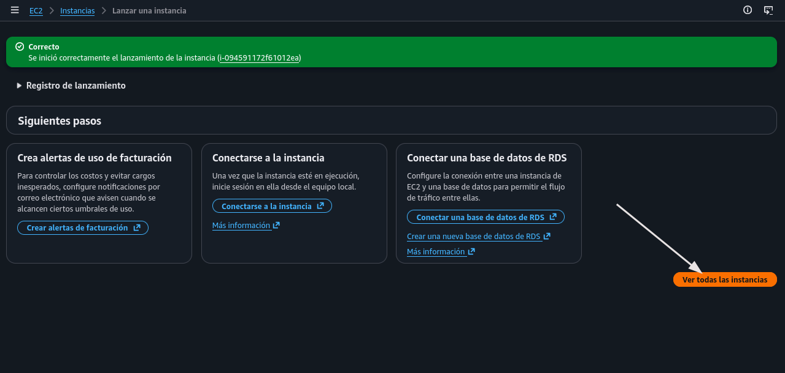

2. Revisar el apartado de redes en 'test instance'
   
    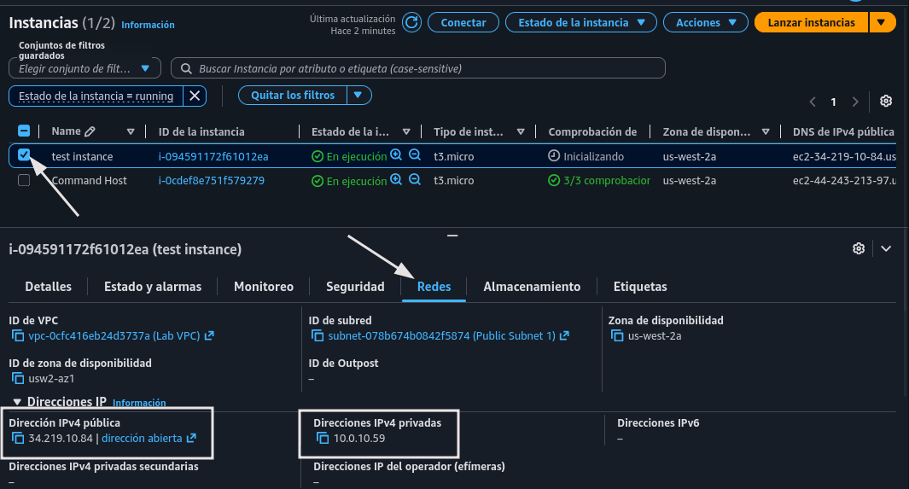
   
   ```
   test instance
   ip pública: 34.219.10.84 
   ip privada: 10.0.10.59
   ```

3. Detener y reiniciar instancia
   
    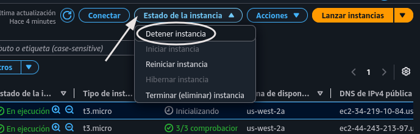
   
    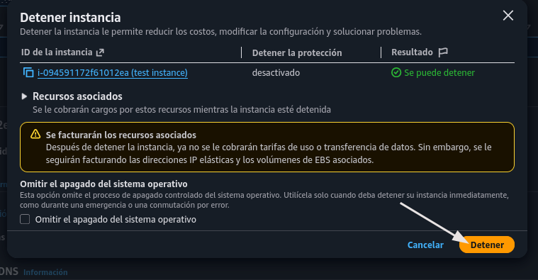
   
    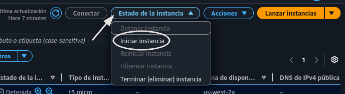

4. Cambio de IP pública
   
    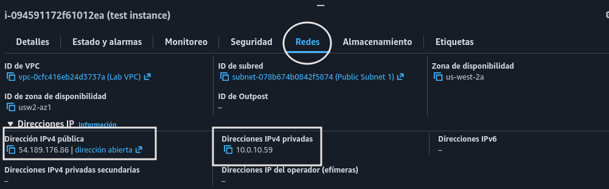
   
    ``ip pública: 34.219.10.84 --> 54.189.176.86  ``

5. Cambio de IP pública:
   
   1. Dirigirse a 'Direcciones IP elásticas' en **Redes y Seguridad**, y asignar dirección IP elástica
      
       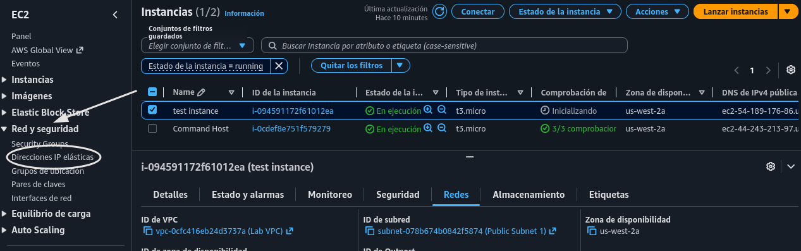
      
       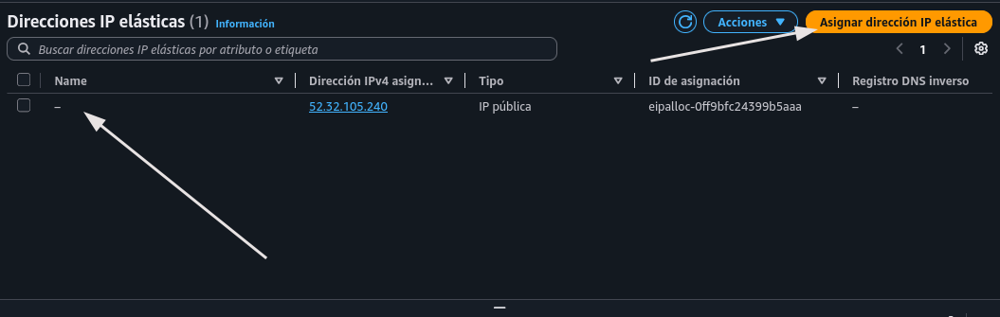
   
   2. Confirmar
      
       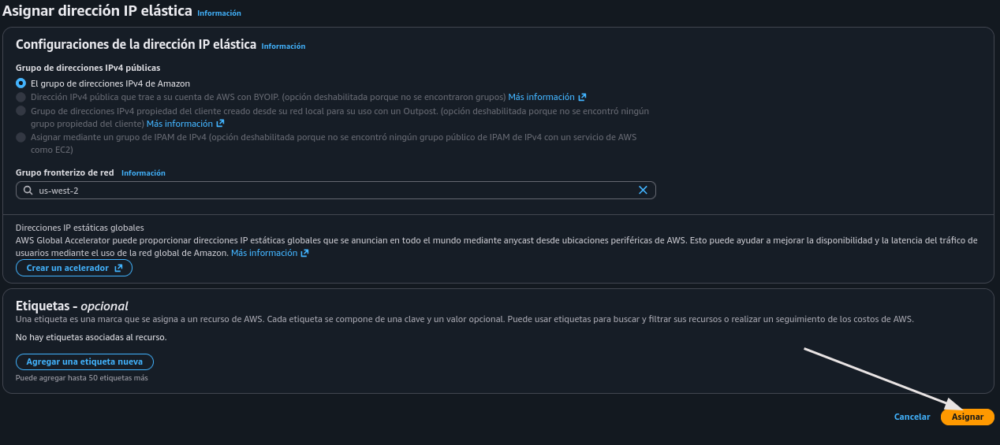
   
   3. Asociar EIP
      
       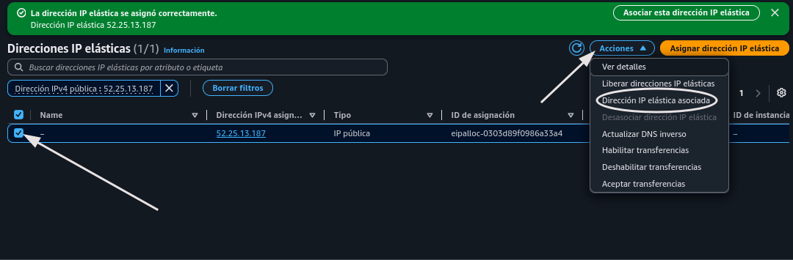
   
   4. Configurar
      
       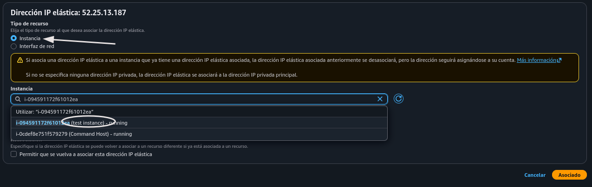
      
       
   
   5. Volver a la  instancia
      
       
   
   6. EIP Asociada 
      
       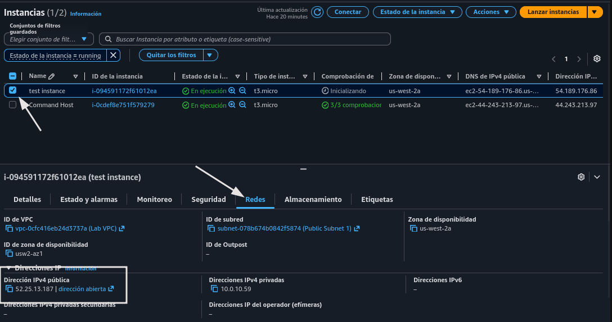

### Tarea 2: enviar la respuesta al cliente (actividad grupal)

Hola, Bob

Replicando el entorno que tienes, no descubrimos nada irregular. Simplemente es que dentro la configuración de red de las instancias al ser creadas, se puede habilitar la "autoasignación de IPv4 pública". Ésta es la forma básica de una instancia para tener dirección IP pública, con la característica de ser dinámica, es decir, cambiará con cada reinicio.   

  La solución directa es crear una IP elástica y asociarla a la instancia. De este modo, ya no rotará la IP pública con cada reinicio. 
