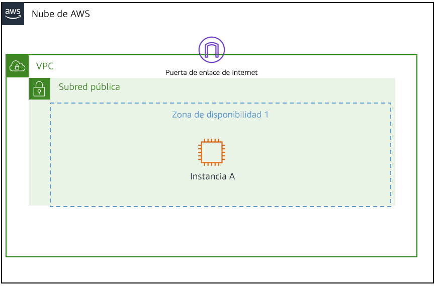
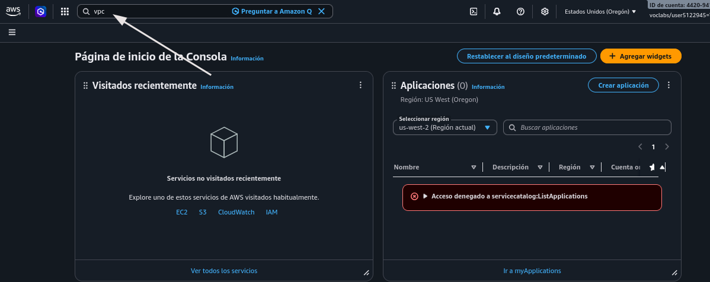
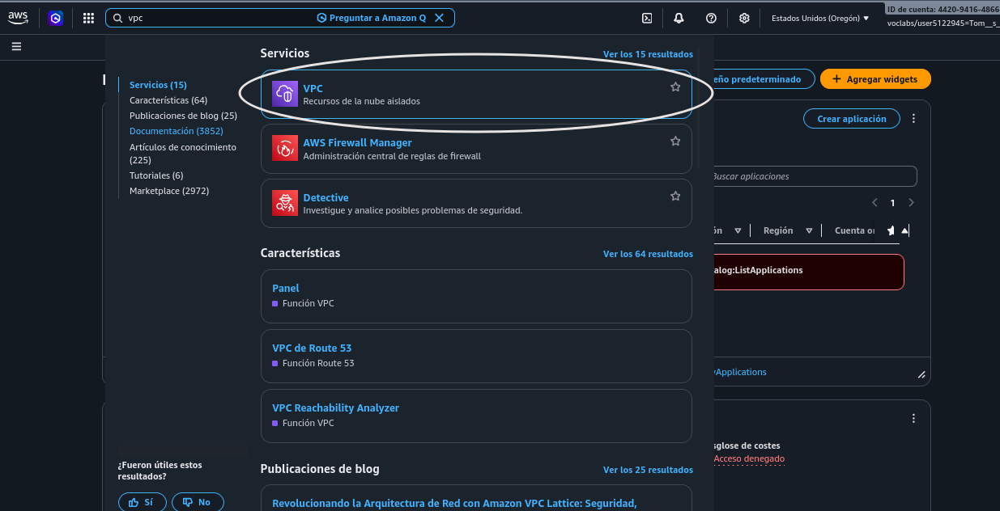
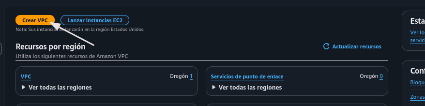
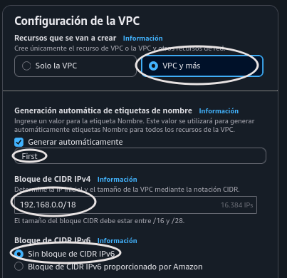
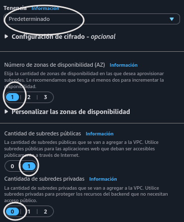
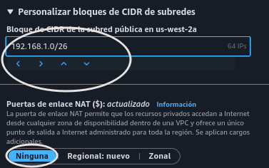
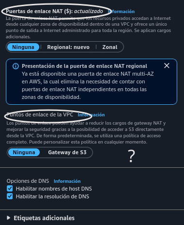
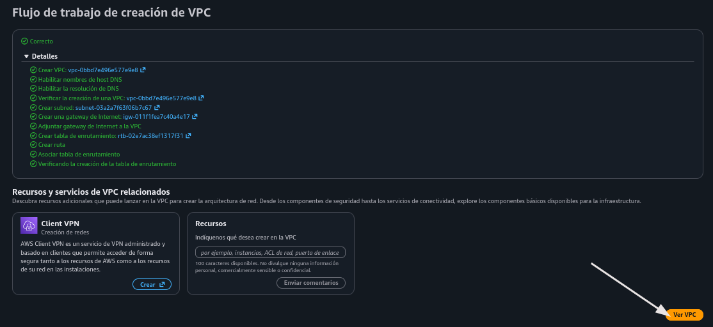

# Lab 263: Creación de subredes y asignación de direcciones IP en una Amazon Virtual Private Cloud (Amazon VPC)

## Objetivos

En esta sesión de laboratorio, hará lo siguiente:

1. Resumir la situación del cliente
2. Crear una Amazon Virtual Private Cloud (Amazon VPC) y aprender a crear subredes y asignar direcciones IP
3. Familiarizarse con la Consola de administración de Amazon Web Services (AWS)
4. Desarrollar una solución al problema del cliente planteado en este laboratorio
5. Resumir y describir los hallazgos (actividad grupal)

## Situación

El rol es el de un ingeniero de soporte en AWS. Durante su turno, un cliente de una empresa emergente solicita asistencia con respecto a un problema de redes que tiene en su infraestructura de AWS. A continuación, figuran el correo y un archivo adjunto de su arquitectura:

Ticket del cliente

    ¡Hola, equipo de soporte en la nube!
    
    Soy nuevo en AWS y necesito ayuda para configurar una VPC. ¿Me pueden ayudar con el 
    proceso de configuración? Me gustaría crear solo la parte de la VPC y que se pareciera
    a la de la siguiente imagen. ¿Me pueden ayudar a garantizar que tenga alrededor de 
    15,000 direcciones IP privadas en esta VPC disponible?  También me gustaría que el 
    bloque de CIDR IPv4 de la VPC sea 192.x.x.x. Sin embargo, no recuerdo cuál es el rango
    privado. ¿Podrían confirmarme eso? También me gustaría asignar, al menos, 50 direcciones
    IP para la subred pública.
    
    Un saludo cordial,
    Paulo Santos
    Propietario de la empresa emergente

Diagrama del cliente

La arquitectura de VPC del cliente consta de una VPC que requiere 15,000 direcciones IP, una puerta de enlace de Internet y una subred pública que requiere 50 direcciones IP

    

### Tarea 1: investigar el entorno del cliente

1. En consola, buscar VPC
   
    
    

2. Crear VPC
   
    
   
   * VPC y más, para crear recursos de redes también, asignando un bloque CIDR IPv4
     
       
   
   * No sé qué es tenencia, pero queda en predeterminado. Sólo una AZ, agregar subred pública, sin subredes privadas
     
       
   
   * Se asigna una porción del bloque CIDR de la VPC. Sin NAT Gateway
     
       
   
   * Tenía dudas aquí. Investigando, entendí mejor la diferencia entre ambas cosas. Entonces, una NAT gateway no es necesario si no hay subred privada. Tampoco lo sería un Gateway de S3 si no estoy usando ese servicio. 
     
       
   
   * Crear
     
       

**Pregunta: ¿Qué configuraciones de VPC cree que se han utilizado en sesiones de laboratorio anteriores?**

Ya que varias veces accedí por ssh de manera remota, probablemente la VPC tenía una subred pública, es decir, una tabla de enrutamiento dirigida a internet con target en Internet Gateway y, obviamente, una IP pública asignada a la instancia EC2 a la que accedí. 

**Pregunta: ¿Por qué cree que hay subredes públicas y privadas?**

Por un tema de seguridad, más que nada. Una subred donde sea necesario y práctico tener una salida a internet, por ejemplo, con un frontend para el usuario final. Y una subred donde no necesite una comunicación directa o, más bien, necesite aislar datos sensibles y aplicaciones o capas que volverían vulnerable el sistema de estar abiertas; de este modo, sólo abriría una 'puerta trasera' para actualizaciones, de modo que nadie pueda establecer conexión con estos servicios dentro de la subred privada. 

**Pregunta: ¿por qué cree que se utilizan las direcciones IP privadas dentro de la VPC?**

Son necesarias para la comunicación entre las distintas instancias que tendrán roles asignados para coordinar una aplicación, y que sería riesgoso hacerlo de manera pública por el viaje de datos sensibles.

### Tarea 2: enviar la respuesta al cliente (actividad grupal)

Hola, Paulo. 

Gracias por contactar al Soporte de AWS.

Paso a responder sus consultas.

* Sobre la Confirmación del Rango Privado (RFC 1918). Para redes privadas que comiencen con 192, el estándar oficial de internet establece que el rango exclusivo para uso privado es 192.168.0.0/16 (desde 192.168.0.0 hasta 192.168.255.255). Utilizar valores como 192.0.x.x o 192.1.x.x podría causar conflictos, ya que son direcciones públicas asignadas en internet.

* Para cumplir con la cantidad de IPs solicitadas, podría asignar a la VPC el bloque CIDR 192.168.0.0/18, que tiene un total de 16,384 direcciones disponibles. Para la subred pública asignar el bloque 192.168.0.0/26 que daría 64 direcciones teóricas. Recordar que AWS reserva 5 direcciones por subred para su infraestructura interna, por lo que quedarían 59 disponibles.

* Según su imagen, para recrear el escenario, la vía más sencilla es agregar una subred pública con el rango ya mencionado, durante la creación de la VPC. En caso de querer saber a detalle cómo se configura una subred pública para futuras configuraciones, le detallo los elementos necesarios:
  
  1. Internet Gateway (IGW): Debe crearlo y adjuntarlo a su VPC para permitir que la subred tenga salida a internet.
  
  2. Tabla de Enrutamiento (Route Table): Debe asociarla a su subred pública y agregar una ruta hacia el destino 0.0.0.0/0 apuntando a su IGW.
  
  3. Subred Pública: Alojada en una sola Zona de Disponibilidad utilizando el bloque /26.
  
  4. Auto-assign Public IP: Asegúrese de activar esta casilla en la configuración de la subred para que su Instancia A reciba una IP pública automáticamente al encenderse.  
  
  5. Mejores Prácticas Recomendadas por AWS: 
     
     * Alta Disponibilidad: En escenarios reales de producción, se recomienda crear subredes en al menos dos Zonas de Disponibilidad (AZ) distintas para tolerar fallos de infraestructura.
     
     * Seguridad: Utilice Grupos de Seguridad (Security Groups) limitando el tráfico solo a los puertos necesarios (por ejemplo, permitir SSH/RDP solo desde su IP pública actual).
     
     Por favor, hágame saber si está de acuerdo con estos bloques CIDR para proceder a guiarle paso a paso en la creación desde la consola o mediante una plantilla.
     
     Sin más que agregar, me despido
     
     tromvn
     AWS Support Engineer
