# Lab 265: Comandos de solución de problemas del protocolo de Internet

## Objetivos

Después de completar este módulo, podrá hacer lo siguiente:

1. Practicar los comandos de solución de problemas
2. Identificar cómo puede usar estos comandos en las situaciones del cliente


## Situación

Es un administrador de red nuevo que soluciona problemas de clientes.


### Tarea 1: Conectarse a una instancia de EC2 de Amazon Linux mediante SSH.

Como en labs anteriores, descargo desde "details" la ip y el archivo .pem, le coloco el nombre del lab: labxxx.pem y accedo por SSH con el comando:

```bash
$ chmod 400 labxxx.pem
$ ssh -i labxxx.pem ec2-user@ip-from-details 

# Responder 'yes' en la 1ra conexión.
```

* Conexión SSH

	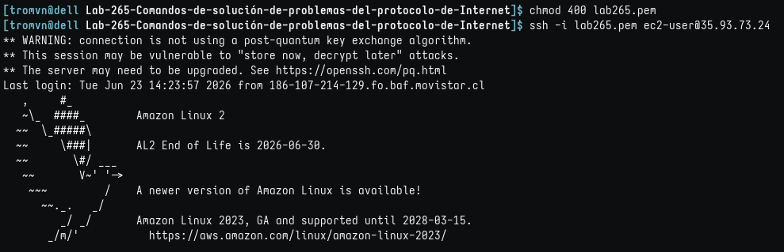


### Tarea 2: Practicar los comandos de solución de problemas

* Recordatorio

Algunas capas tienen comandos relacionados con ellas para ayudar con la resolución de problemas. El siguiente es un ejemplo de cómo fluyen los comandos de solución de problemas con el modelo de interconexión de sistemas abiertos (OSI):

* Modelo OSI y comandos asociados por capas

	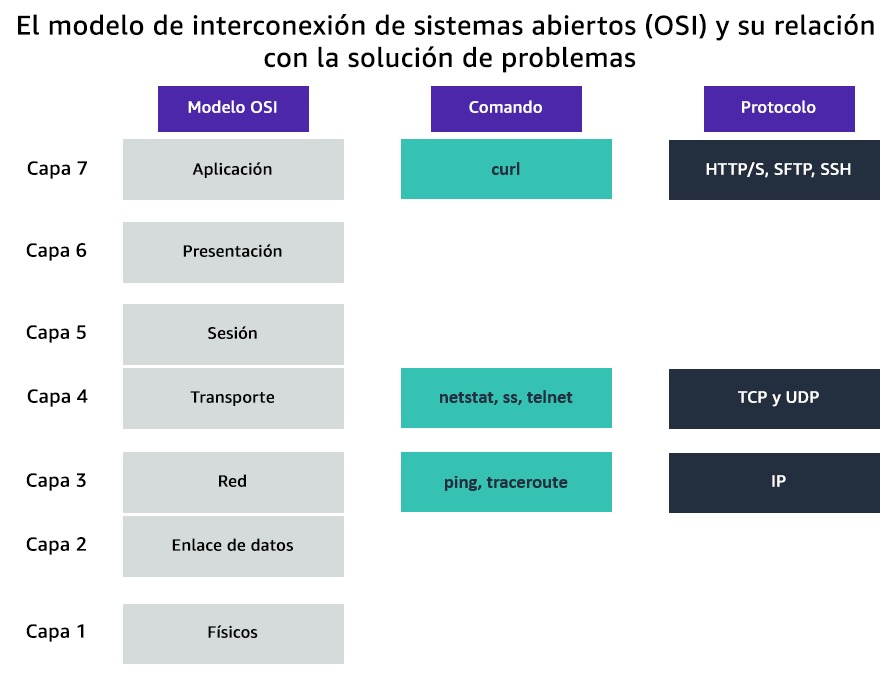


1. Comando ping:
    
       El siguiente es un ejemplo de una situación del cliente en la que puede usar el comando ping:  
         
       El cliente lanzó una instancia de EC2. Para probar la conectividad hacia y desde la instancia, ejecute el comando ping. Puede usar este comando para probar la conectividad y asegurarse de que permite las solicitudes del Protocolo de mensajes de control de Internet (ICMP) en el nivel de seguridad, como grupos de seguridad y ACL de red.

   
```
 En la terminal de Linux, ejecute el siguiente comando y presione Enter:

    ping 8.8.8.8 -c 5

    Este es el comando ping. Cuando ejecuta este comando, puede ingresar una IP o URL seguida de opciones. En este ejemplo, -c significa conteo y 5 representa cuántas solicitudes está solicitando.

```

* Comando ping ejecutado

	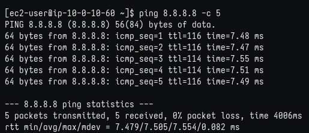

```
Los resultados del comando ping, que son respuestas del servidor 8.8.8.8. Está probando la conectividad IP a un servidor web.
    Figura: el comando ping muestra la conectividad IP a un servidor web.

    Puede usar el comando ping por varias razones, pero la razón más común es probar la conectividad a algo como un servidor. El comando ping envía solicitudes de eco ICMP desde la máquina al servidor al que intenta acceder (por ejemplo, amazon.com). El servidor envía una respuesta de eco con un tiempo de ida y vuelta. Utilice el comando ping sobre todo para solucionar problemas de conectividad y accesibilidad a un objetivo específico. También puede usarlo para activar una red específica si el tráfico necesita fluir de manera continua a través de una red. También puede enviar un ping continuo.
```


2. Comando traceroute


        El siguiente es un ejemplo de una situación del cliente en la que puede usar el comando traceroute:
        
        El cliente tiene problemas de latencia. Dice que su conexión tarda mucho y que pierde paquetes. No está seguro de si está relacionado con AWS o con su proveedor de servicios de Internet (ISP). Para investigar, puede ejecutar el comando traceroute desde su recurso de AWS al servidor al que intentan acceder. Si la pérdida ocurre hacia el servidor, lo más probable es que el problema sea el ISP. Si la pérdida es para AWS, es posible que deba investigar otros factores que pudieran limitar la conectividad de red.

```

    En la terminal de Linux, ejecute el siguiente comando y presione Enter:

    traceroute 8.8.8.8

    Este es el comando traceroute. Puede ingresar una IP o URL seguida de opciones.

    Después de ejecutar este comando, debería ver un resultado similar al siguiente:
```


* Comando traceroute ejecutado

	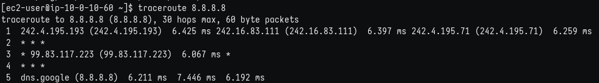

   
```
 La pérdida de paquetes, vista como porcentajes, puede ocurrir en cada salto y esta pérdida por lo general ocurre debido a un problema con la red de área local (LAN) o el ISP del usuario.

    Puede identificar un problema o error cuando fallan los nombres de host y las direcciones IP a ambos lados de un salto. Tres asteriscos (***) indican un salto fallido.

    El comando traceroute informa sobre la ruta y la latencia que toma el paquete para llegar desde la máquina al destino (8.8.8.8). Cada servidor es un salto. Puede haber pérdida de paquetes, vistos como porcentajes, en cada pérdida, que por lo general se debe a la red de área local (LAN) del usuario o al ISP; sin embargo, si la pérdida de paquetes se produce hacia el final de la ruta, lo más probable es que el problema sea la conexión del servidor. Puede identificar un problema o error cuando los nombres de host y las direcciones IP están a ambos lados de un salto fallido, que se ve como tres asteriscos (***).
```


3. Capa 4 (transporte):

	* Comando netstat


       
```
El siguiente es un ejemplo de una situación del cliente en la que puede usar el comando netstat:
       La empresa ejecuta un análisis de seguridad de rutina y descubre que se puso en riesgo uno de los puertos de una determinada subred. Para confirmar, ejecute el comando netstat en un host local en esa subred para confirmar si el puerto escucha cuando no debería hacerlo.    

    En la terminal de Linux, ejecute el siguiente comando y presione Enter:

    netstat -tp

    Este es el comando netstat. Puede utilizar las siguientes opciones:

        netstat -tp: Confirma las conexiones establecidas.

    netstat -tp: Resultados de servicios de escucha.

        netstat -tp: Genera servicios de escucha, pero no resuelve los números de puerto.

    Después de ejecutar este comando, debería ver un resultado similar al siguiente:
```

* Comando netstat ejecutado

	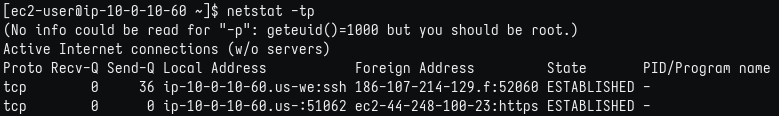

      El comando netstat muestra las conexiones TCP establecidas en la actualidad desde las que el host está escuchando. Cuando se solucionan problemas de red a partir de la máquina que aloja y trabajar hacia afuera, puede ejecutar este comando para comprender qué puertos escuchan y cuáles no. Debido a que este comando le brinda una instantánea de su conectividad de capa 4, el uso de este comando lo ayudará a ganar tiempo cuando intente resolver un problema de red importante.

     

	
	* Comando telnet


   
```
 El siguiente es un ejemplo de una situación del cliente en la que puede usar el comando telnet:

        El cliente tiene un servidor web seguro y tiene configuradas reglas de grupo de seguridad personalizadas y reglas de ACL de red. Sin embargo, les preocupa que el puerto 80 esté abierto a pesar de que muestra que su configuración de seguridad indica que su grupo de seguridad bloque este puerto, puede ejecutar el comando telnet 192.168.10.5 80 para asegurarse de que se rechace la conexión.

    En la terminal de Linux, ejecute el siguiente comando y presione Enter para instalar telnet:

    sudo yum install telnet -y

    En la terminal de Linux, ejecute el siguiente comando y presione Enter:

    telnet www.google.com 80

    Este es el comando telnet. Puede ingresar una IP o URL seguida del número de puerto para conectarse a ese puerto.

    Después de ejecutar este comando, debería ver un resultado similar al siguiente:
```


* Instalar y ejecutar Telnet

	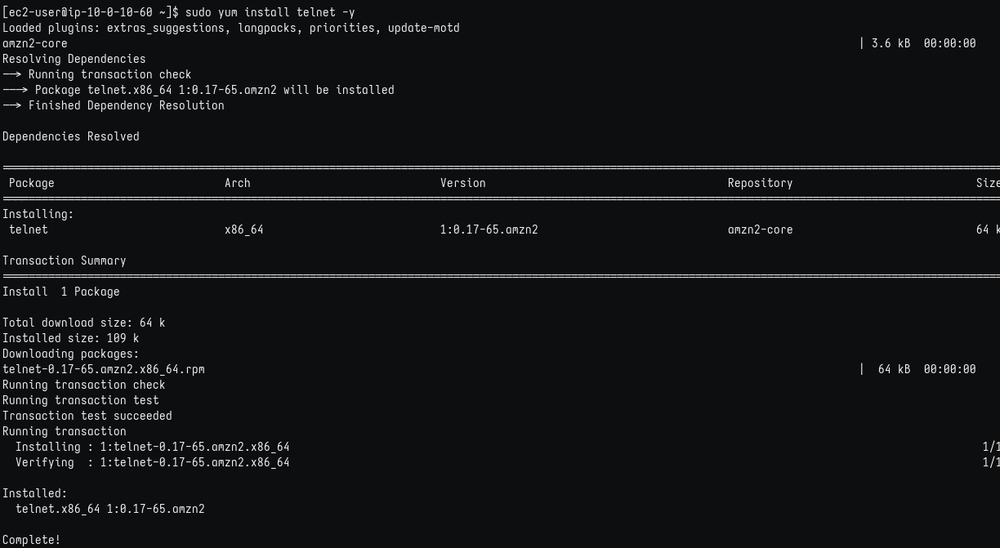
	
	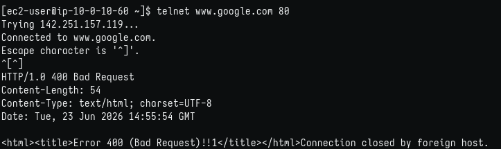

```
    El resultado del comando telnet, que confirma la conexión TCP a un servidor web. Una solicitud HTTP se realiza mediante el comando telnet.
    Figura: el comando telnet confirma la conexión TCP a un servidor web. Realiza las solicitudes HTTP mediante el comando telnet.

    El comando telnet confirma la conexión TCP a un servidor web que realiza una solicitud HTTP si usa el puerto 80 para el comando telnet. También puede utilizar este comando en la capa 7. Si puede conectarse con éxito al servidor web, entonces no hay nada que le impida a usted o al servidor conectarse. Si la conexión falla con un mensaje como “conexión rechazada”, es probable que algo bloquee la conexión, como un firewall o un grupo de seguridad. Si la conexión falla con un mensaje como “tiempo de conexión agotado”, entonces el problema puede ser que no haya ruta de red o conectividad.  
```


4. Capa 7 (aplicación): el comando curl

```
 El siguiente es un ejemplo de una situación del cliente en la que puede usar el comando curl:

        El cliente tiene un servidor Apache ejecutándose y quiere probar si está recibiendo una solicitud exitosa (200 OK), lo que indica que su sitio web se está ejecutando de manera correcta. Puede ejecutar una solicitud del comando curl para ver si el servidor Apache del cliente devuelve una respuesta 200 OK.   

    En la terminal de Linux, ejecute el siguiente comando y presione Enter:

    curl -vLo /dev/null https://aws.com

    Este es el comando curl. Puede utilizar las siguientes opciones de comando:

    -I: Esta opción proporciona información de encabezado y especifica que el método de solicitud es Head.
    -i: Esta opción especifica que el método de solicitud es GET.
    -k: Esta opción le dice al comando que ignore los errores de SSL.
    -v: Estas opciones son detalladas. Muestra lo que hace el equipo o lo que está cargando el software durante el inicio.
    -o /dev/null: Esta opción enviará HTML y CSS en respuesta a nulo.

    Después de ejecutar este comando, debería ver un resultado similar al siguiente:
```

* Comando curl ejecutado

	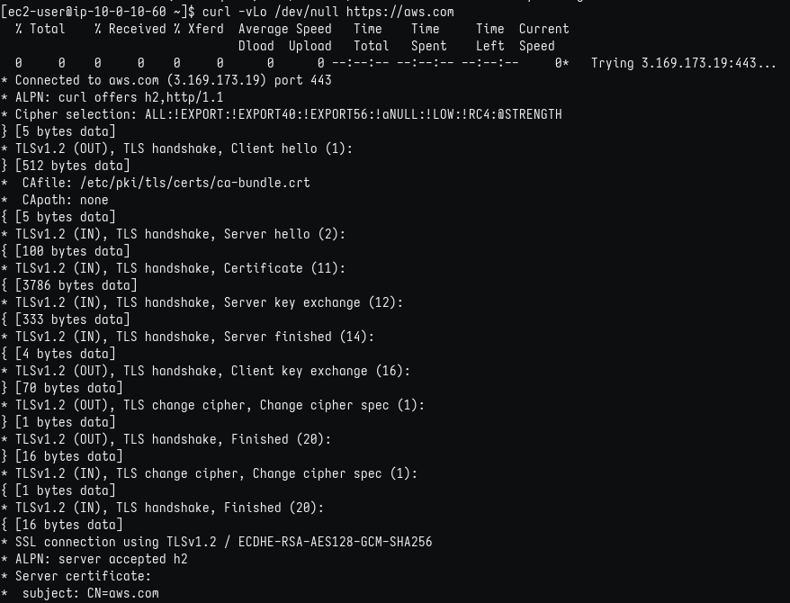

	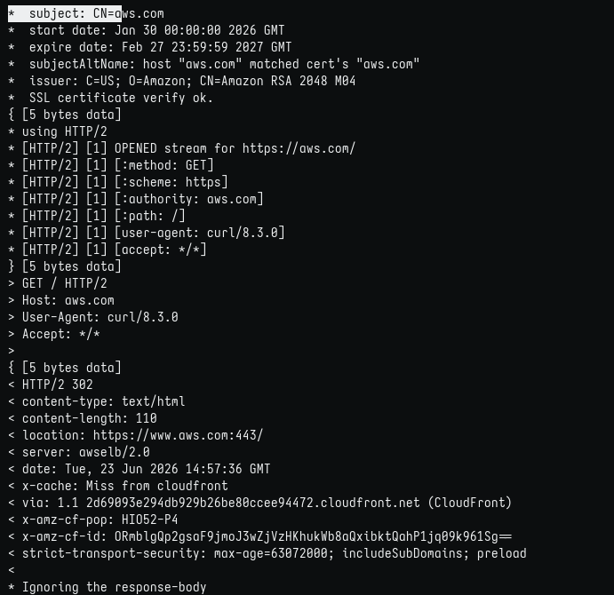
	
	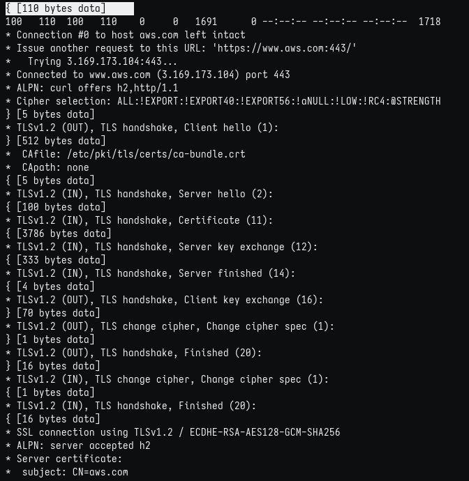
	
	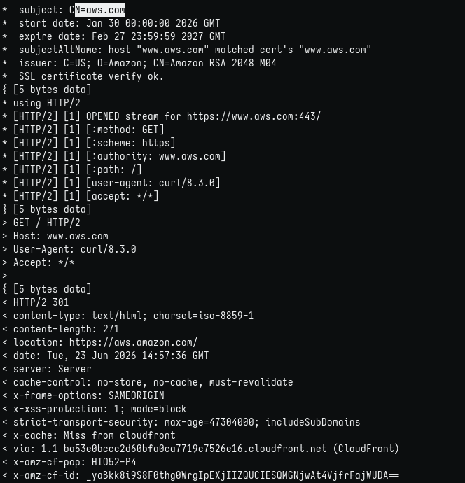
	
	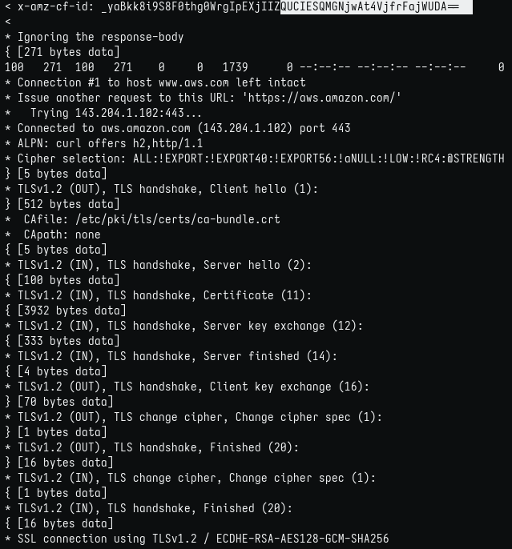
	
	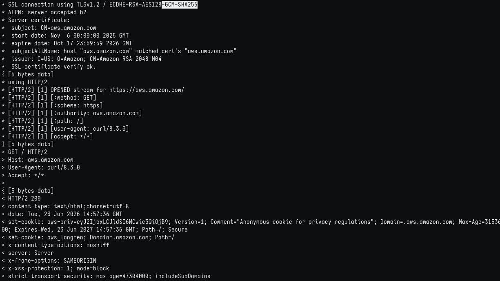
	
	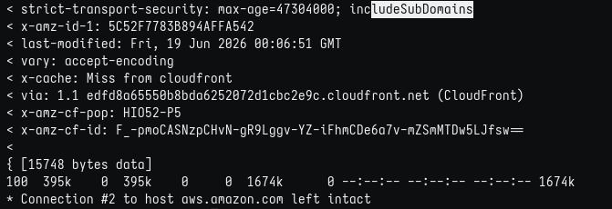

    
```
Los resultados de curl: en este ejemplo, la salida prueba la conexión a un servicio web, como AWS, y envía la solicitud HTTP.
    Figura: los resultados del comando curl: la salida prueba la conexión a un servicio web, como AWS, y envía la solicitud HTTP.

    Puede usar el comando curl para transferir datos entre usted y el servidor. El comando curl puede usar muchos protocolos diferentes, pero los más comunes son HTTP y HTTPS. Puede usar el comando curl para solucionar problemas de comunicación desde el dispositivo local a un servidor.    
```
