# Lab 266: Solución de problemas de red

## Objetivos

Después de completar este módulo, podrá hacer lo siguiente:

1. Analizar la situación del cliente
2. Solucionar el problema

## Situación

Usted es un ingeniero de soporte en la nube en Amazon Web Services (AWS). Durante su turno, una empresa de consultoría tiene un problema de red dentro de su infraestructura de AWS. El siguiente es el correo y un archivo adjunto con respecto a su arquitectura:
Correo del cliente

``` 
	¡Hola, equipo de soporte en la nube!

    Cuando creo un servidor Apache a través de la línea de comandos, no puedo hacerle ping. También recibo un error cuando ingreso la dirección IP en el navegador. ¿Pueden ayudarme a averiguar qué está bloqueando mi conexión?

    Gracias.

    Ana
    Contratista
```


* Arquitectura

	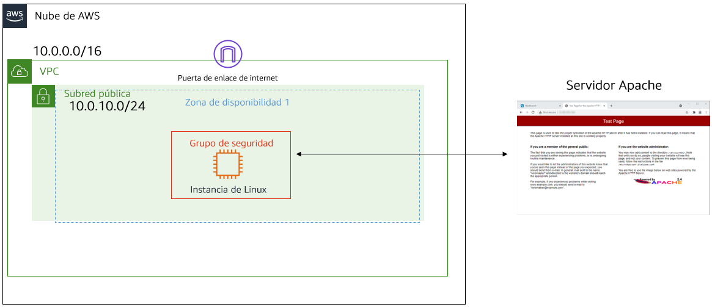


### Tarea 1: Conectarse a una instancia de EC2 de Amazon Linux mediante SSH.

Como en labs anteriores, descargo desde "details" la ip y el archivo .pem, le coloco el nombre del lab: labxxx.pem y accedo por SSH con el comando:

```bash
$ chmod 400 labxxx.pem
$ ssh -i labxxx.pem ec2-user@ip-from-details 

# Responder 'yes' en la 1ra conexión.
```

1. Conexión SSH

	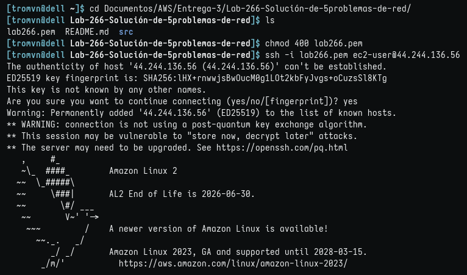

### Tarea 2: Instalar httpd

Para esta tarea, instale httpd antes de verificar los recursos del cliente.

En la situación, Ana, la clienta que solicita asistencia, no puede acceder a su servidor Apache ni conseguir que se cargue de manera correcta en una página web desde su nube virtual privada (VPC).

Usted tiene una réplica exacta de la VPC y sus recursos para solucionar el problema.

2. Instalar y configurar httpd

	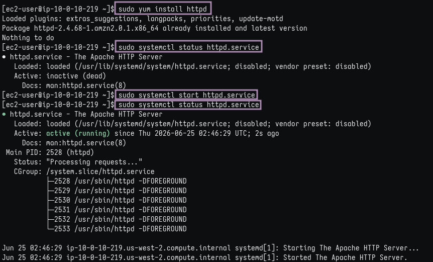

### Tarea 3: investigar la configuración de la VPC del cliente

Para esta tarea, investigará la VPC del cliente y sus recursos.

En la situación, Ana, la clienta que solicita asistencia, no puede comunicarse con su servidor Apache a pesar de que está activo. Tiene una réplica exacta de la VPC y sus recursos. Tenga en cuenta el error que recibió cuando intentó cargar Apache en el navegador web mientras soluciona este problema.

3. Servidor no carga

	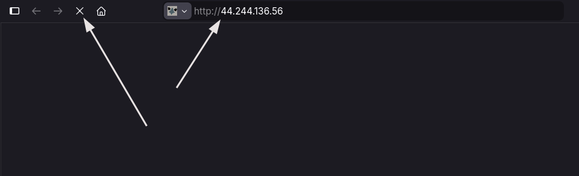
	
4. VPC no bloquea acceso público

	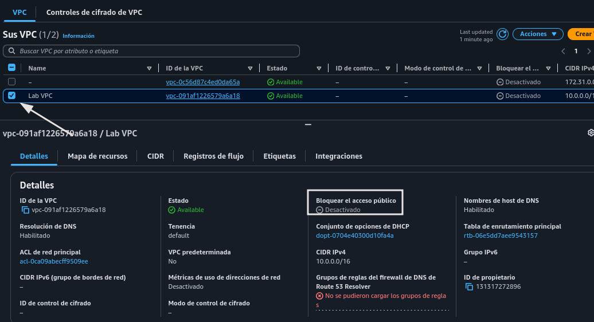
	
5. NACL permite el tráfico en Public Subnet 1

	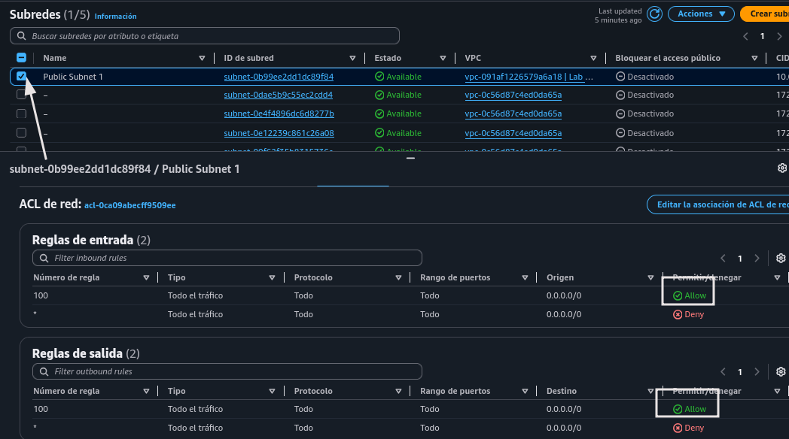

6. Tabla de enrutamiento dirige a Internet Gateway

	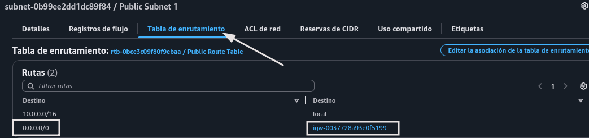
	
7. Subred asociada tampoco bloquea acceso público

	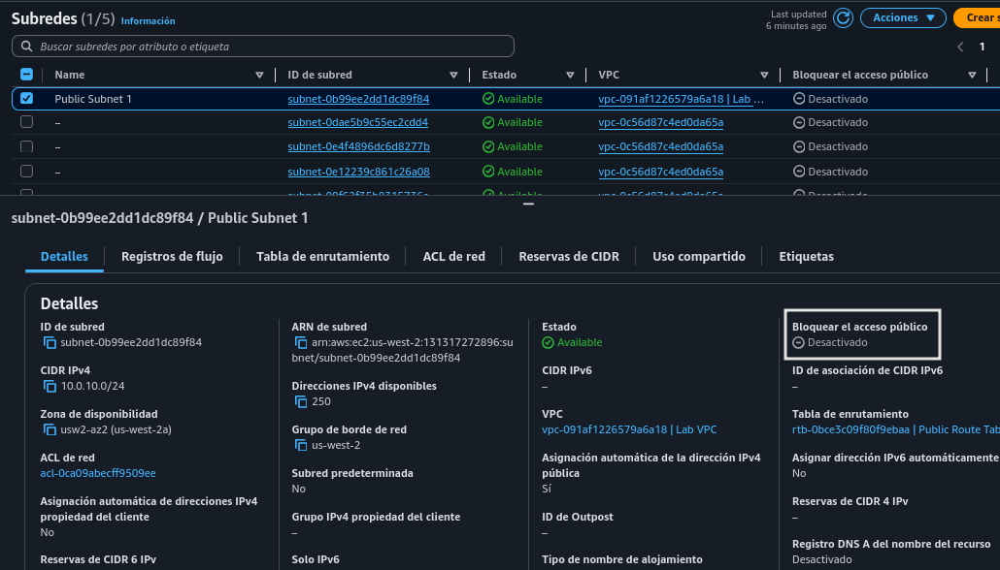
	
8. 'Public Route Table' asociada a 'Public Subnet 1'

	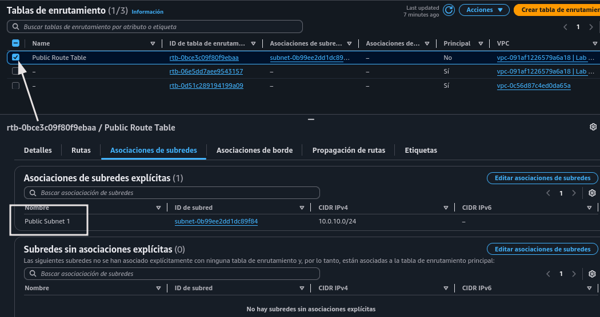
	
	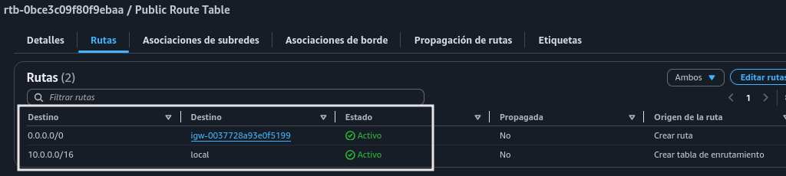
	
9. NACL asociada a Public Subnet 1

	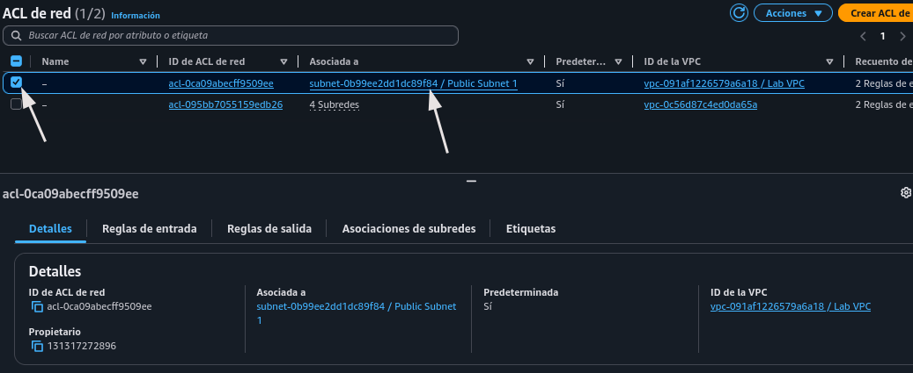
	
10. NACL Reglas de entrada y salida

	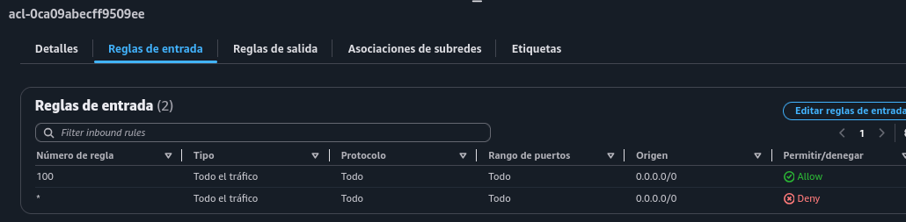
	
	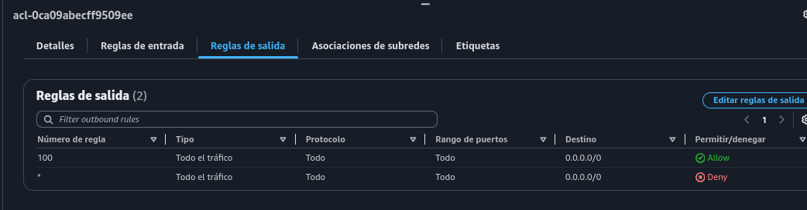
	

11. Instancia y SG asociada

	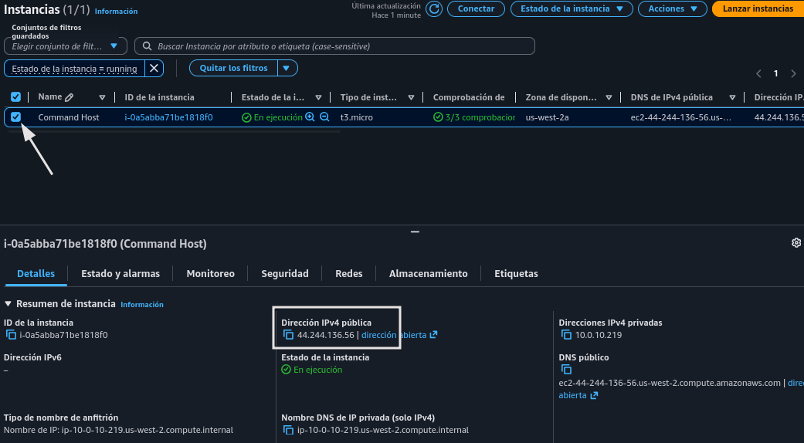
	
	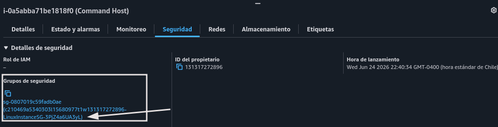
	
12. Consola de SG y configurar salida

	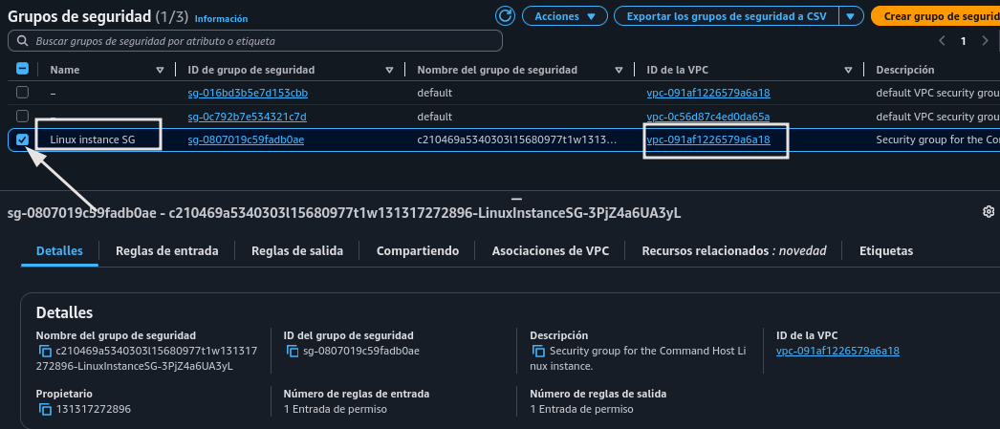

	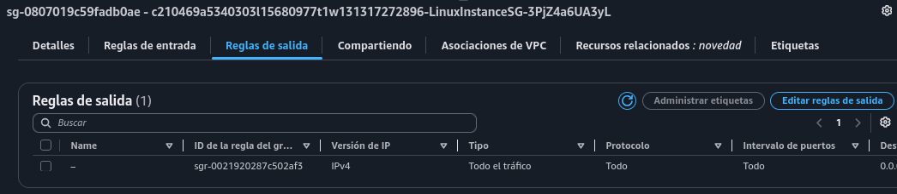


13. Sin problema con ping

	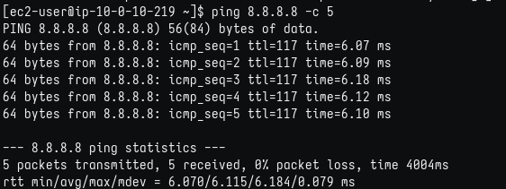
	
14. Configurar entrada de SG

	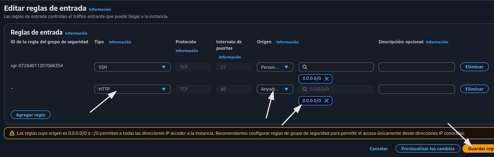
	
15. Prueba en navegador

	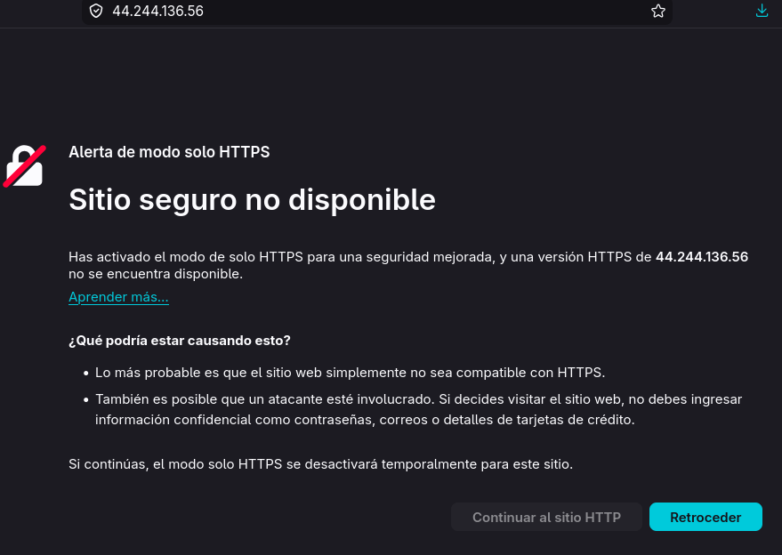
	
	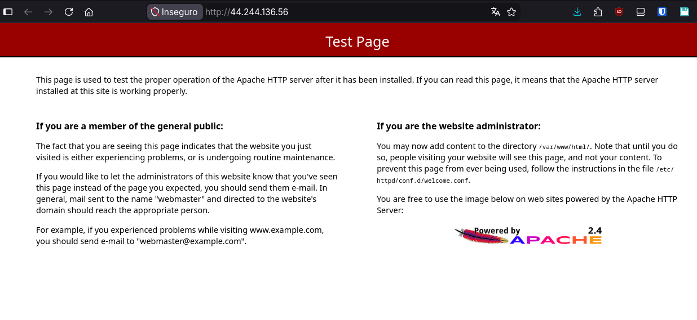

#### Resumen

En este laboratorio, solucionó el problema de redes del cliente. Descubrió que el cliente tenía un problema con los puertos de seguridad en el grupo de seguridad. Después de arreglar el problema, fue capaz de cargar el servidor Apache correctamente.

