# Lab 276: Endurecimiento de la red

## Información general sobre el laboratorio

En este laboratorio, utilizará Amazon Inspector para buscar vulnerabilidades en sus recursos de AWS, específicamente en las funciones de AWS Lambda. Aprenderá a activar Amazon Inspector, interpretar los informes de vulnerabilidad y corregir los hallazgos.

## Situación

Los desarrolladores de Una Empresa se encuentran en las fases iniciales de creación de una aplicación que utiliza principalmente AWS Lambda. Durante todo el proceso de desarrollo, necesitan una herramienta de seguridad automatizada que no solo analice en busca de paquetes de software vulnerables, sino que también analice el código en sí. Decide utilizar Amazon Inspector para cubrir esta necesidad.

Amazon Inspector cumple los requisitos de poder analizar las funciones de AWS Lambda respondiendo rápidamente a las nuevas implementaciones. También analiza automáticamente los recursos adicionales, como las instancias de EC2 y los ECR de Amazon, dentro de la cuenta de AWS de Una Empresa.
Objetivos

Después de completar este laboratorio, podrá realizar lo siguiente:

1. Activar Amazon Inspector.
2. Analizar e interpretar los hallazgos de vulnerabilidades.
3. Corregir las vulnerabilidades encontradas por Amazon Inspector.

## Entorno del laboratorio

El entorno tiene funciones de Lambda con vulnerabilidades que, posteriormente, Amazon Inspector analizará y notificará según su gravedad.

### Tarea 1: activar Amazon Inspector

1. Consola Inspector
   
    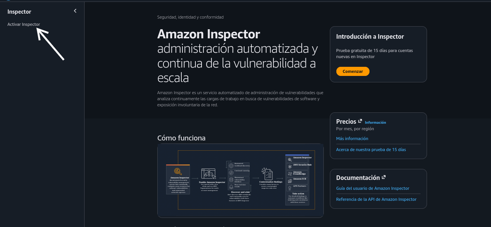

2. Activar
   
    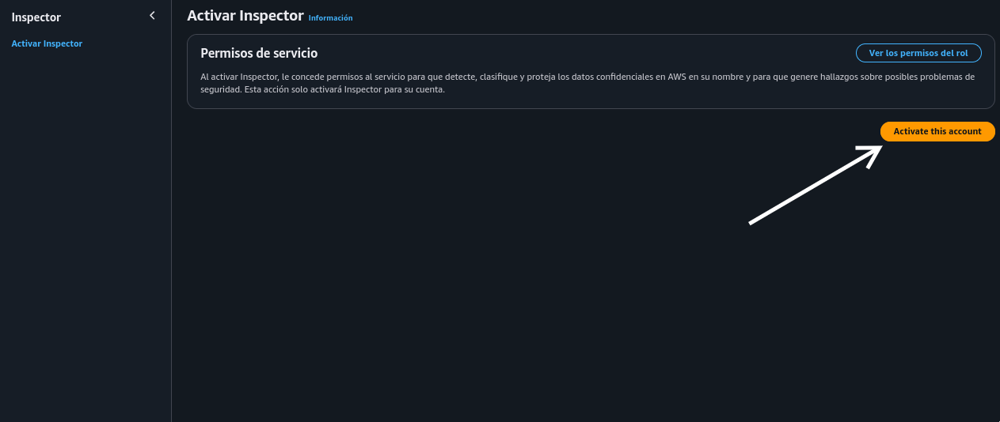

3. Funciones de lambda
   
    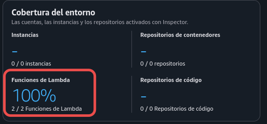

### Tarea 2: revisión de los recursos inspeccionados

4. Hallazgos en Inspector
   
    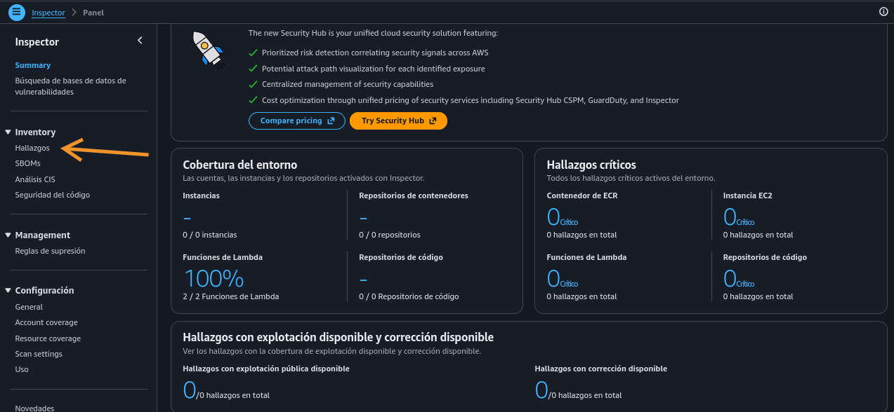
   
    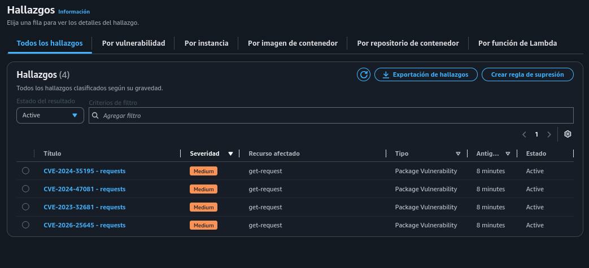
   
    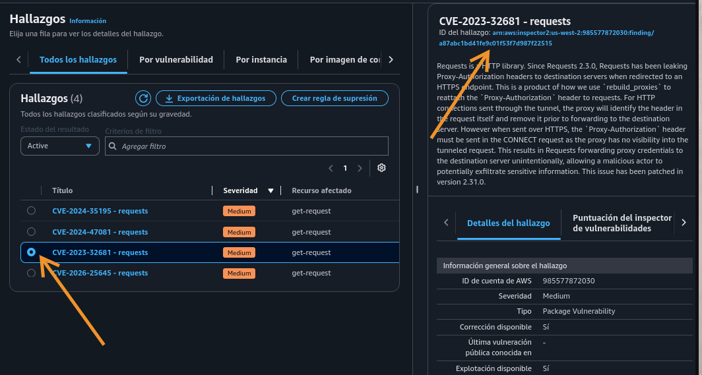
   
   * Revisión de las funciones de lambda
     
       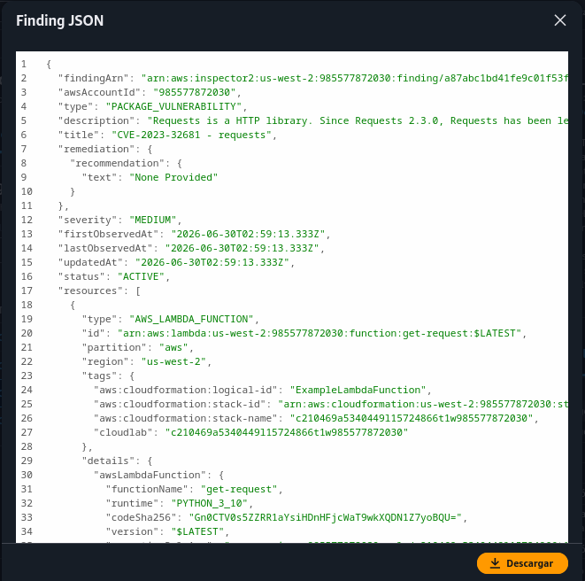
   
   * Correción propuesta por Inspector
     
       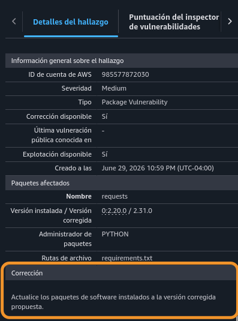

5. Consola Lambda
   
    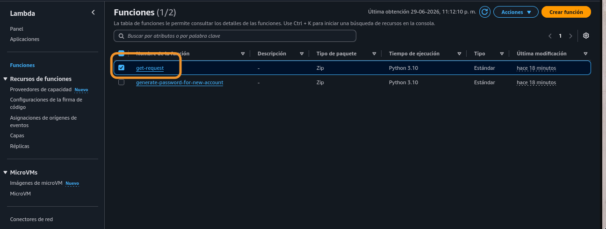

### Tarea 3: corrección de los hallazgos de vulnerabilidades

6. Revisar archivo requirements.txt en el código, y corregir
   
    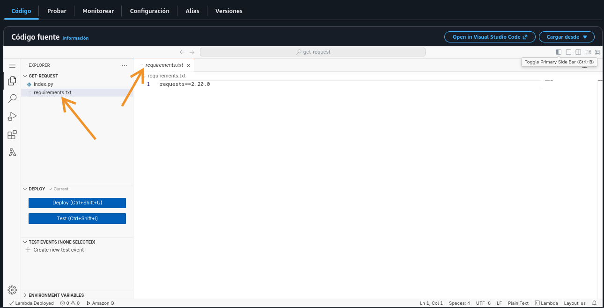
   
   * Luego de la correción, hacer click en Deploy
     
       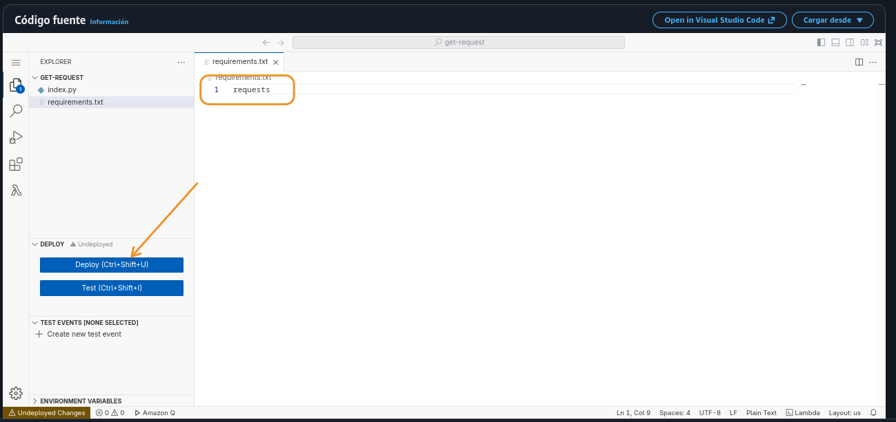

7. Revisar con el filtro "closed"
   
    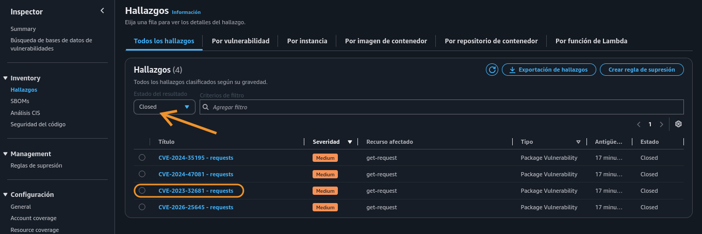
   
    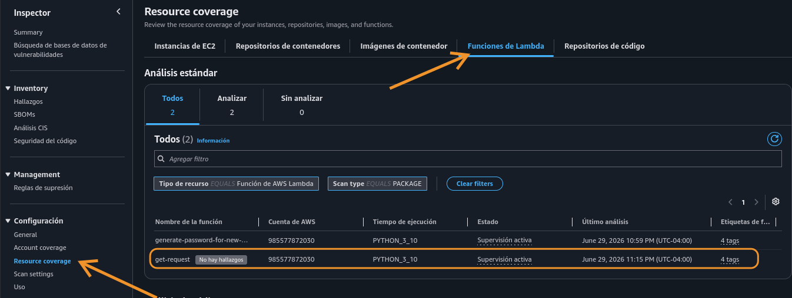
