# Lab 277: Endurecimiento de sistemas

## Información general sobre el laboratorio

En organizaciones con cientos e incluso miles de estaciones de trabajo, puede ser logísticamente difícil mantener todo el software de sistemas operativos (SO) y de aplicaciones actualizado. En la mayoría de los casos, las actualizaciones de SO en las estaciones de trabajo se pueden aplicar automáticamente mediante la red. Sin embargo, los administradores deben tener una política de seguridad clara y un plan de referencia para asegurarse de que todas las estaciones de trabajo esté funcionando en una versión mínima del software.

En este laboratorio, usará gerente de parches, una funcionalidad de AWS Systems Manager, para crear una línea de base de revisiones. A continuación, usará la línea de base de revisiones para escanear las instancias de Amazon Elastic Compute Cloud (Amazon EC2) para Windows que se crearon previamente para este laboratorio. También utilizará la línea de base de revisiones predeterminada para aplicar parches a las instancias de EC2 de Linux.

## Objetivos

Después de completar este laboratorio, podrá realizar lo siguiente:

1. Aplicar parches a instancias de Linux usando la línea de base predeterminada
2. Crear una línea de base de revisiones personalizada 
3. Utilizar grupos de parches para aplicar parches a las instancias de Windows mediante una línea de base de revisiones personalizada 
4. Verificar el cumplimiento de los parches

## Entorno del laboratorio

El entorno actual tiene seis instancias de EC2: tres instancias con el SO Linux y tres con el SO Windows.

Todos los componentes de backend, como las instancias de EC2, los roles de AWS Identity and Access Management (AWS IAM) y algunos servicios de AWS, ya están construidos en su laboratorio.

### Tarea 1: Aplicar parches a instancias de Linux usando la línea de base predeterminada

1. Consola de Systems Manager

	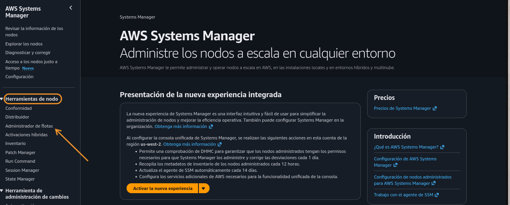
	
2. Administrador de flotas

	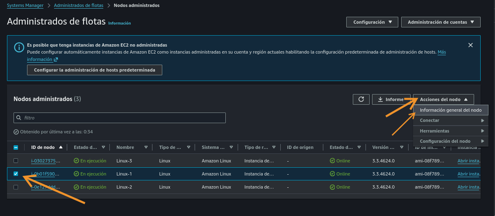
	
3. Detalles de instancia Linux-1

	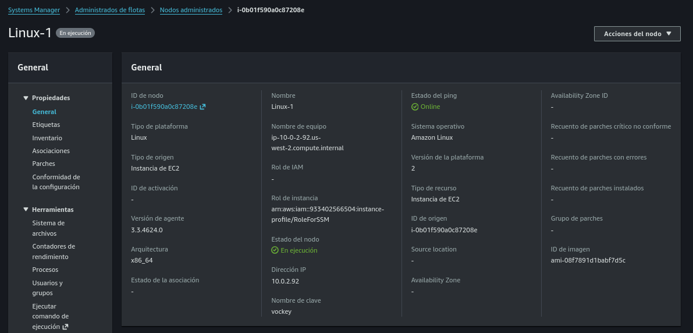
	
4. Patch Manager

	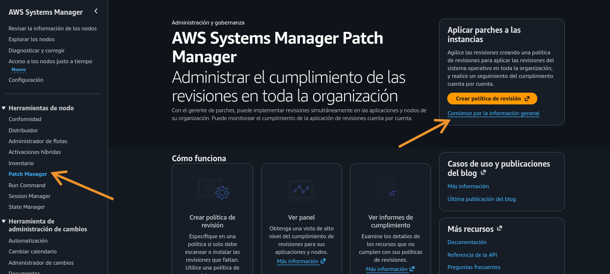
	
	* Aplicar parches ahora
	
		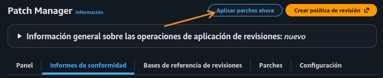
		
	* Configurar y aplicar parche
	
		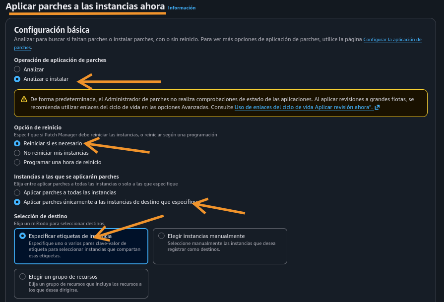
		
		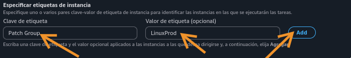

5. Resumen
	
	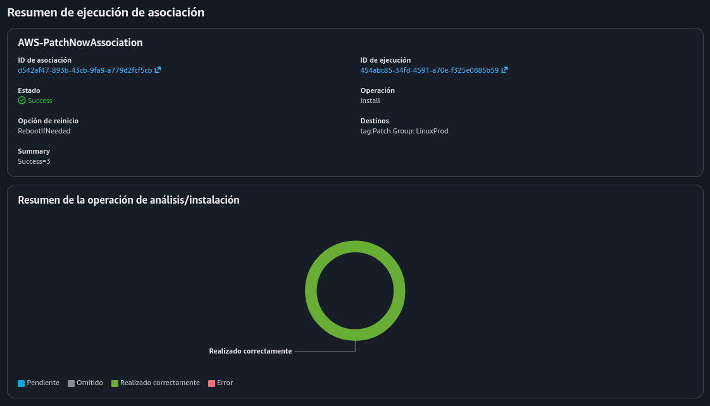
	
	

### Tarea 2: Crear una línea de base de revisiones personalizada para las instancias de Windows

1. Base de referencia

	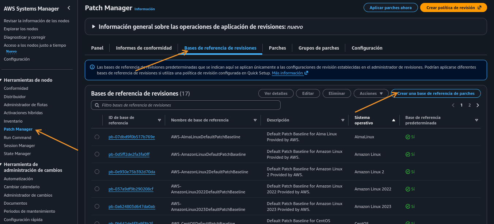
	
2. Configurar y crear punto de referencia de parches

	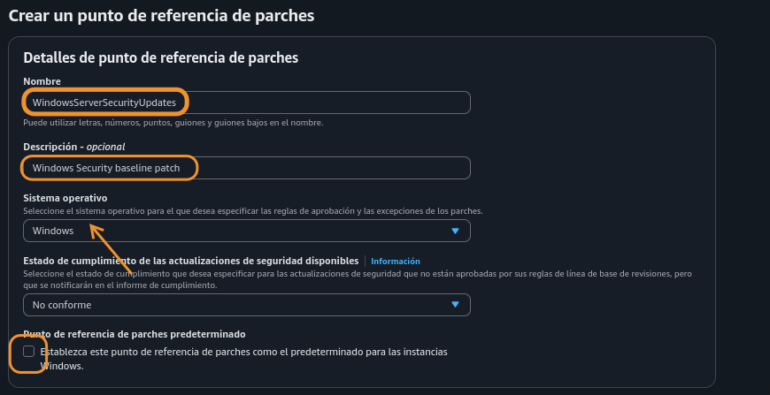
	
	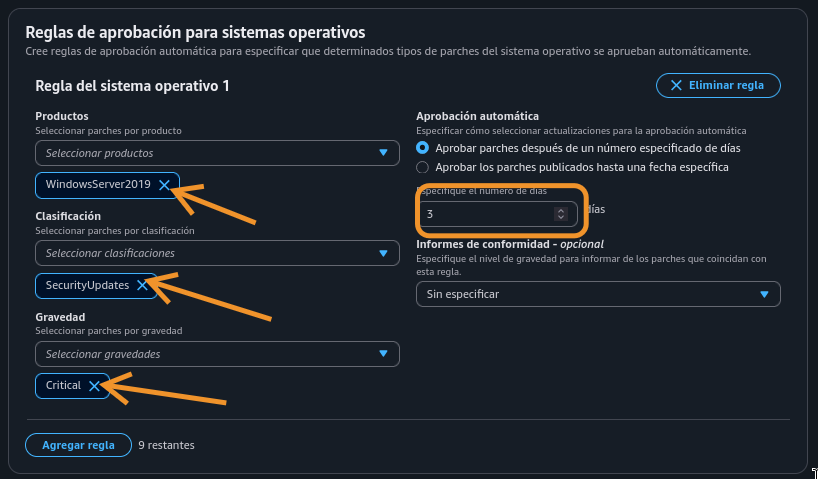
	
3. Volver a la Base de referencias (página 2)

	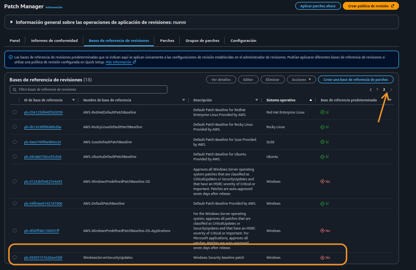
	
	* Acciones, modificar grupos de parches
	
		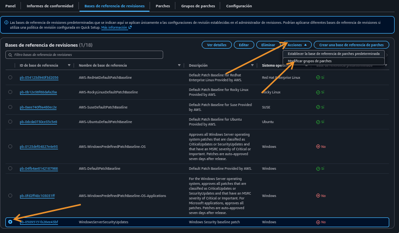

		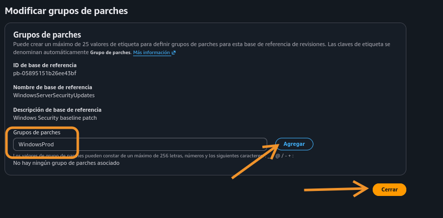
		
4. Consola de EC2, agregar etiquetas

	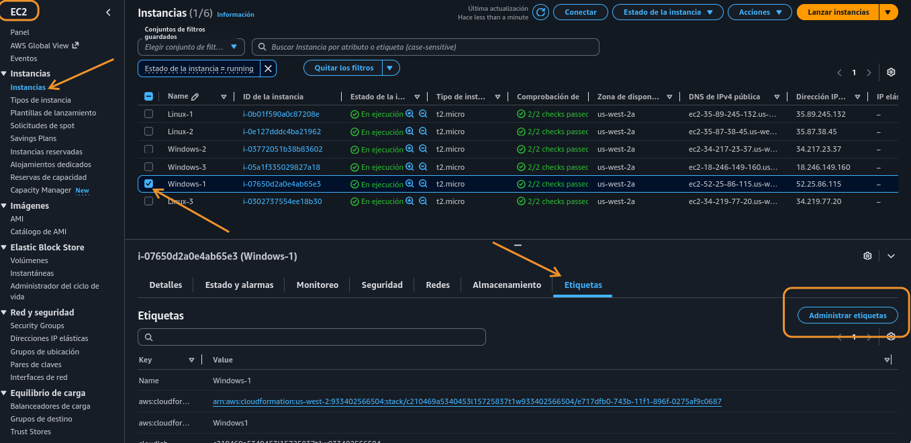
	
	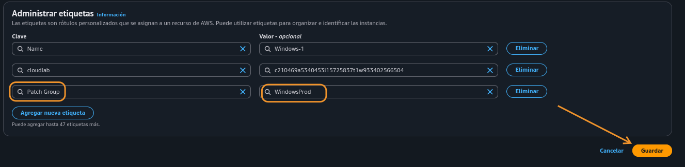
	
### Tarea 3: Aplicar parches a las instancias de Windows

1. Aplicar parches en Patch Manager (Systems Manager)

	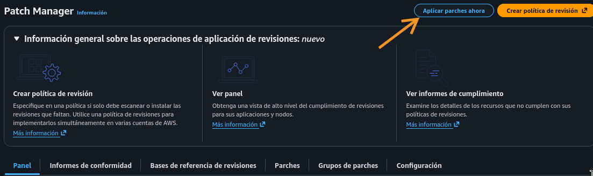
	
	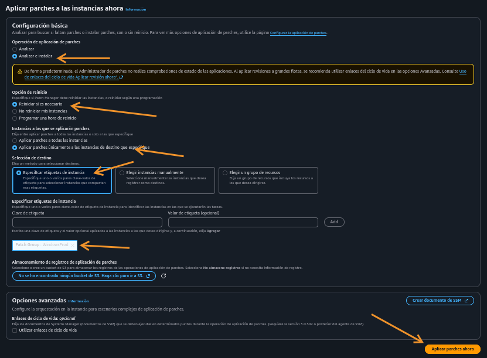
	
2. En el resumen de ejecución de asociación, ver ID de ejecución

	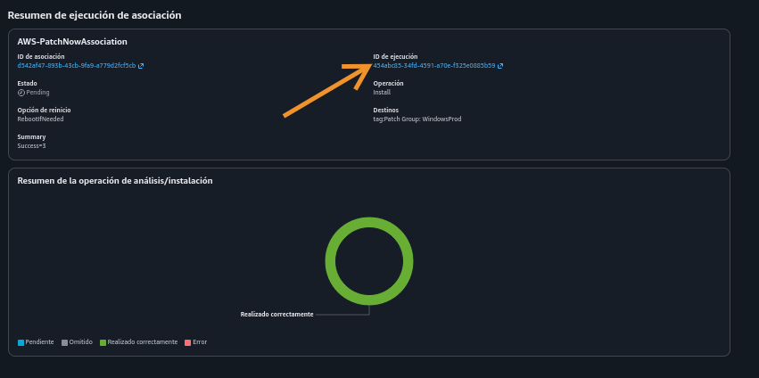
	
	* Pasó algo raro, me apareció el Patch Group de Linux
	
		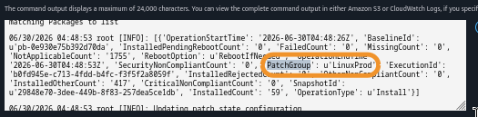

Tarea 4: Verificar el cumplimiento
	
1. Resumen de conformidad en Patch Manager

	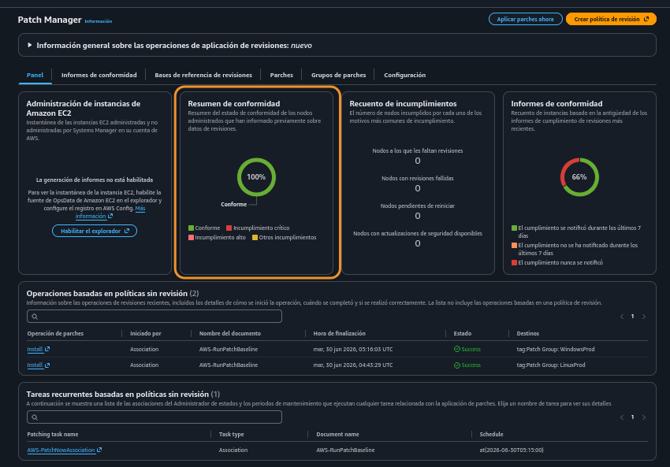
	
	
* Volví a hacer el laboratorio, siendo más riguroso con los pasos y sucedió que en el PatchNowAssociation, que está en la sección de abajo del dashboard de Patch Manager, llamado 'Tareas recurrentes basadas en políticas sin revisión', elegí una instancia Linux en lugar de una Windows. Aquí ya aparece el PatchGroup: WindowsProd y los parches actualizados.

	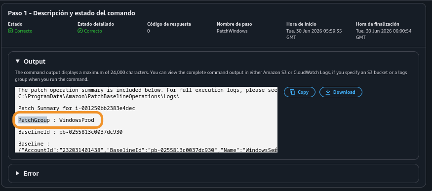
	
	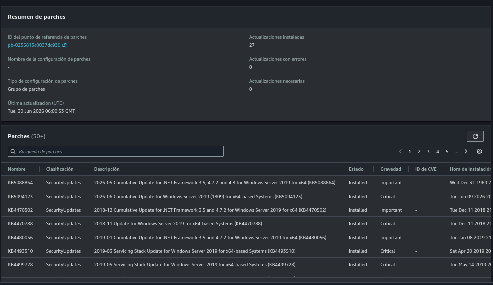

    En el panel de navegación izquierdo, en Administrador de nodos, elija gerente de parches.

    Seleccione la pestaña Panel. En Resumen de conformidad, ahora podrá ver Conforme: 6, que verifica que todas las instancias de Windows y Linux están en conformidad.

    Seleccione la pestaña Informes de conformidad. 
     Este laboratorio proporciona información general de todas las instancias en ejecución de SSM. Podrá comprobar que el Estado de conformidad de todas las instancias de Linux y Windows es  Conforme.

        Las seis instancias (tres de Linux y tres de Windows) deberían mostrarse como compatibles.

        Desplácese hacia la derecha en el panel Detalles de revisiones en nodos para encontrar cada instancia:

            Recuento de incumplimientos críticos

            Recuento de incumplimientos de seguridad

            Otros recuentos de incumplimiento

            Fecha de la última operación 

            ID de la línea base 

        Elija el ID de nodo de uno de los nodos de Windows.

        En la página ID de nodo que se abrirá, seleccione la pestaña Parche.

        Desplácese hacia abajo y observe qué parches se aplicaron a esta instancia, además de la hora de instalación.

Conclusión

 Felicitaciones. Aprendió a realizar correctamente lo siguiente:

    Instancias Linux con parches usando la línea de base predeterminada.

    Creó una línea de base de revisiones personalizada.

    Usó grupos de parches para aplicar parches a instancias de Windows mediante una línea de base de revisiones personalizada.

    Verificó el cumplimiento de los parches.

Laboratorio completado

    Seleccione  End Lab (Finalizar laboratorio) en la parte superior de esta página y, a continuación, seleccione Yes (Sí) para confirmar que desea finalizar el laboratorio.

    Aparece de manera breve el mensaje Ended AWS Lab Successfully (El laboratorio de AWS finalizó correctamente), que indica que concluyó el laboratorio.

Para más información sobre AWS Training and Certification, consulte AWS Training and Certification (Capacitación y certificación de AWS).

Sus comentarios son bienvenidos y valorados.

Si desea compartir alguna sugerencia o corrección, proporcione los detalles en nuestro Formulario de contacto de AWS Training and Certification.

© 2024 Amazon Web Services, Inc. y sus filiales. Todos los derechos reservados. Este contenido no puede reproducirse ni redistribuirse, total ni parcialmente, sin el permiso previo por escrito de Amazon Web Services, Inc. Queda prohibida la copia, el préstamo o la venta de carácter comercial.
