**Aviso importante:** Este laboratorio no pude completarlo debido a que está desactualizado y no logré dar con el debido procedimiento.

# Protección de datos usando cifrado

## Información general sobre el laboratorio

Criptografía es la conversión de información comunicada a un código secreto que mantiene la información confidencial y privada. Las funciones incluyen la autenticación, la integridad de datos y el no repudio. La función central de la criptografía es el cifrado, que transforma los datos en una forma ilegible.

El cifrado asegura la privacidad al mantener la información oculta de las personas para las que no está destinada la información. Descifrado, lo opuesto del cifrado, transforma los datos cifrados en datos una vez más, no tendrán sentido hasta que se hayan descifrado correctamente.

En este laboratorio, se conectará a un servidor de archivos que está alojado en una instancia de Amazon Elastic Compute Cloud (Amazon EC2). Configurará la interfaz de línea de comando (CL) de AWS Encryption en la instancia Creará una clave de cifrado usando AWS Key Management Service (AWS KMS). La clave se usará para cifrar y descifrar datos. A continuación, creará múltiples archivos de texto que de forma predeterminada, no están cifrados. Luego usará la clave de AWS KMS para cifrar los archivos y verlos mientras se cifran. Finalizará el laboratorio al descifrar los mismos archivos y ver los contenidos.
Objetivos

## Después de completar este laboratorio, podrá realizar lo siguiente

1. Crear una clave de cifrado de AWS KMS
2. Instalar la CLI de AWS Encryption
3. Cifrar datos de texto simple
4. Descifrar texto cifrado

### Tarea 1: Crear una clave de AWS KMS

1. Crear KMS Key

	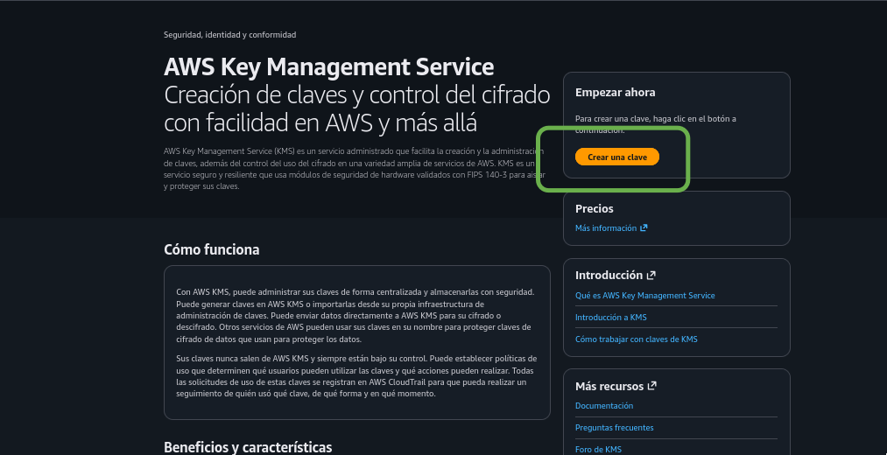
	
	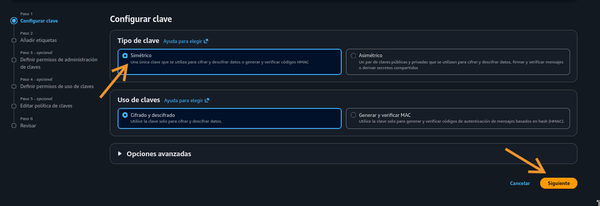
	
	
	
	
	
	
	
	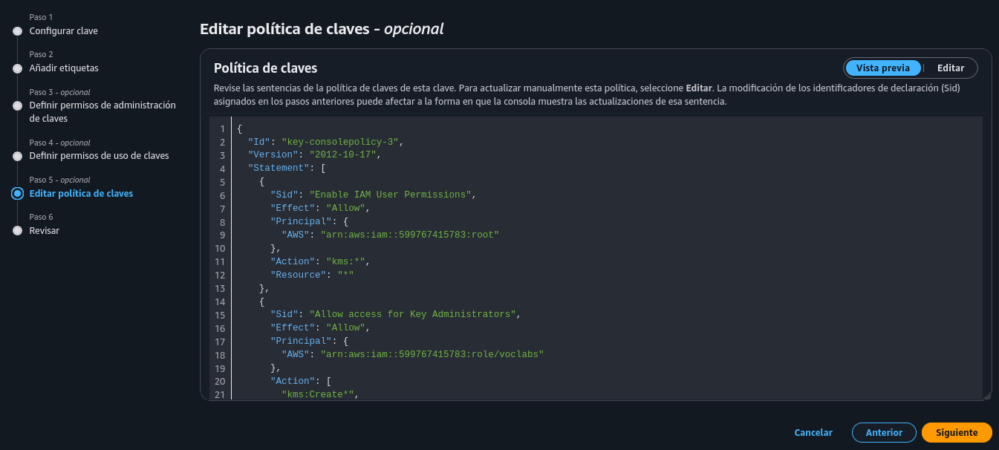
	
	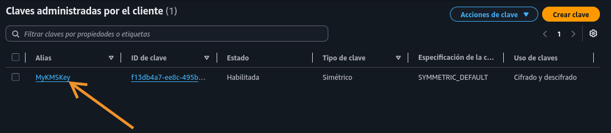
	
	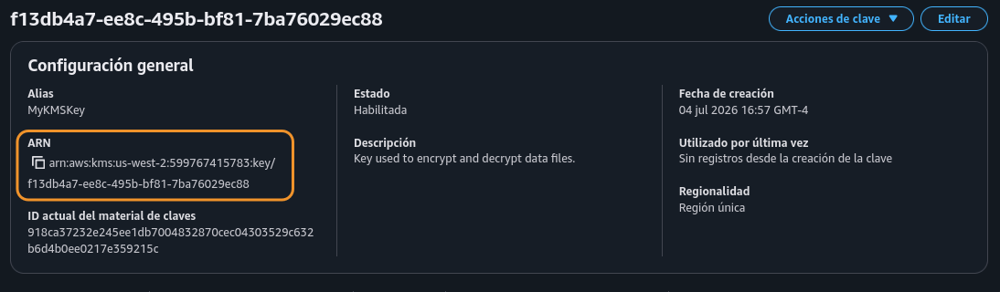
		
#### Resumen de la Tarea 1

En esta tarea, creó una clave AWS KMS simétrica y le otorgó la propiedad de esa clave al rol voclabs IAM que se creó previamente para este laboratorio.

### Tarea 2: Configurar la instancia de servidor de archivo

2. Entrar a instancia File Server

	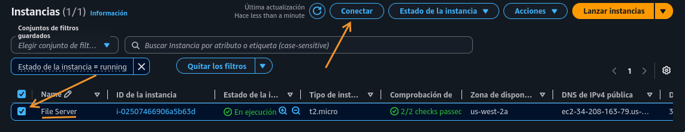
	
	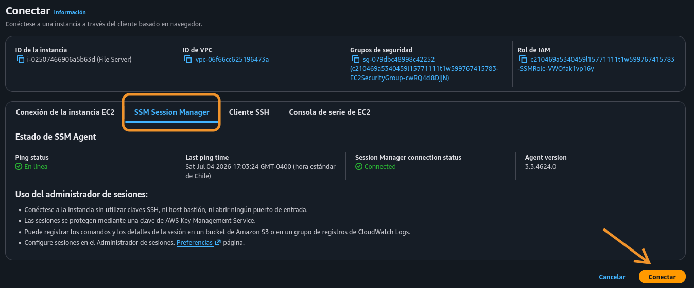
	
	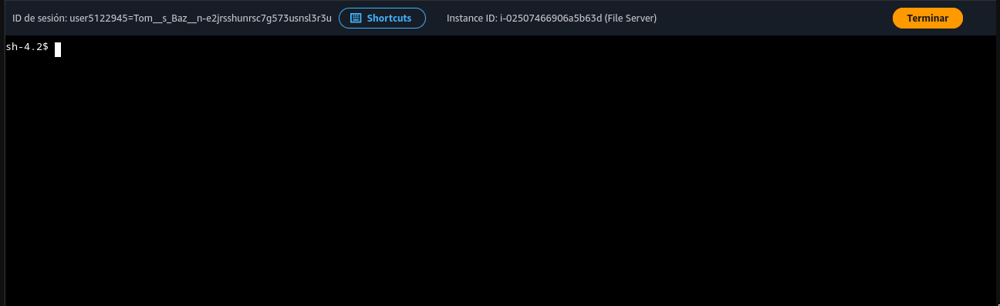
	
	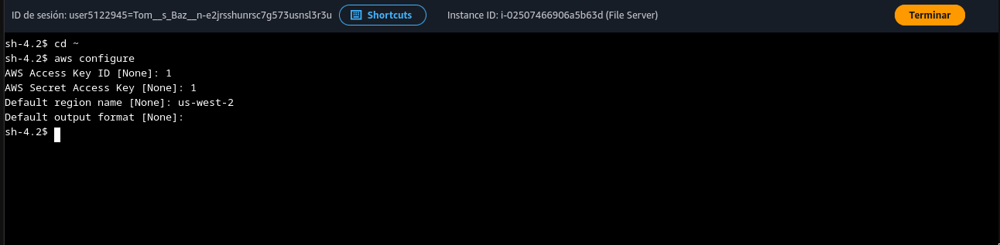

	* Details en Vocaerum
	
		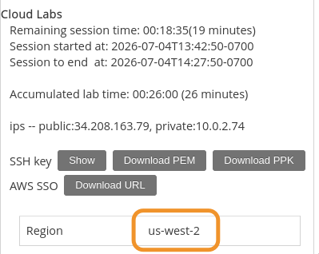
		
		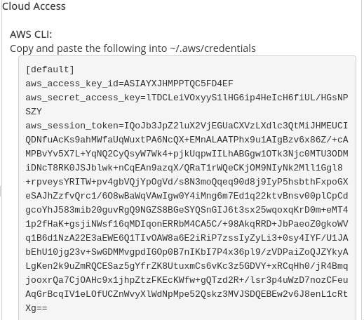
		
	* Credentials
	
		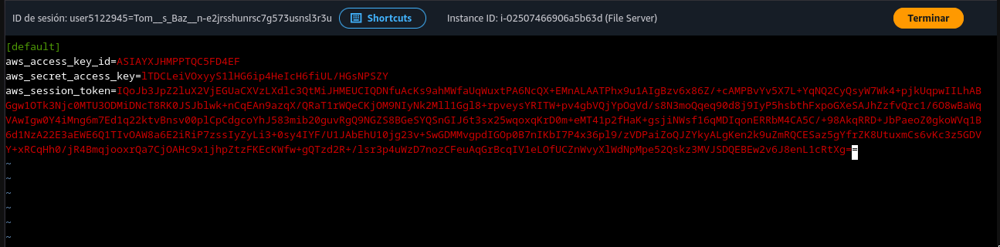
		
	* Instalar aws encryption
	
		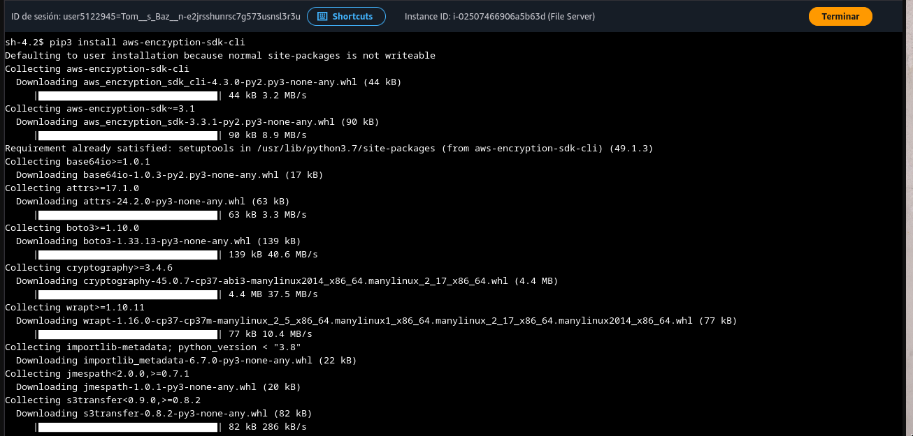
		
		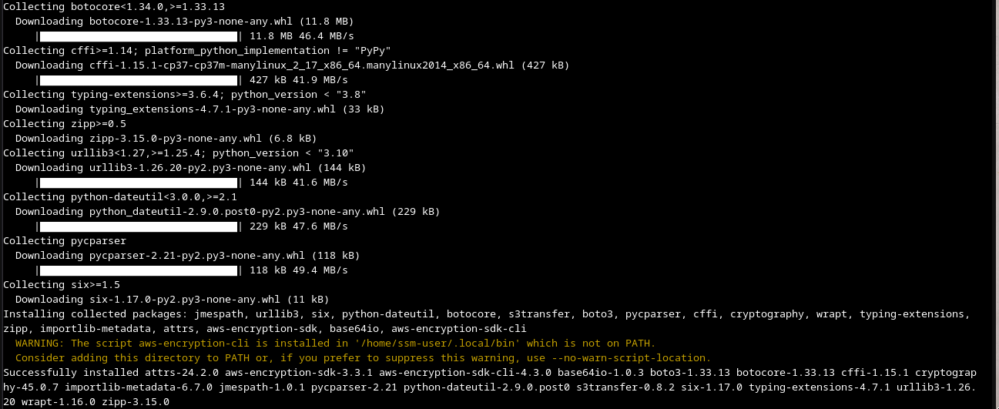
		
	* export de ruta
	
		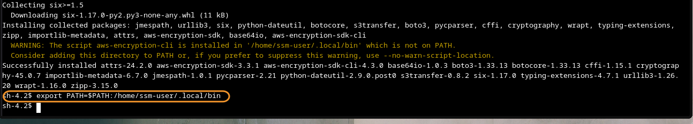	
	

#### Resumen de la Tarea 2

En esta tarea, configuró el archivo de credenciales de AWS, que proporciona la capacidad de usar la clave de AWS KMS que creó anteriormente. Luego instaló la CLI de AWS Encryption, para poder ejecutar comandos de cifrado.

**NOTA**: Hasta aquí llegué. La versión de aws encryption o la versión de Python no permitía los siguientes pasos.

### Tarea 3: Cifrar y descifrar datos

En esta tarea, creará un archivo de texto con información confidencial ficticia. Luego, usará el cifrado para asegurar los contenidos del archivo. Luego, descifrará los datos y verá los contenidos del archivo.

    Para crear el archivo de texto, ejecute los siguientes comandos:

    touch secret1.txt secret2.txt secret3.txt

    echo 'TOP SECRET 1!!!' > secret1.txt

    Para ver los contenidos del archivo secret1.txt, ejecute el siguiente comando:

    cat secret1.txt

    Para crear un directorio en el que crear el archivo cifrado, ejecute el siguiente comando:

    mkdir output

    Copie y pegue el siguiente comando en un editor de texto:

    keyArn=(KMS ARN)

    En este editor de texto, reemplace (KMS ARN) con el AWS KMS ARN que copió en la tarea 1.

    Ejecute el comando actualizado en el terminal del Servidor de archivos.

     Este comando guarda el ARN de una clave de AWS KMS en la variable $keyArn. Cuando cifra usando una clave de AWS KMS, puede identificarla usando una ID de clave, el ARN de clave, el nombre de alias, o el ARN de alias.

    Para cifrar el archivo secret1.txt, ejecute el siguiente comando:

    aws-encryption-cli --encrypt \

                         --input secret1.txt \

                         --wrapping-keys key=$keyArn \

                         --metadata-output ~/metadata \

                         --encryption-context purpose=test \

                         --commitment-policy require-encrypt-require-decrypt \

                         --output ~/output/.

    La siguiente información describe lo que hace este comando:
        La primera línea cifra los contenidos del archivo. El comando usa el parámetro --encrypt para especificar la operación y el parámetro --input para indicar el archivo a cifrar.
        El parámetro --wrapping-keys, y su atributo requerido key, le indican al comando que use la clave de AWS KMS que está representada por el ARN de clave.
        El parámetro --metadata-output se usa para especificar un archivo de texto para los metadatos acerca de la operación de cifrado. 
        Como práctica recomendada, el comando usa el parámetro --encryption-context para especificar un contexto de parámetro.
        El parámetro –commitment-policy se usa para especificar que la característica de seguridad de la confirmación de claves se debe usar para cifrar y descifrar.
        El valor del parámetro --output, ~/output/., indica al comando que escriba el archivo de destino en el directorio de destino.

     Cuando el comando encrypt se lleva a cabo correctamente, no arroja ningún resultado.

    Para determinar si el comando se realizó correctamente, ejecute el siguiente comando:

    echo $?

    Si el comando se realizó correctamente, el valor de $? es 0. Si el comando falló, el valor no es cero.

    Para ver la ubicación del archivo recién cifrado, ejecute el siguiente comando:

    ls output

    El resultado debería verse de la siguiente manera:

    secret1.txt.encrypted

    Para ver los contenidos del archivo recién cifrado, ejecute el siguiente comando:

    cd output

    cat secret1.txt.encrypted

     El proceso de cifrado y descifrado toma los datos en texto simple, que se puede leer y comprender, y manipula su forma para crear texto cifrado, que es lo que está viendo ahora.

    Cuando los datos se transforman en texto cifrado, el texto simple no estará disponible hasta que se descifre.

    El siguiente diagrama muestra cómo funciona el cifrado con las claves y algoritmos simétricos.. Una clave y un algoritmo simétricos y usan para convertir un mensaje de texto simple en texto cifrado.
    Cifrado de clave simétrico.

    Presione Intro.

    A continuación, descifrará el archivo secret1.txt.encrypted.

    Para descifrar el archivo, ejecute los siguientes comandos:

    aws-encryption-cli --decrypt \

                         --input secret1.txt.encrypted \

                         --wrapping-keys key=$keyArn \

                         --commitment-policy require-encrypt-require-decrypt \

                         --encryption-context purpose=test \

                         --metadata-output ~/metadata \

                         --max-encrypted-data-keys 1 \

                         --buffer \

                         --output .

    Para ver la ubicación del nuevo archivo, ejecute el siguiente comando:

    ls

    El archivo secret1.txt.encrypted.decrypted contiene los contenidos descifrados del archivo secret1.txt.encrypted.

    Para ver los contenidos del archivo descifrado, ejecute el siguiente comando:

    cat secret1.txt.encrypted.decrypted

    Después del descifrado correcto, podrá ver los contenidos en texto simple originales de secret1.txt.

    El siguiente diagrama muestra cómo se usan la misma clave secreta y el mismo algoritmo simétrico del proceso de cifrado para descifrar el texto cifrado de vuelta al texto simple.
    Cifrado de clave simétrico.

#### Resumen de la Tarea 3

En esta tarea, aprendió cómo cifrar datos de texto simple en texto cifrado al ejecutar el comando --encrypt. Luego descifró correctamente el texto cifrado de vuelta a los datos de texto simple originales y legibles.
