# Lab 280: Protección contra malware usando un AWS Network Firewall

## Información general sobre el laboratorio

Malware, que significa software malicioso, se refiere a cualquier software intrusivo desarrollado por cibercriminales (a los que se suele llamar hackers) para robar datos o destruir equipos y sistemas. Los ejemplos de malware común incluyen virus, gusanos, troyanos, spyware, adware y ransomware.

Los firewalls son como muros de seguridad físicos que se encuentran entre la red interna de una organización y cualquier red pública externa, como la Internet. El firewall protege a una red interna del acceso por usuarios no autorizados en una red externa.

Los usuarios necesitan acceso a Internet por motivos de negocios, pero pueden descargar malware accidentalmente, el que puede afectar la seguridad de la red y de los datos.

Las amenazas de malware pueden estar presentes, y las organizaciones pueden usar varias técnicas y servicios para mitigar estas amenazas (por ejemplo, firewalls, software antivirus y prácticas recomendadas de control de usuarios). Este laboratorio se enfoca en técnicas de contramedidas usando un firewall.
Escenario

## Situación

AnyCompany lo contrató como un nuevo ingeniero de seguridad y la empresa le confió la tarea de reforzar el periodo de seguridad de la empresa. Existen informes de usuarios que descargaron malware accidentalmente después de acceder a sitios web específicos. El equipo de TI de AnyCompany le proporcionó las URL de los sitios que alojan el malware. Su trabajo es encontrar una solución para mitigar el acceso a estos archivos de actores maliciosos.
Objetivos

**Después de completar este laboratorio, podrá realizar lo siguiente:**

1. Actualizar un firewall de red de AWS
2. Crear un grupo de reglas de firewall
3. Verificar y probar que el acceso a los sitios maliciosos esté bloqueado

## Entorno de laboratorio

En este laboratorio, tiene una instancia de TestInstance (Amazon Elastic Compute Cloud [Amazon EC2]) preconfigurada para usar en las pruebas de acceso al sitio que aloja los archivos maliciosos. Esto está contenido en una zona de perímetro y está separado del resto de los servidores importantes de AnyCompany. Actualiza el firewall de la red de AnyCompany, crea un grupo de reglas y luego adjunta el grupo de reglas a una política de firewall y el firewall de red en sí. Luego inicia sesión en TestInstance y prueba la corrección.

Todos los componentes de backend, como Amazon EC2, los roles de AWS Identity y Access Management (IAM) y algunos servicios de AWS, ya están construidos en el laboratorio. 

### Tarea 1: Confirmar accesibilidad

En esta tarea, inicia sesión en la instancia TestInstance de EC2 que se preconfiguró durante la preparación del laboratorio. Desde ahí, emite un comando wget a los archivos del actor malicioso que el equipo de TI le proporcionó para confirmar la accesibilidad.

1. Ya conectado a la instancia por SSM y dentro de la terminal, ejecutar wget:

	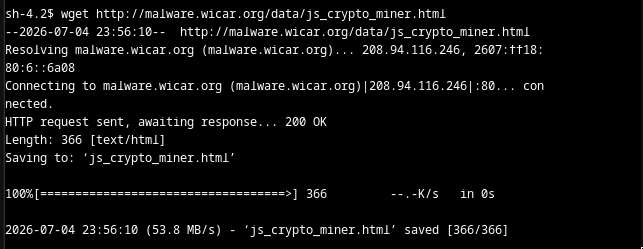
	
	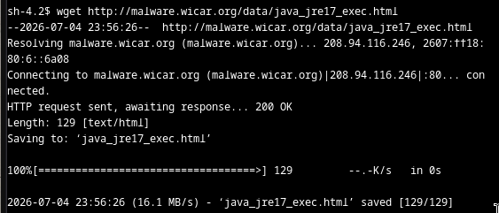

#### Resumen de la Tarea 1

En esta tarea, confirmó que la URL que aloja los archivos de malware es accesible mediante la siguiente red y el firewall de red que usa AnyCompany. Usó una instancia TestInstance de EC2 aislada para ejecutar los comandos y descargar los mismos archivos maliciosos que descargaron los usuarios. Ahora debe corregir el firewall de red de AnyCompany para detener el acceso a este sitio.

### Tarea 2: Inspeccionar el firewall de red

En esta tarea, inspeccionará el firewall de AWS Network Firewall que se configuró durante la preparación del laboratorio. Actualizar este firewall es la prioridad principal que le asignó AnyCompany como el nuevo ingeniero de seguridad.

1. Revisar firewall

	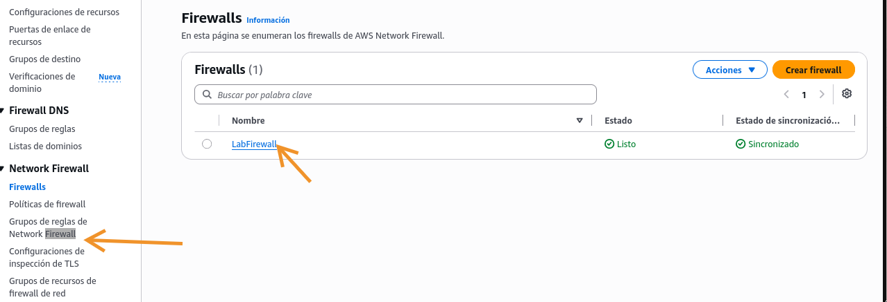
	
2. Revisar política de firewall

	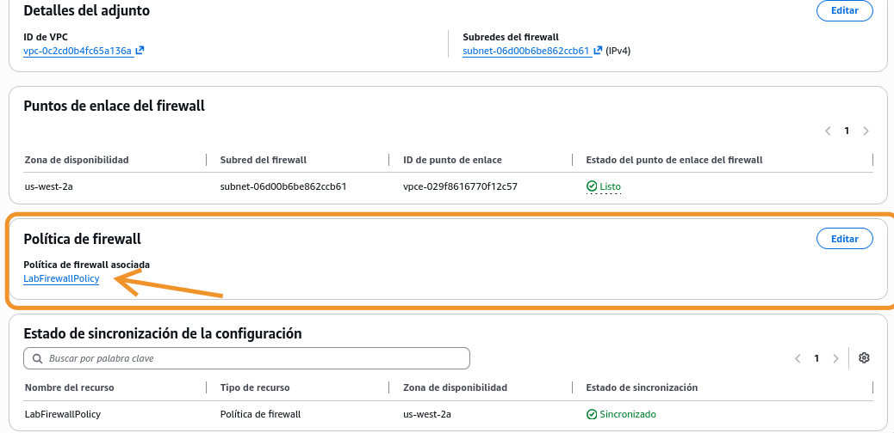
	
	* Editar acciones predeterminadas sin estado
	
		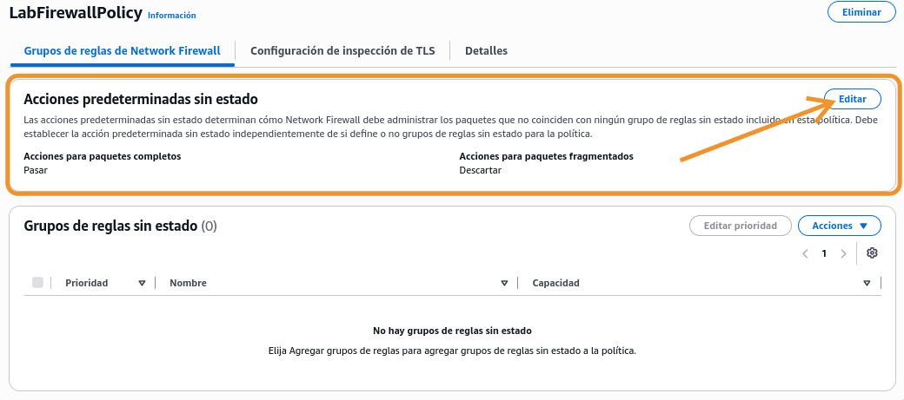
		
		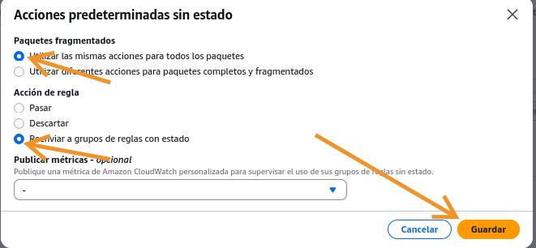

#### Resumen de la Tarea 2

En esta tarea, inspeccionó el firewall de red y actualizó la política de firewall. Luego actualizó la política de firewall para reenviar todos los paquetes para una inspección de reglas con estado.

### Tarea 3: Crear un grupo de reglas de firewall

En esta tarea, creará un grupo de reglas de firewall de red con reglas que bloquean el acceso a las URL maliciosas. Luego adjuntará esta regla a su política de firewall.

Un grupo de reglas de firewall de red es un conjunto de criterios para inspeccionar y manejar el tráfico de red. Agregará uno o más grupos de reglas a una política de firewall como parte de una configuración de política. Este grupo de reglas bloquea el acceso a las URL del actor malicioso.

1. Crear grupo

	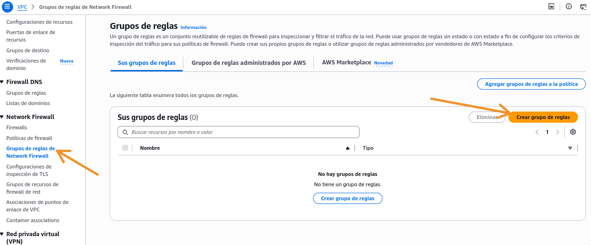
	
	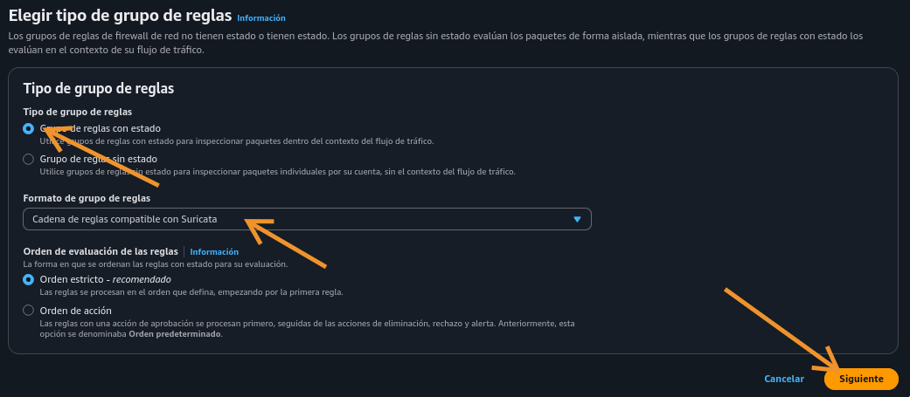
	
	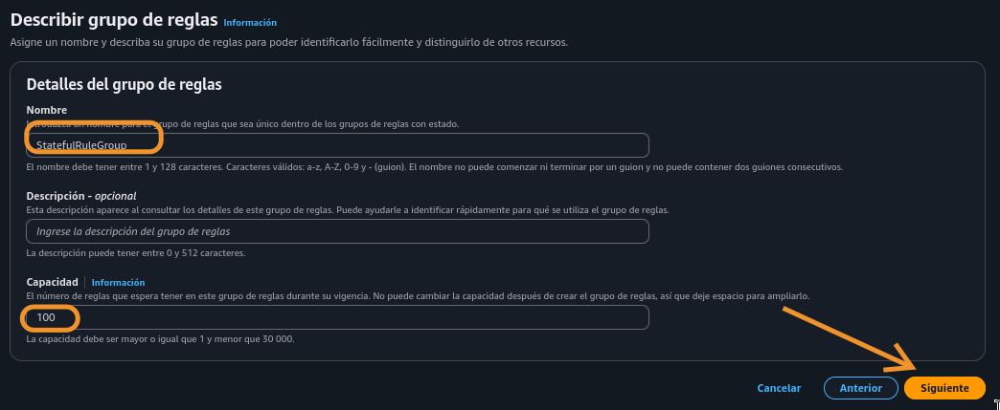
	
	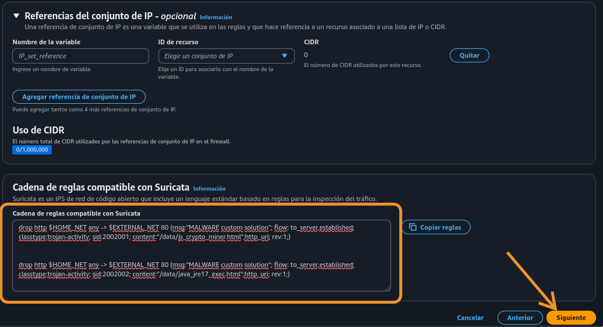
	
	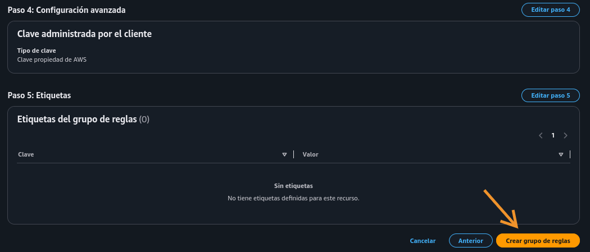
	
	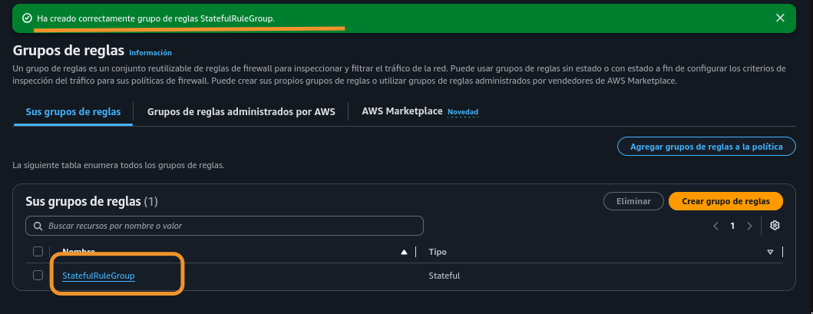
	

#### Resumen de la Tarea 3

En esta tarea, creó un grupo de reglas de firewall de red con estado que usa reglas Suricata. Después de adjuntar este grupo de reglas al firewall de red, este bloquea los sitios web maliciosos a los que accedieron los usuarios de AnyCompany.

### Tarea 4: Adjuntar un grupo de reglas al firewall de red

En esta tarea, adjuntará el grupo de reglas de firewall de red que creó al firewall de red. 

1. Primer intento basado en la guía del Lab

	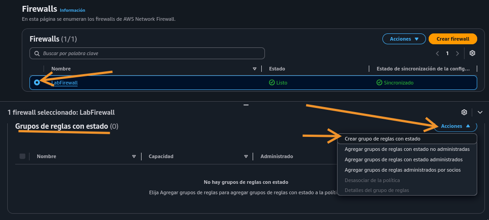
	
2. Ruta actualizada: agregar grupo a la política, y luego asociar el firewall a la política

	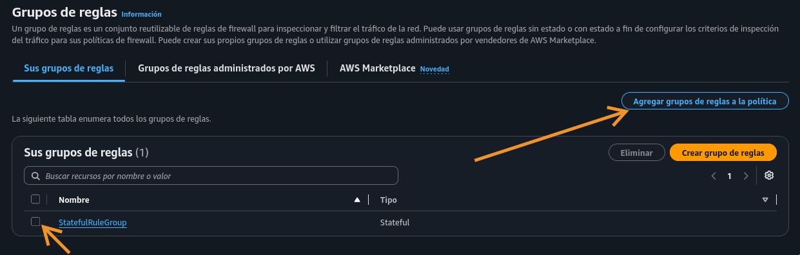
	
	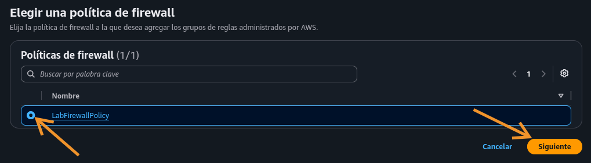
	
	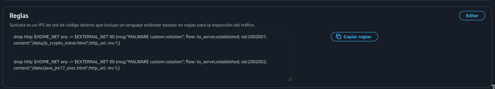
	
	* La política no encontraba el grupo, porque el grupo creado en la config 'Orden de evaluación de las reglas' estaba en 'Orden estricto', pero la política estaba en 'Orden de acción'. Eliminé y creé nuevamente el grupo considerando esto. 
	
	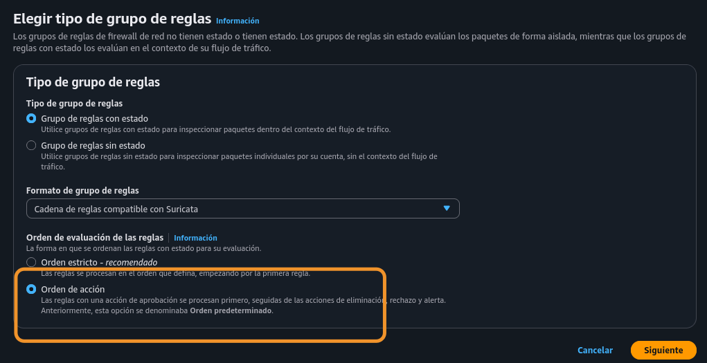

#### Resumen de la Tarea 4

Adjuntó el grupo de reglas al firewall, lo que bloquea los intentos de acceder a los archivos del actor malicioso alojados en el sitio web.

### Tarea 5: Validar la solución

En esta tarea, volverá a iniciar sesión en TestInstance para probar que el firewall de red bloquee correctamente los intentos de acceder a los archivos del sitio web malicioso.

* **IMPORTANTE**: No logré el objetivo, los archivos infectados se descargaron igual

	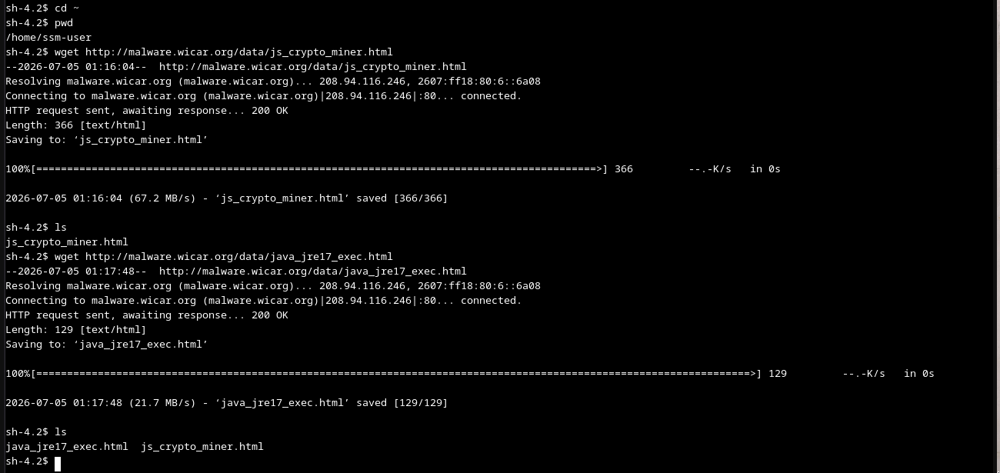

#### Resumen de la Tarea 5

En esta tarea, comprobó que el firewall de red se actualizó y se configuró correctamente para bloquear los sitios web maliciosos. Confirmó que el acceso está bloqueado al iniciar sesión en la instancia TestInstance de EC2 y ejecutar comandos wget** para esos archivos. Los usuarios ahora no pueden acceder a esos archivos maliciosos desde este sitio web. 

 