# Lab 160: Crear un servidor de base de datos e interactuar con la base de datos mediante una aplicación

## Situación

Este laboratorio se ha diseñado para reforzar el concepto del uso de instancias de base de datos administradas por AWS con el objetivo de satisfacer las necesidades de las bases de datos relacionales.

Amazon Relational Database Service (Amazon RDS) facilita la configuración, operación y escalado de una base de datos relacional en la nube. Proporciona una capacidad rentable y de tamaño ajustable y, al mismo tiempo, permite gestionar las tareas de administración de base de datos que consumen mucho tiempo, lo que permite centrarse en las aplicaciones y el negocio. Amazon RDS ofrece seis motores de base de datos familiares entre los que elegir: Amazon Aurora, Oracle, Microsoft SQL Server, PostgreSQL, MySQL y MariaDB.

* Arquitectura inicial

	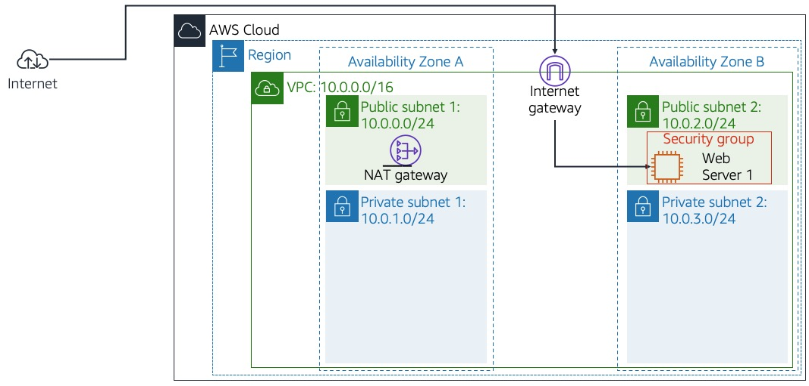
	
* Arquitectura final

	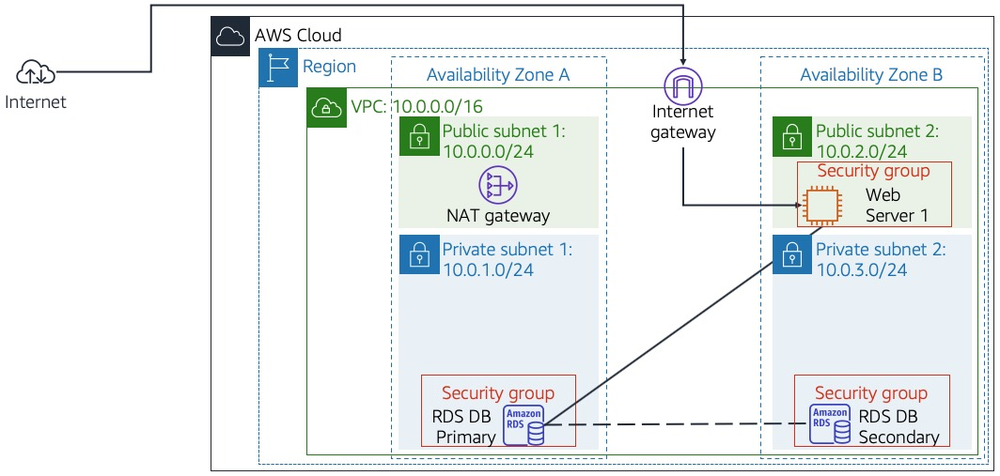

## Objetivos

Luego de completar este laboratorio, podrá realizar lo siguiente:

1. Lanzar una instancia de base de datos de Amazon RDS con alta disponibilidad.
2. Configurar la instancia de base de datos para permitir conexiones desde su servidor web.
3. Abrir una aplicación web e interactuar con su base de datos.

### Tarea 1: Crear un grupo de seguridad para la instancia de base de datos de RDS

En esta tarea, creará un grupo de seguridad para permitir que su servidor web acceda a la instancia de base de datos de RDS. El grupo de seguridad se utilizará al iniciar la instancia de base de datos.

1. Crear Grupo de Seguridad

	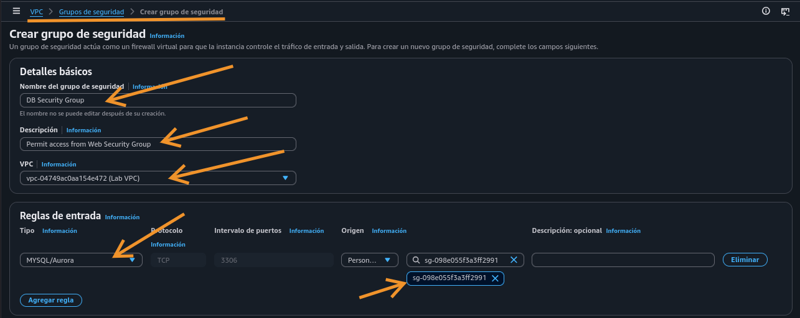
	
### Tarea 2: Crear un grupo de subredes de base de datos

Para esta tarea, creará un Grupo de subredes de base de datos que se emplea para informar a RDS acerca de qué subredes se pueden utilizar para la base de datos. Cada grupo de subredes de base de datos requiere subredes en al menos dos zonas de disponibilidad.

1. Crear grupo de subredes RDS

	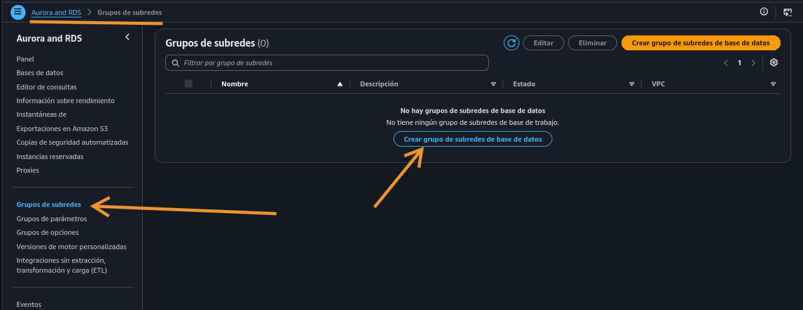
	
	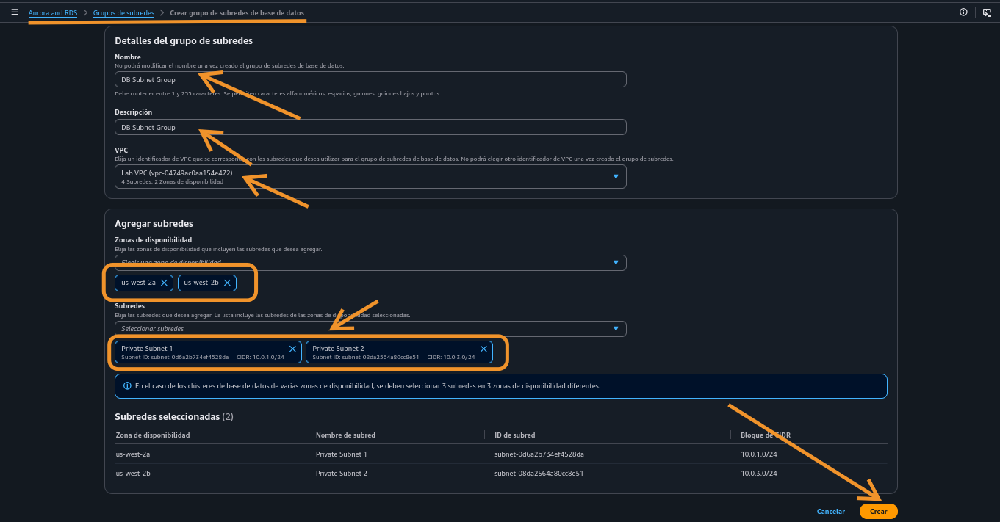
 
### Tarea 3: Crear una instancia de base de datos de Amazon RDS

En esta tarea, deberá configurar y lanzar una instancia de base de datos Multi-AZ de Amazon RDS para MySQL.

Los despliegues Multi-AZ de Amazon RDS proporcionan mejoras en la disponibilidad y durabilidad de las instancias de base de datos (DB), lo que las hace adecuadas para las cargas de trabajo de bases de datos de producción. Cuando aprovisiona una instancia de base de datos Multi-AZ, Amazon RDS crea automáticamente una instancia de base de datos primaria y, de forma sincronizada, replica los datos en una instancia en espera en una zona de disponibilidad (AZ) diferente.

1. Crear BBDD

	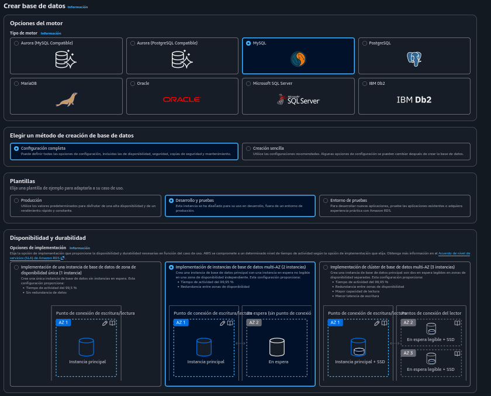
	
	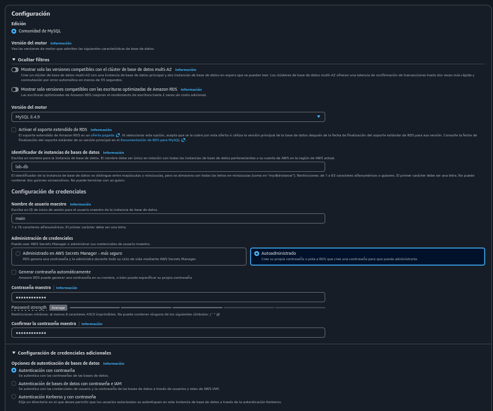

	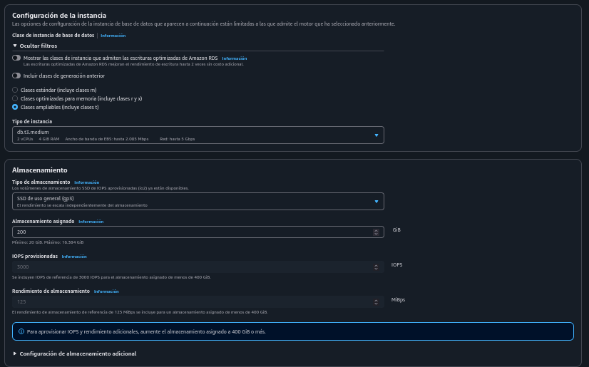
	
	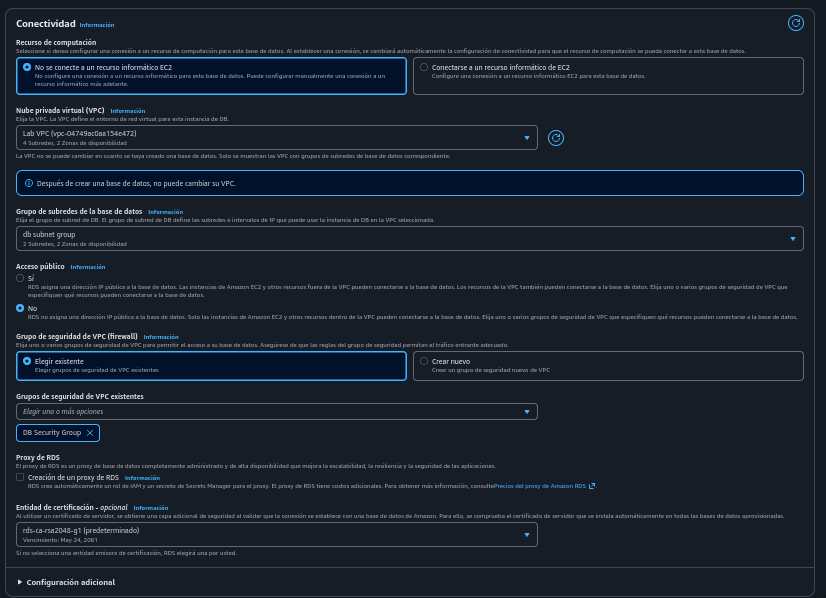
	
	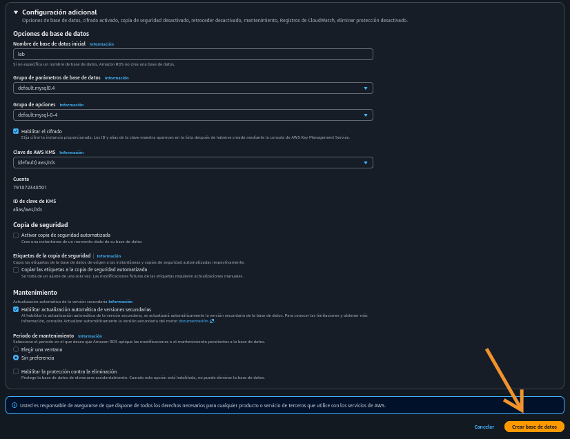
	
 
### Tarea 4: Interactuar con la base de datos

En esta tarea, abrirá una aplicación web que se ejecuta en el servidor web y la configurará para utilizar la base de datos.

1. Aquí simplemente accedí a la base de datos por navegador (ip)

	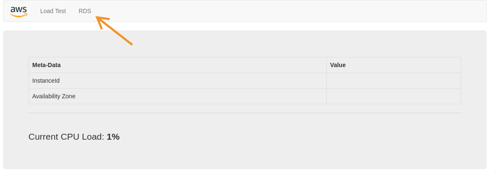
	
2. Y, muestro una creación de fila

	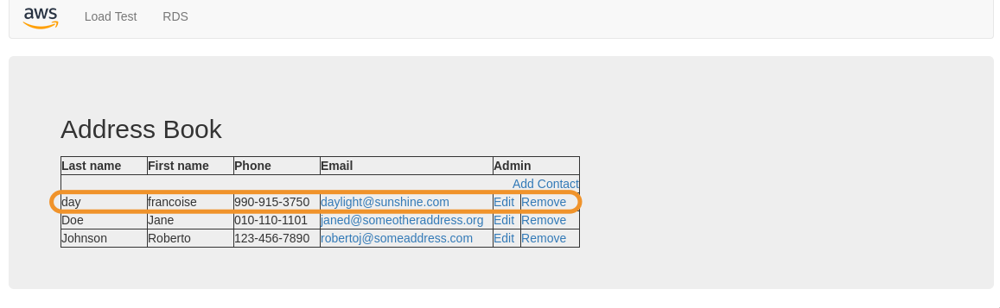