# Lab 162: Desafío. Crear un servidor de base de datos e interactuar con la base de datos

## Situación

Este laboratorio se ha diseñado para reforzar el concepto del uso de instancias de base de datos administradas por AWS con el objetivo de satisfacer las necesidades de las bases de datos relacionales.

Amazon Relational Database Service (Amazon RDS) facilita la configuración, operación y escalado de una base de datos relacional en la nube. Proporciona una capacidad rentable y de tamaño ajustable y, al mismo tiempo, permite gestionar las tareas de administración de base de datos que consumen mucho tiempo, lo que permite centrarse en las aplicaciones y el negocio. Amazon RDS ofrece seis motores de base de datos familiares entre los que elegir: Amazon Aurora, Oracle, Microsoft SQL Server, PostgreSQL, MySQL y MariaDB.

## Objetivo

Después de completar este laboratorio, podrá hacer lo siguiente:

1. Crear una instancia de RDS
2. Utilizar el editor de consultas de Amazon RDS para consultar datos.
 

## El desafío

Para finalizar el desafío, realice lo siguiente:

1. Configurando BDD

	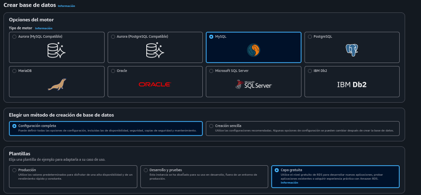
	
	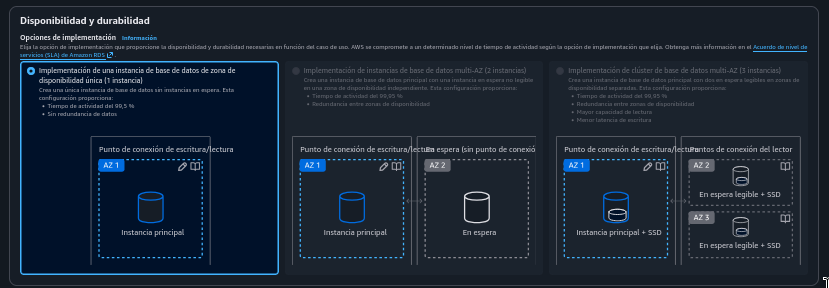
	
	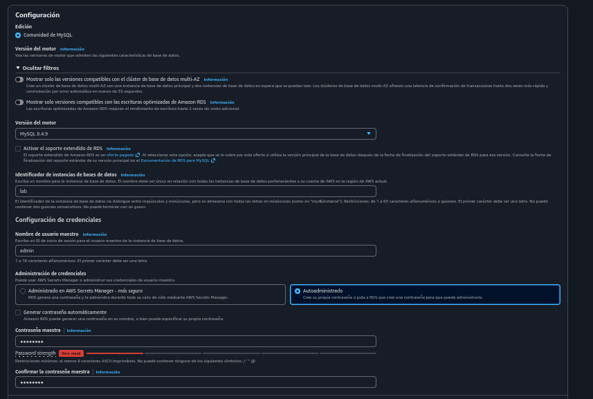
	
	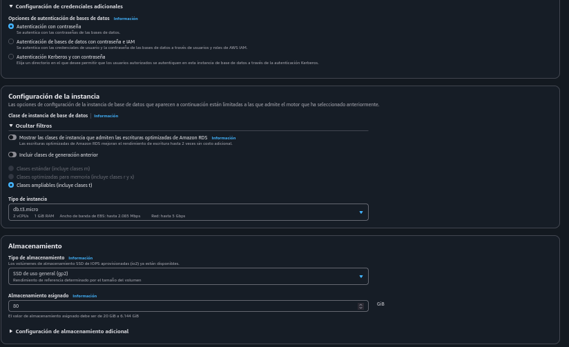
	
	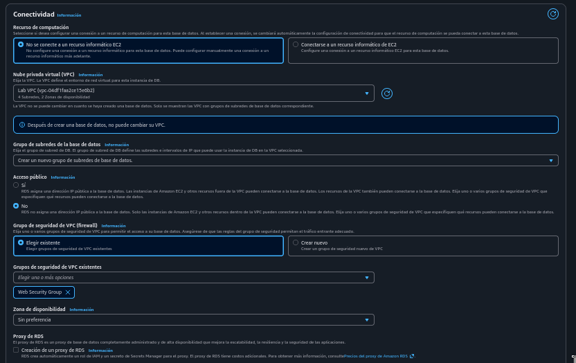
	
	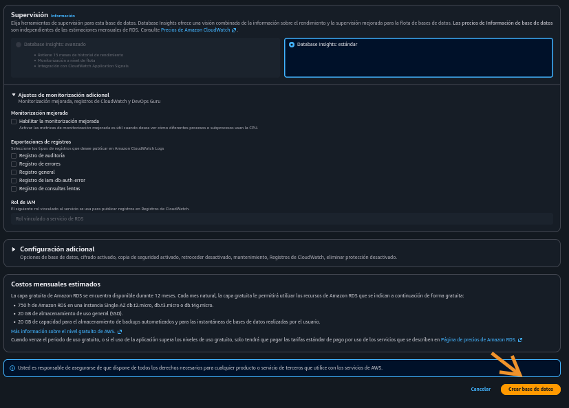
	
2. Instalar mysql. Luego descubrí un error: mysql en la AMI de esta EC2 tiene versión 5 vs versión 8 de la BDD en RDs

	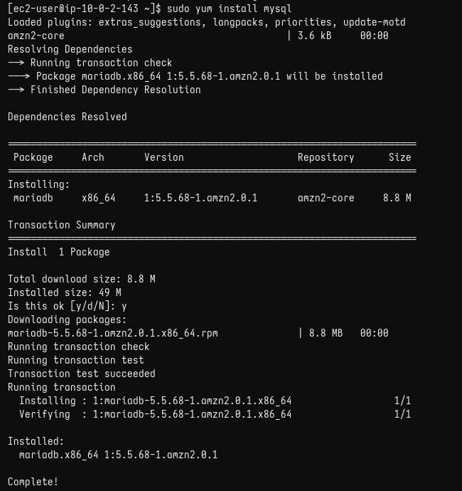
	
3. Logré entrar, luego de entender que la base de datos estaba asociada al Grupo de Seguridad 'Web Security Group', el mismo de la instancia. Entonces, faltaba una regla de entrada para permitir acceso tipo mysql/aurora. Además, en la fuente puse el mismo Grupo de Seguridad, es decir, 'pueden acceder aquellos que pertenecen a dicho grupo de seguridad'

	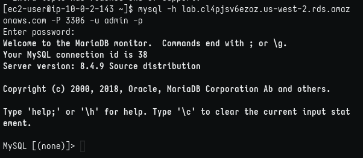
	
4. Creé la tabla RESTART e inserté los datos

	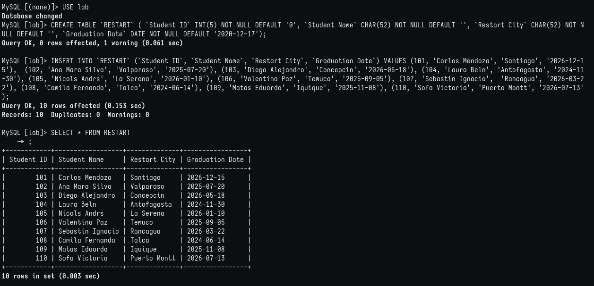
	
5. Creé la tabla CLOUD_PRACTITIONER e inserté los datos

	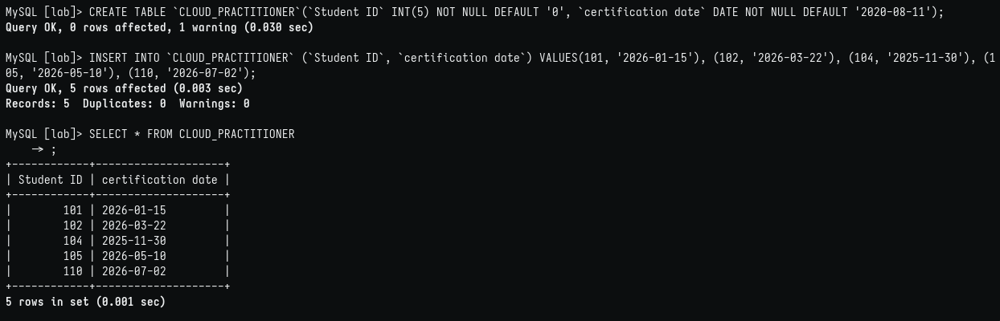
	
6. Inner join para cruzar datos de ambas tablas con Stutend ID

	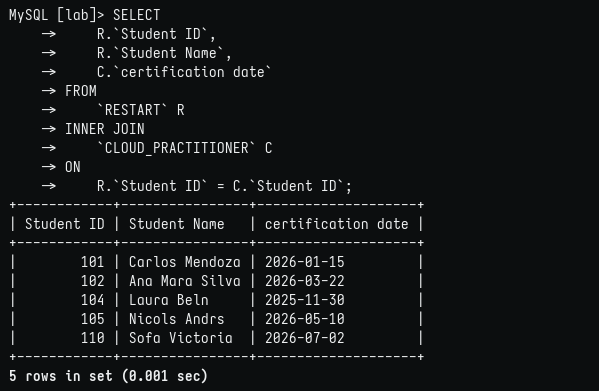

