# Lab 268: Operaciones de tabla de base de datos

## Situación

El equipo de operaciones de base de datos para una organización configuró una instancia de base de datos relacional. El equipo le pidió que practique crear y descartar (eliminar) bases de datos y tablas.

## Información general y objetivos del laboratorio

Este laboratorio muestra cómo usar algunas operaciones de bases de datos y tablas comunes.

Después de completar este laboratorio, podrá realizar lo siguiente:

1. Usar el enunciado CREATE para crear bases de datos y tablas
2. Usar el enunciado SHOW para ver las bases de datos y tablas disponibles
3. Usar el enunciado ALTER para alterar la estructura de una tabla
4. Usar el enunciado DROP para eliminar bases de datos y tablas

Cuando comience este en laboratorio, los siguientes recursos ya estarán creados para usted:

  Una instancia con un cliente de base de datos instalado

### Tarea 1: Conectarse a Command Host

1. Conectarse a la instancia 

	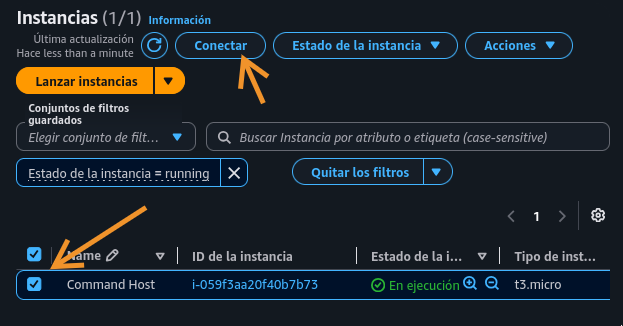
	
	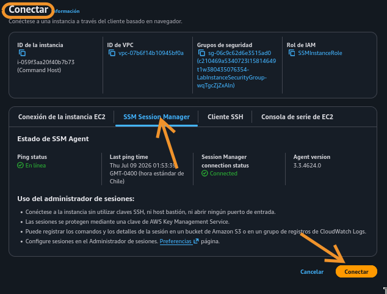


2. Comandos para elevar privilegios, cambiar a home de ec2-user y entrar al cliente de base de datos.

	
```
	sudo su

    cd /home/ec2-user/
    
    mysql -u root --password='re:St@rt!9'
```

* Entrada a cliente
	
	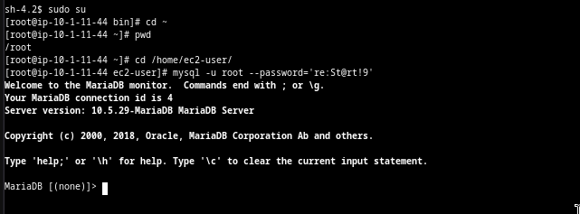

### Tarea 2: Crear una base de datos y una tabla

En esta tarea, creará una base de datos llamada world y una tabla llamada country. Luego, alterará la tabla country.

1. Crear base de datos

	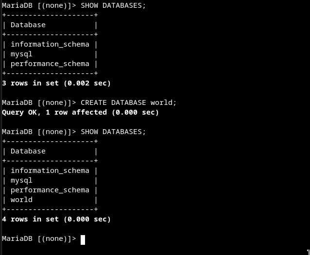
	
2. Crear tabla

	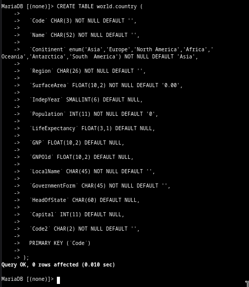
	
3. Confirmar

	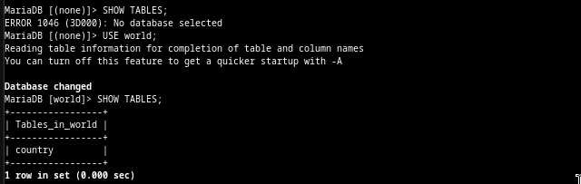
	
	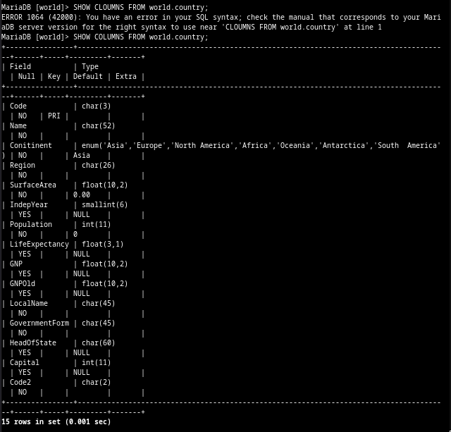
	
4. Cambiar nombre de columna Conitinent -> Continent

	
	
	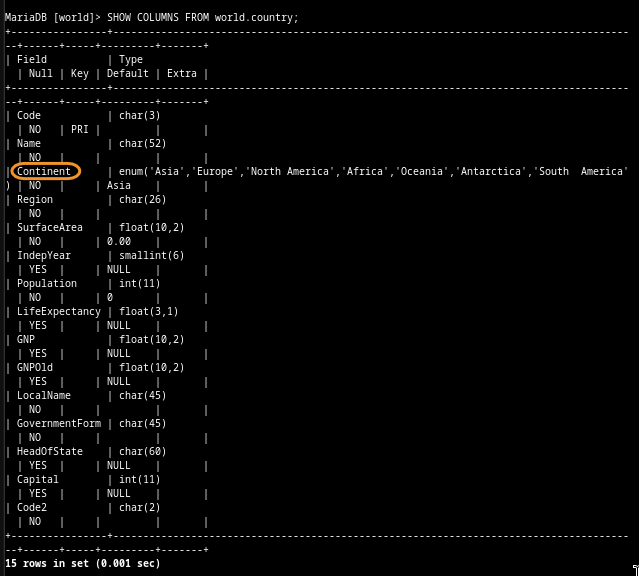

#### Desafío 1
Cree una tabla llamada city y agregue dos columnas llamadas Name y Region. Ambas columnas deben usar el tipo de datos CHAR.

* Crear tabla y mostrar columnas

	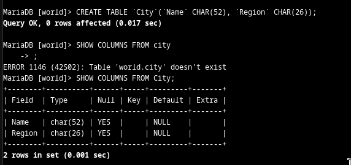
	

### Tarea 3: Eliminar una base de datos y tabla

En esta tarea, eliminará la base de datos world y la tabla country.

* Eliminar tabla world.city
	
	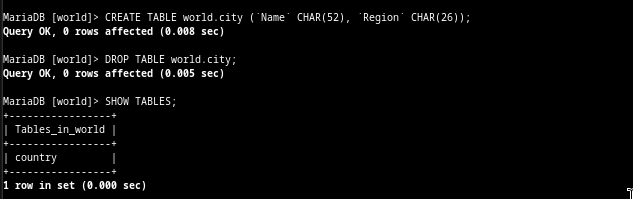

#### Desafío 2
Escribe una consulta y descarte la tabla country.

1. Eliminar tabla country

	
	
	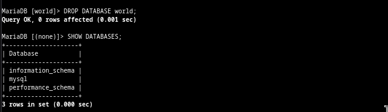