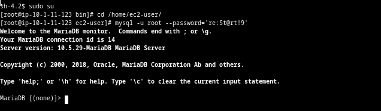
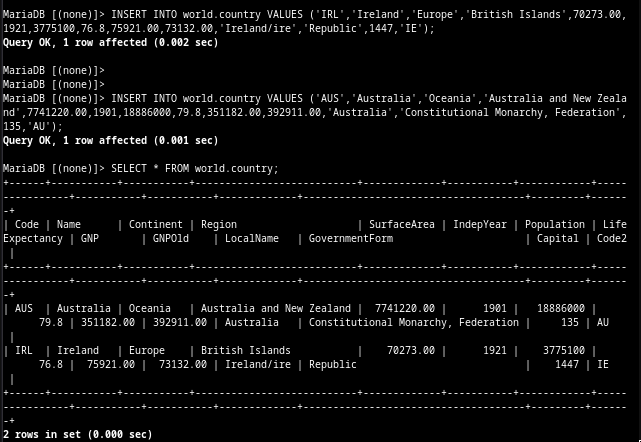
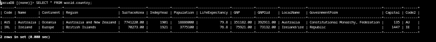
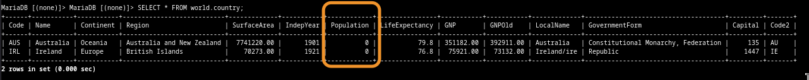
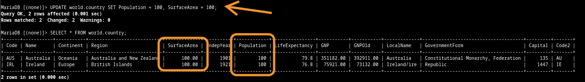
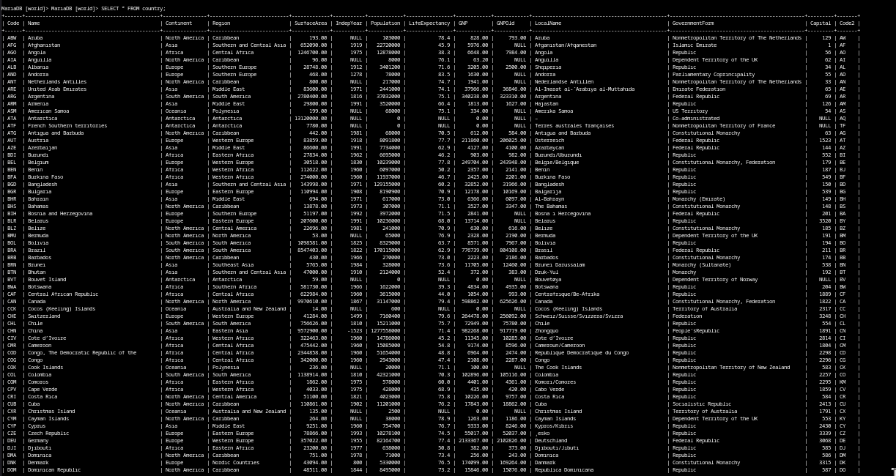
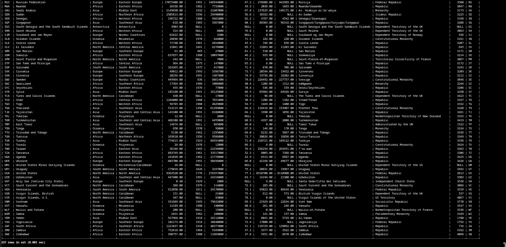
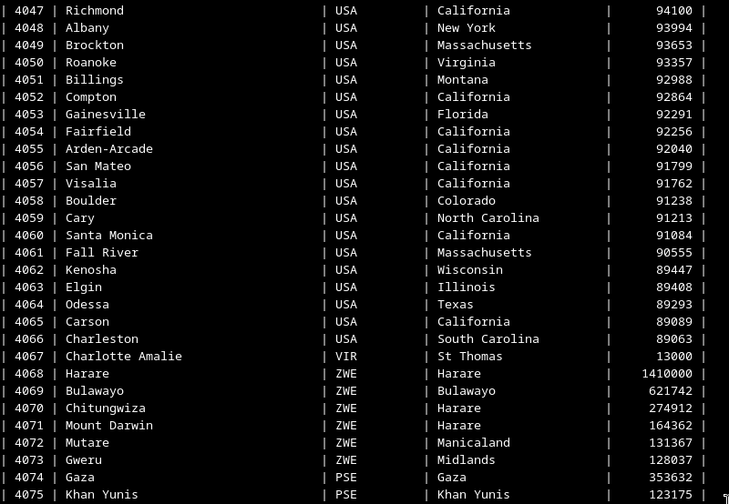
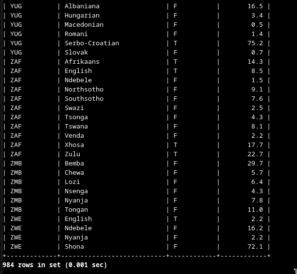

# Lab 269: Insertar, actualizar y eliminar datos en una base de datos

 
## Situación

El equipo de operaciones de base de datos creó una base de datos relacional llamada world que contiene tres tablas: city, country y countrylanguage. Tiene que validar la configuración de la base de datos al ejecutar los enunciados INSERT, UPDATE y DELETE en la tabla country.

 
## Información general y objetivos del laboratorio

Este laboratorio muestra cómo insertar, actualizar, eliminar e importar filas de datos con el lenguaje de consulta estructurada (SQL).

Después de completar este laboratorio, podrá hacer lo siguiente:

1. Insertar filas en una tabla
2. Actualizar filas de una tabla
3. Eliminar filas de una tabla
4. Importar filas de un archivo de respaldo de base de datos


### Tarea 1: Conectar a una base de datos

En esta tarea, se conecta a una instancia que contiene un cliente de base de datos, que se usa para conectarse a una base de datos. Esta instancia se conoce como Command Host.

1. Entrando en cliente mysql

	
	
	
	

### Tarea 2: Insertar datos en una tabla

En esta tarea, insertará datos de muestra en la tabla country.

1. Insertar datos y comprobar

	

	


### Tarea 3: Actualizar filas en una tabla

En esta tarea, actualizará ambas filas en la tabla country con un enunciado UPDATE.

1. Actualizar datos de columna Population

	
	
	
	
 
### Tarea 4: Eliminar filas de una tabla

En esta tarea, actualizará ambas filas en la tabla country con un enunciado DELETE. 

**Tenga cuidado cuando use enunciados de manipulación de datos como UPDATE y DELETE ya que estos cambios pueden no ser reversibles.**

1. Eliminar filas

	
 

### Tarea 5: Importar datos con un archivo SQL.

En esta tarea, insertará datos de muestra en la tabla country con un archivo SQL.

1. Salir del cliente mysql, comprobar que existe el archivo.sql, volver a entrar y importando tabla world, con el comando: 

	
```
	mysql -u root --password='re:St@rt!9' < /home/ec2-user/world.sql
```

* Referencia

	
	
2. Usar tabla y visualizar

	
	
	
	
	
	
	

 3. Select city
 
	
	
	