# Lab 270: Selección de datos de una base de datos

 
## Situación

El equipo de operaciones de base de datos creó una base de datos relacional llamada world que contiene tres tablas: city, country y countrylanguage. Según los casos prácticos específicos definidos en el ejercicio de laboratorio, escribirá algunas consultas con operadores de base de datos y la instrucción SELECT.
Información general y objetivos del laboratorio

Este laboratorio muestra cómo usar algunas operaciones de bases de datos comunes y el enunciado SELECT.

## Objetivo

Después de completar este laboratorio, podrá realizar lo siguiente:

1. Usar el enunciado SELECT para consultar una base de datos
2. Usar la función COUNT ()
3. Use las siguientes operaciones para consultar una base de datos:
	* <, >, =, WHERE, ORDER BY, AND

### Tarea 1: Conectarse a Command Host

En esta tarea, se conecta a una instancia que contiene un cliente de base de datos, que se usa para conectarse a una base de datos. Esta instancia se conoce como Command Host.

1. Entrando en cliente

	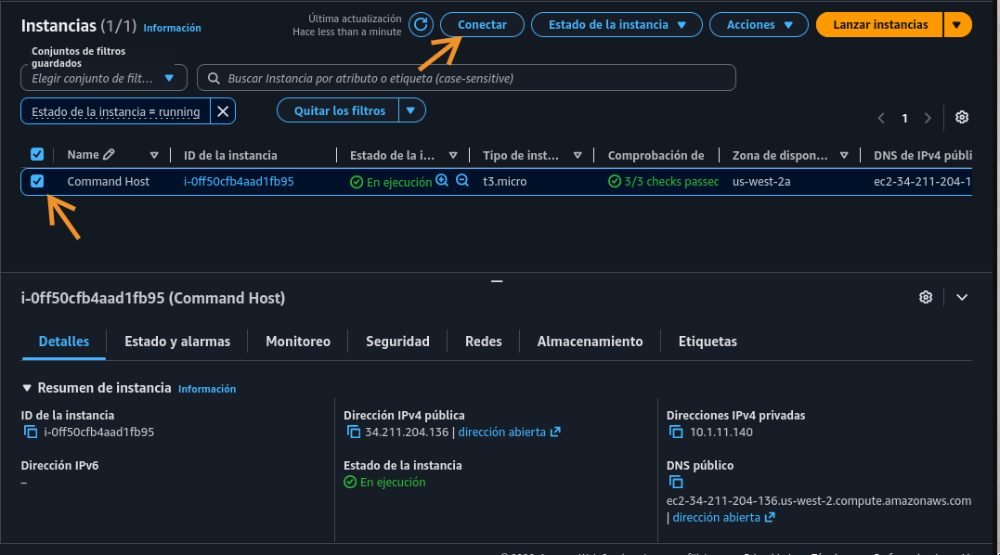
	
	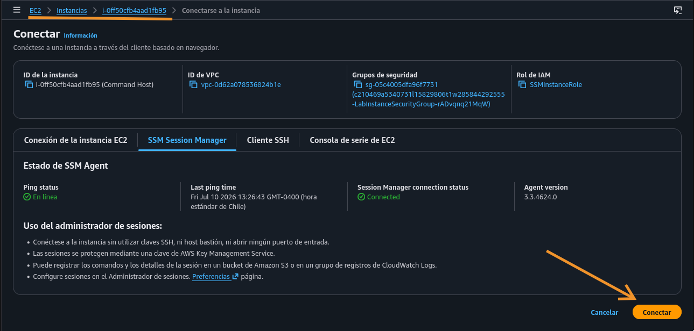
	
	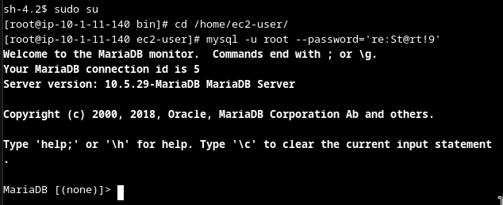
 
### Tarea 2: Consultar la base de datos world

En esta tarea, consultará la base de datos world con varios enunciados SELECT y funciones de la base de datos.

1. Mostrar BBDD

	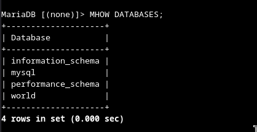
	
	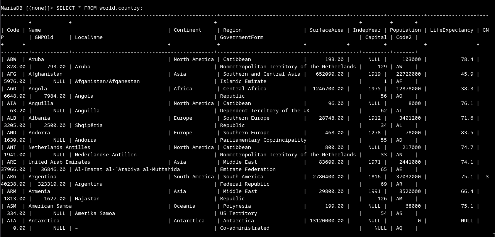
	
2. Count()

	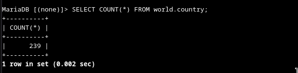
	
	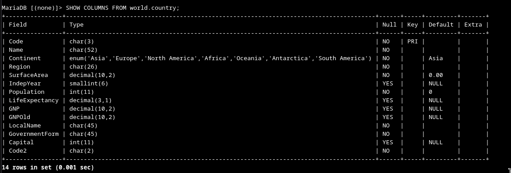

3. Columnas específicas

	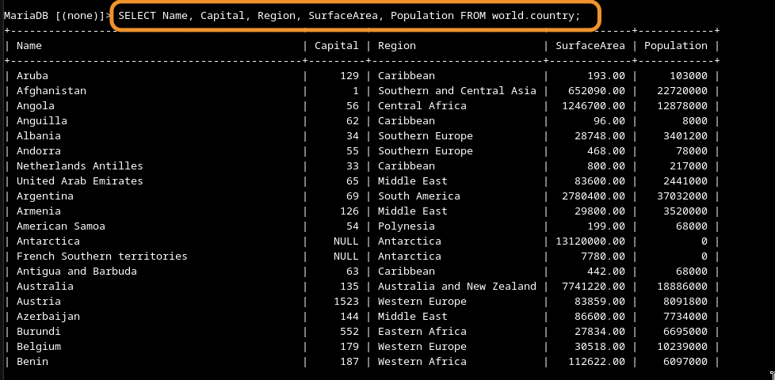
	
4. Alias

	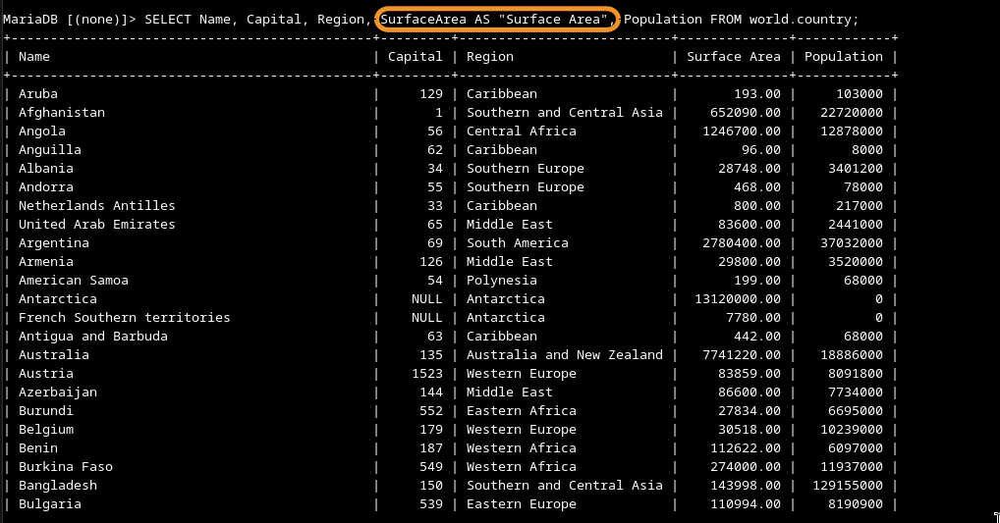
	
5. Order by

	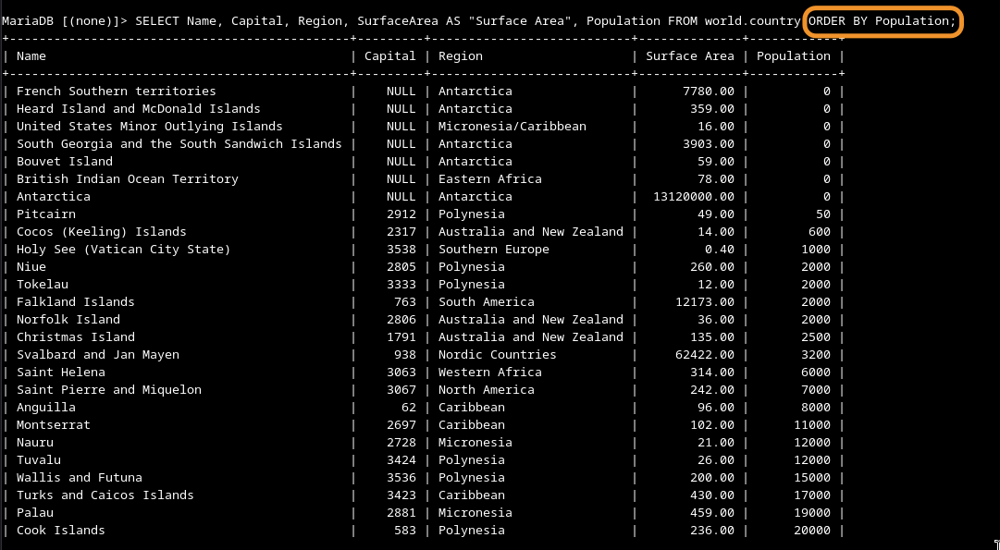
	
	* Descendente (order by por defecto es ascendente)
	
		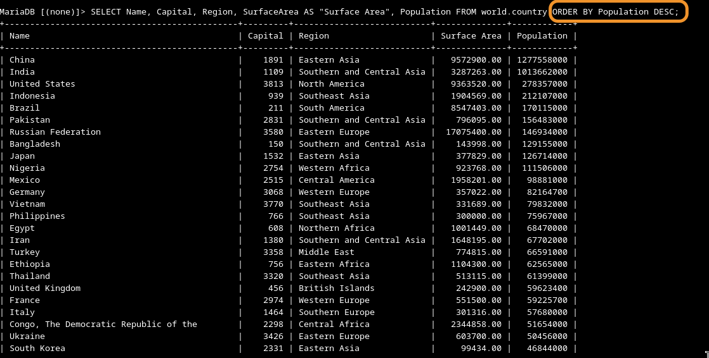
		
6. Where

	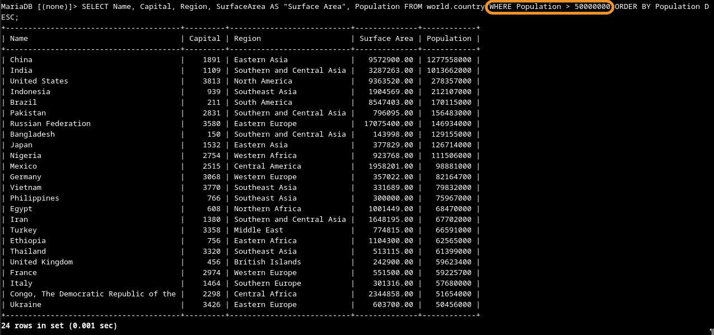
	
7. And

	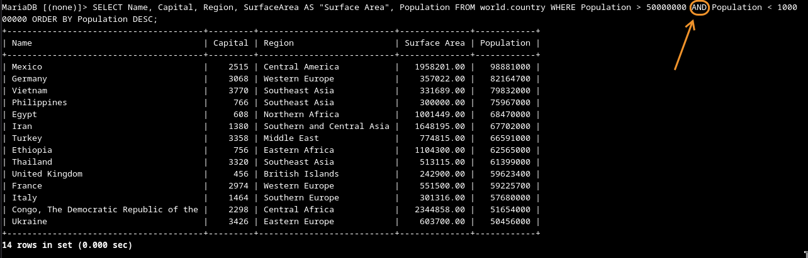
 

#### Desafío

Consulte la tabla country para arrojar un conjunto de registros basado en la siguiente pregunta.
¿Qué país en el Sur de Europa tiene una población de más de 500 000 000?

1. Mirar tabla y columnas

	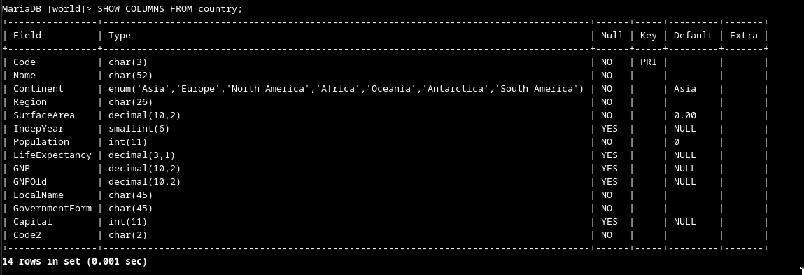
	
2. Buscar la columna Southern Europe

	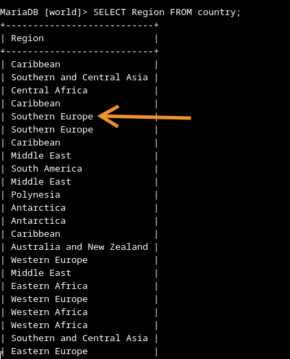
	
3. Seleccionar columnas y filtrar Region

	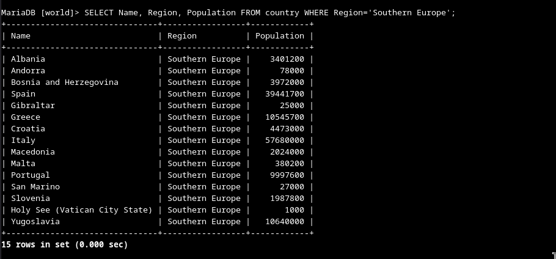
	
4. Filtrar por Region y Population, para el resultado esperado

	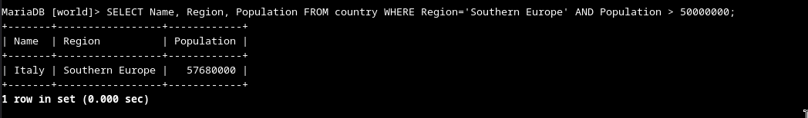