# Lab 271: Realización de una búsqueda condicional

 
## Situación

El equipo de operaciones de base de datos creó una base de datos relacional llamada world que contiene tres tablas: city, country y countrylanguage. Para ayudar al equipo, escribirá algunas consultas para buscar registros en la tabla country con el enunciado SELECT y una cláusula WHERE.
Información general y objetivos del laboratorio

Este laboratorio muestra cómo usar el enunciado SELECT y una cláusula WHERE para filtrar los registros con una búsqueda condicional.

## Objetivo

Después de completar este laboratorio, podrá realizar lo siguiente:

1. Escribir una condición de búsqueda con la cláusula WHERE
2. Usar el operador BETWEEN
3. Usar el operador LIKE con caracteres de comodín
4. Usar el operador AS para crear un alias de columna
5. Usar funciones en un enunciado SELECT
6. Usar funciones en una cláusula WHERE

### Tarea 1: Conectarse a Command Host

En esta tarea, se conectará a una instancia de Amazon Elastic Compute Cloud (Amazon EC2) que contiene un cliente de base de datos, el que usará para conectarse a una base de datos. Esta instancia se conoce como Command Host.

1. Entrar en consola y acceso a terminal de instancia por SSM

	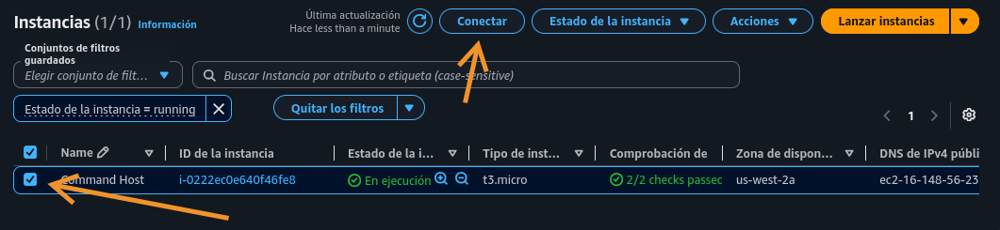
	
	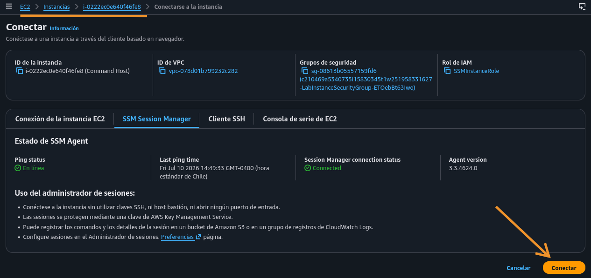
	
2. Cliente mysql

	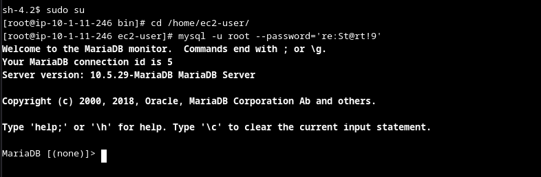
	
 
### Tarea 2: Consulte la base de datos world

En esta tarea, consultará la base de datos world con varios enunciados SELECT y funciones de la base de datos.

1. Visualizar country

	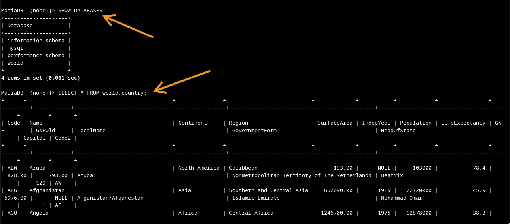
	
2. Filtrar con dos condiciones de cantidad, usando where y and

	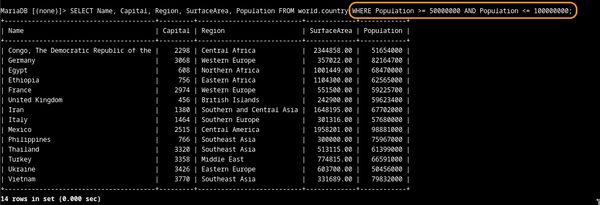
 
3. Mismo resultado, usando between y and

	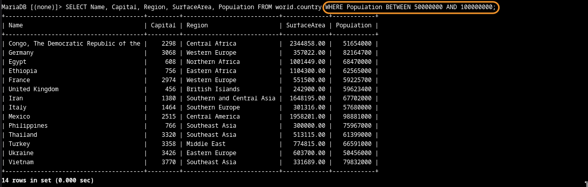
	
4. Filtro aproximado con like y uso de %

	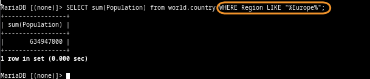
	
5. Visualizar total de Population de toda Europa, aunando todas las coincidencias de 'Europe' en Region con LIKE

	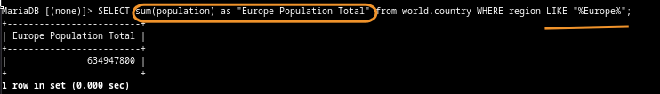
	
6. Importante, uso para sensitive case con LOWER

	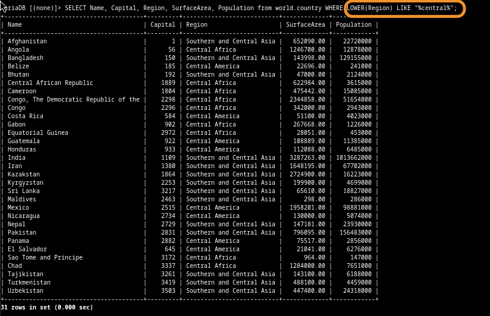
	

#### Desafío

Escriba una consulta para arrojar la suma del área de superficie y de la población de Norteamérica.
Consulte la tabla primero para determinar qué columnas y operadores debe usar.

1. Primero, ver las columnas de country

	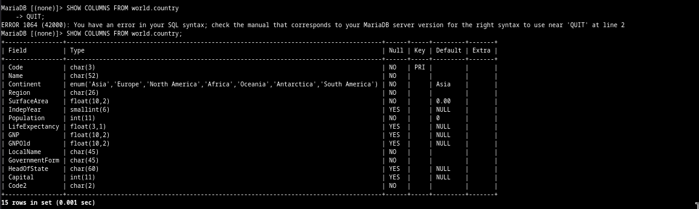
	
2. Luego, filtré por Continent 'North America'

	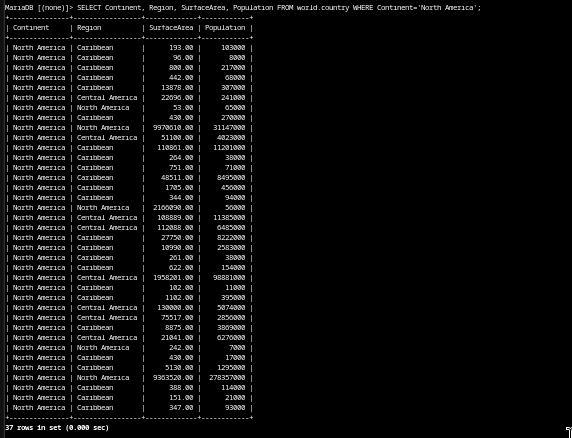
	
3. Superficie total, población total con sus alias, filtrando por el mismo continente

	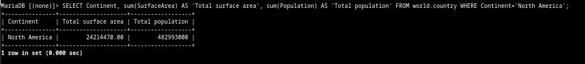
	
4. Misma operación, pero cambiando el filtro a Region

	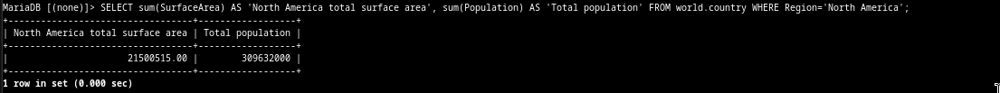