# Lab 272: Trabajar con funciones

## Situación

El equipo de operaciones de base de datos creó una base de datos relacional llamada world que contiene tres tablas: city, country y countrylanguage. Según los casos prácticos específicos definidos en el ejercicio de laboratorio, escribirá algunas consultas usando funciones de base de datos con la instrucción SELECT y la cláusula WHERE.
Información general y objetivos del laboratorio

Este laboratorio demuestra cómo usar funciones de base de datos comunes con el enunciado SELECT y la cláusula WHERE.

## Objetivo

Después de completar este laboratorio, podrá realizar lo siguiente:

1. Use las funciones agregadas SUM(), MIN(), MAX() y AVG() para resumir datos.
2. Use la función SUBSTRING_INDEX() para dividir las cadenas.
3. Use las funciones LENGTH() y TRIM() para determinar la longitud de una cadena
4. Use la función DISTINCT() para filtrar los registros duplicados
5. Use las funciones en el enunciado SELECT y la cláusula WHERE

### Tarea 1: Conectarse a Command Host

En esta tarea, se conecta a una instancia que contiene un cliente de base de datos, que se usa para conectarse a una base de datos. Esta instancia se conoce como Command Host.

1. Terminal, cliente mysql

	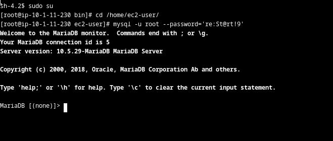
	

### Tarea 2: Consulte la base de datos world

En esta tarea, consultará la base de datos world con varios enunciados SELECT y funciones de la base de datos. Usará una función para procesar y manipular los datos en una consulta. Hay una amplia variedad de funciones SQL y este laboratorio revisa un subconjunto de funciones utilizadas con frecuencia.

1. Ver BBDD

	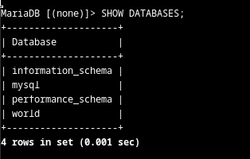

2. Comparando sum, avg, max, min y count en Population

	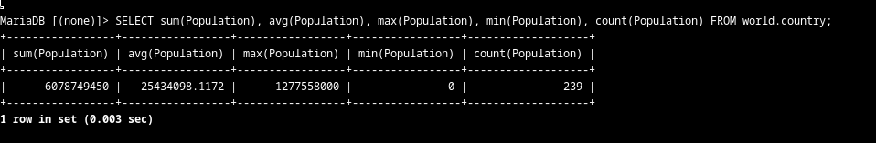
	
3. Subtring para cortar y extraer una parte de nombre de la columna

	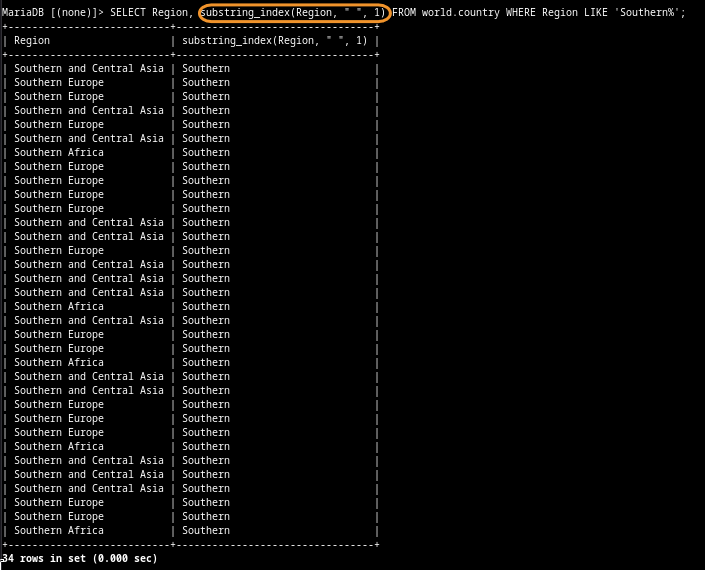
	
4. Substring para filtrar: "que la primera palabra en la columna Region sea Southern"

	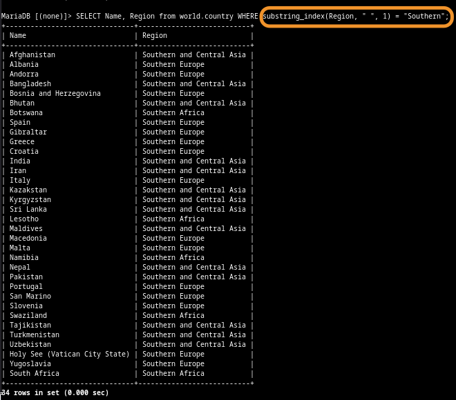
	
5. Length para la cantidad de elementos en la selección y trim para quitar espacios inicial y final. Filtrar por Regiones que tengan menos de 10 caracteres 
	
	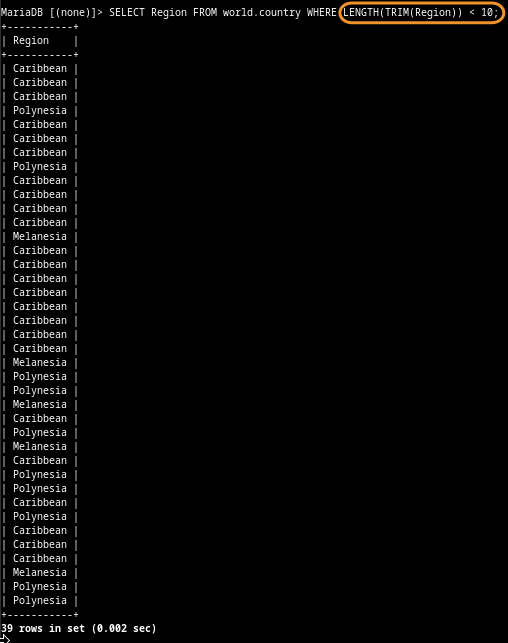
	
6. Distinct para obtener un único ejemplar de coincidencia en el filtro

	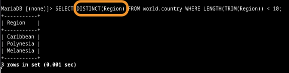

#### Desafío

Consulte la tabla country para arrojar un conjunto de registros basado en el siguiente requisito.
Escriba una consulta que arroje filas que tienen Micronesian/Caribbean como nombre en la columna de región. El resultado debe dividir la región como Micronesia y Caribbean en dos columnas separadas: una llamada Region Name 1 y una llamada Region Name 2.

1. Seleccioné las columnas necesarias y filtré con Like para saber bien el nombre de la columna

	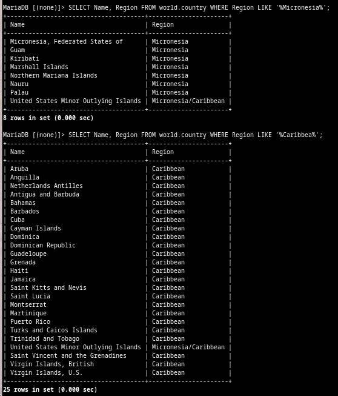
	
2. Pude extraer fácilmente la primera parte del string, por los ejemplos anteriores

	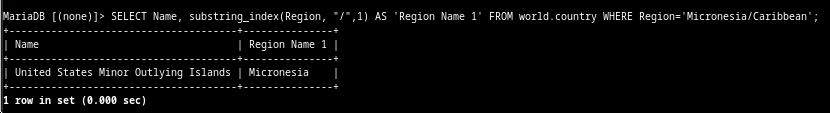
	
3. Tratando de entender la sintaxis de substring_index. Entendí que el "divisor" fracciona la cadena en varios elementos (desapareciendo en la muestra), dependiendo de cuántas veces exista el caracter elegido. Ahora, si la cantidad de elementos es 4, por ejemplo, y selecciono el índice 1, aparecerá sólo el 1; pero, si uso el 3, aparecerán los elementos 1, 2 y 3 (incluyendo los antes divisores), es decir, es acumulativo, de tal modo que si muestro índice 4 (total de elementos), la cadena se muestra completa, con todo y divisores. Como dividí Micronesia/Caribbean con /, que es único en la cadena, ésta se divide en dos elementos. Si coloco índice 2, se mostrará completo. La lógica de un array o lista, para estos casos, es usar negativo -1, usando elementos desde el final hasta el inicio. -1 era la respuesta para selecciona sólo Carribean

	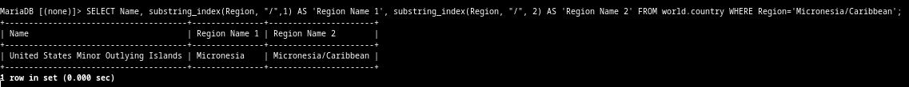
	
	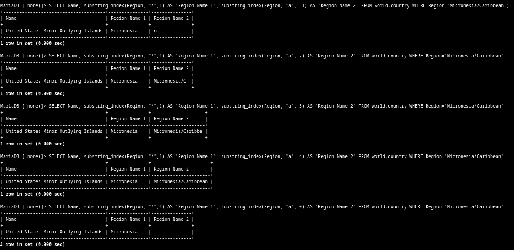
	
4. Resultado final

	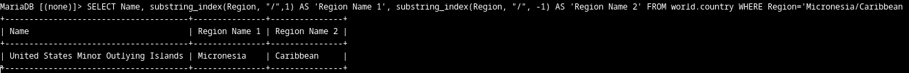