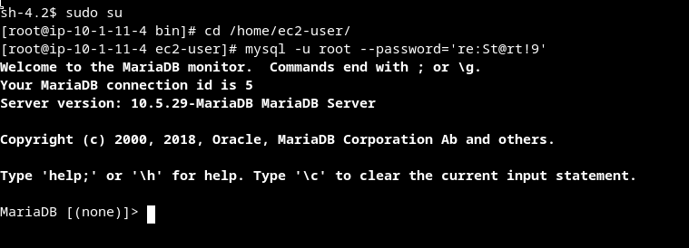
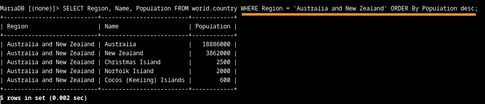
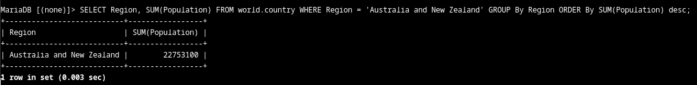
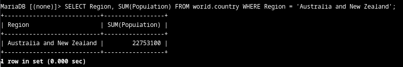
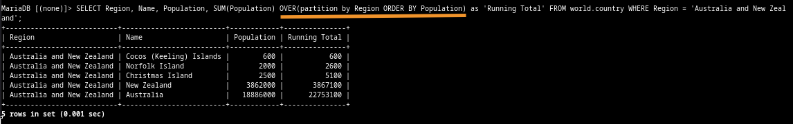
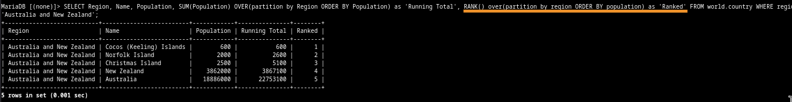
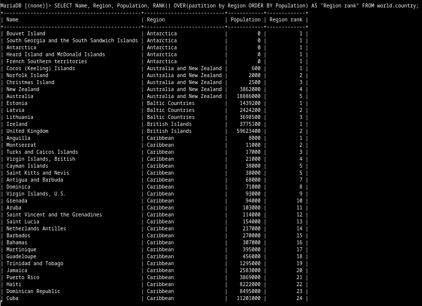
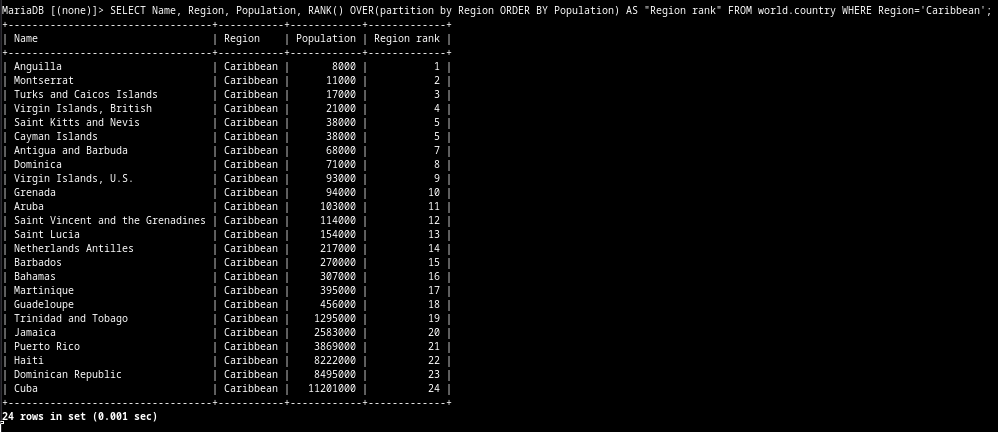

# Lab 273: Organización de datos

## Situación

El equipo de operaciones de base de datos creó una base de datos relacional llamada world que contiene tres tablas: city, country y countrylanguage. Ayudará a escribir algunas consultas a los registros de grupo para su análisis con ambas cláusulas GROUP BY y OVER.

 
## Información general y objetivos del laboratorio

Este laboratorio demuestra cómo usar funciones de base de datos comunes con las cláusulas GROUP BY y OVER.

Después de completar este laboratorio, podrá realizar lo siguiente:

1. Usar la cláusula GROUP BY con la función agregada SUM()
2. Usar la cláusula OVER con la función de ventana RANK()
3. Usar la cláusula OVER con la función agregada SUM() y la función de ventana RANK()

### Tarea 1: Conectarse a Command Host

En esta tarea, se conecta a una instancia que contiene un cliente de base de datos, que se usa para conectarse a una base de datos. Esta instancia se conoce como Command Host.

1. Cliente mysql

	
 
### Tarea 2: Consulte la base de datos world

En esta tarea, consultará la base de datos world con varios enunciados SELECT y funciones de la base de datos.

1. Filtro por Region, orden de Population descendente

	
	
2. Usando group by. Aquí tuve una duda. Sucede que me confundió que, tanto usar group by como no usarlo, daba el mismo resultado. Googleando, entendí que la sintaxis de algunos motores son más estrictos, por lo tanto, ese "ahorro" de statements induce error. En mariadb la cosa es más flexible y acepta estas "faltas" siempre que no existan ambigüedades. Conclusión: es buena práctica la sintaxis completa, se aprovecha para enternder mejor la lógica, además.

	
	
	* Duda en cuestion. 
	
		

3. Over para detallar el resultado de la función sum, por acumulación

	
	
4. Rank para dar un orden jerárquico, según el filtro que se aplique. En este caso, hago una escala agrupando por región, pero ordenando por población
	
	

#### Desafío

Describa una consulta para calificar los países en cada región por su población de mayor a menor.
Tiene que determinar si usar la cláusula de agrupación GROUP BY o OVER y la función SUM() o RANK().

1. Seleccioné columnas Name, Region y Population, además de rank, que crea su propia columna, agrupando por Region con over y ordenando por Population. 

	
	
2. Aquí apliqué lo mismo, pero filtrando a Region Caribbean, para mostrar un resultado completo. En ambas me faltó el DESC, para aplicar orden descendente.

	