# Lab 274: Introducción a Amazon Aurora

## Información general

Este laboratorio le presenta Amazon Aurora y le proporciona una comprensión básica de cómo usar Aurora. Seguirá los pasos para crear una instancia de Aurora y luego conectarse a ella.

## Temas tratados

1. Después de completar este laboratorio, podrá hacer lo siguiente:
2. Crear una instancia de Aurora
3. Conectarse a una instancia de Amazon Elastic Compute Cloud (Amazon EC2)
4. Configurar la instancia de Amazon EC2 para conectarse a Aurora
5. Consultar la instancia de Aurora

## Presentación de las tecnologías

**Amazon Aurora**

Aurora es un motor de base de datos relacional completamente administrado, compatible con MySQL que combina el rendimiento y la fiabilidad de las bases de datos comerciales de alto nivel con la simplicidad y la rentabilidad de las bases de datos de código abierto. Brinda hasta cinco veces más rendimiento que MySQL sin requerir cambios a la mayoría de sus aplicaciones insistentes que usan bases de datos MySQL.

**Amazon Elastic Compute Cloud (Amazon EC2)**

Amazon EC2 es un servicio web que proporciona capacidad de cómputo de tamaño modificable en la nube. Se ha diseñado con el fin de simplificar el uso de cómputo en la nube a escala web para los desarrolladores. Amazon EC2 reduce el tiempo necesario para aprovisionar nuevas instancias de servidores a minutos, lo que le permite escalar rápidamente la capacidad, ya sea aumentándola o reduciéndola, según cambien sus requisitos informáticos.

**Amazon Relational Database Service (Amazon RDS)**

Amazon RDS facilita las tareas de configuración, utilización y escalado de las bases de datos relacionales en la nube. Proporciona una capacidad rentable y de tamaño modificable y, al mismo tiempo, administra las tediosas tareas de administración de base de datos, lo que le libera para enfocarse en sus aplicaciones y en su negocio. Amazon RDS le ofrece seis motores de base de datos entre los que elegir, incluidos Aurora, Oracle, Microsoft SQL Server, PostgreSQL, MySQL y MariaDB.

 
### Tarea 1: Crear una instancia de Aurora

En esta tarea, creará una instancia de base de datos (DB) de Aurora.

1. Crear instancia Aurora

	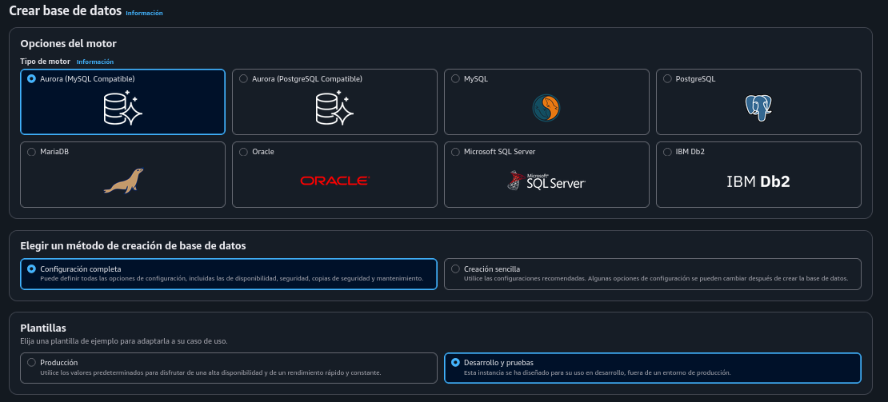
	
	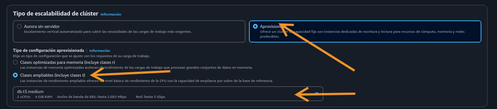
	
	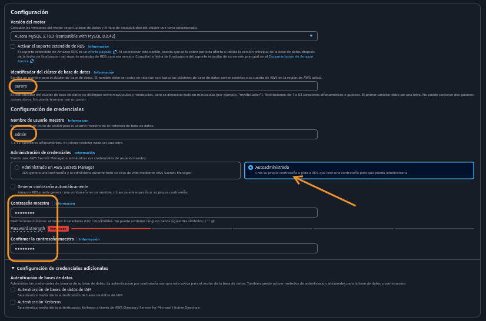
	
	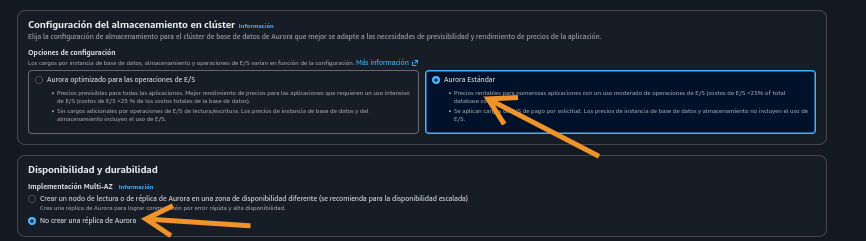
	
	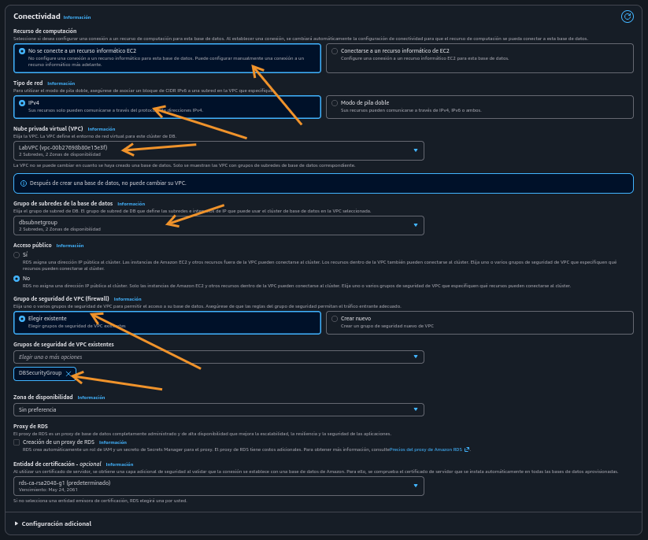
	
	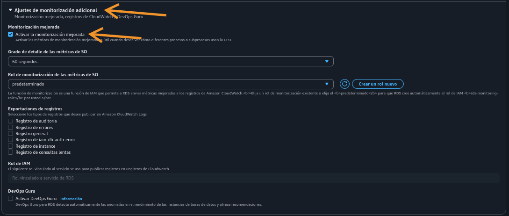
	
	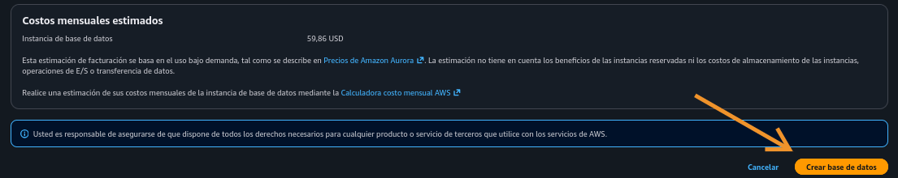

### Tarea 2: Conectarse a una instancia de Linux de Amazon EC2

En esta tarea, iniciar la sesión en su instancia de Linux de Amazon EC2. Esta instancia se lanzó para usted cuando inició su laboratorio con CloudFormation.

1. Conectar a instancia por SSM, e instalar paquete mariadb

	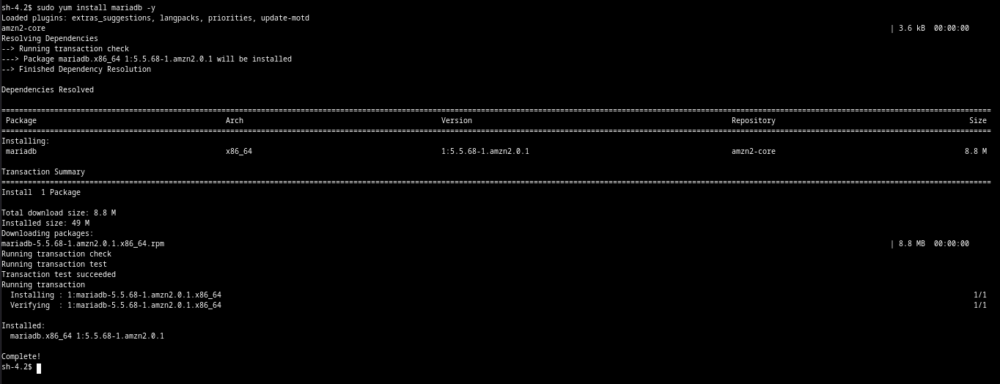
 
### Tarea 3: Configurar la instancia de Linux de Amazon EC2 para conectarse a Aurora

En esta tarea, utilizará el administrador de paquetes yum para instalar el cliente MariaDB y, posteriormente, configurar la instancia Linux de Amazon EC2 a fin de conectarse a la base de datos Aurora.

1. Repito la imagen previa, por la instalación de mariadb

	
	

    
```
En otra pestaña del navegador, vuelva a la Consola de administración de AWS y, en la barra de búsqueda, busque y seleccione RDS.

    En el menú de navegación izquierdo, seleccione Bases de datos.

    Espere que aurora-instance-1 muestre  Disponible.

    Seleccione aurora.

    Seleccione la pestaña Conectividad y seguridad, y en la sección Puntos de enlace, copie el Nombre del punto de enlace para la Instancia escritor en su editor de texto.

    El punto de enlace debe ser similar a lo siguiente: aurora.cluster-cabcdefghijklm.us-west-2.rds.amazonaws.com.
```


**Nota:** Un punto de enlace se representa como una URL especifica de Aurora que contiene una dirección de host y un puerto. Los siguientes tipos de puntos de enlace están disponibles desde un clúster de base de datos de Aurora.

**Punto de enlace del clúster:**
            Un punto de enlace de clúster para un clúster de base de datos de Aurora se conecta a la instancia de base de datos primaria para ese clúster de base de datos. Este punto de enlace es el único que puede realizar operaciones de escritura, como enunciados DDL. Debido a esto, el punto de enlace de clúster es al que se conecta cuando configura un clúster por primera vez o cuando su clúster contiene solo una instancia de base de datos.
           Cada clúster de base de datos de Aurora tiene un punto de enlace de clúster y una instancia de base de datos primaria.
           Usa el punto de enlace de clúster para todas las operaciones de escritura en el clúster de base de datos, incluidas las inserciones, actualizaciones, eliminaciones y cambios de DDL. También puede usar el punto de enlace de clúster para operaciones de lectura, como consultas.
           El punto de enlace del clúster proporciona soporte de conmutación por error para conexiones de lectura/escritura al clúster de base de datos. Si la instancia de base de datos primaria de una base de datos falla, Aurora automáticamente realizada la conmutación por error a una nueva instancia de base de datos primaria. Durante una conmutación por error el clúster de base de datos continúa realizando solicitudes de conexión al punto de enlace del clúster desde la nueva instancia de base de datos primaria.
           El siguiente ejemplo ilustra un punto de enlace para un clúster de base de datos de MySQL de Aurora.
           *mydbcluster.cluster-123456789012.us-west-2.rds.amazonaws.com:3306*

**Punto de enlace del lector:**
        Un punto de enlace del lector para un clúster de base de datos de Aurora se conecta a una de las réplicas de Aurora disponibles para ese clúster de base de datos. Cada clúster de base de datos de Aurora tiene un punto de enlace del lector. Si hay más de una replica de Aurora, el punto de enlace del lector dirige cada solicitud de conexión a una de las réplicas de Aurora.
        El punto de enlace del lector proporciona soporte de balanceo de carga para conexiones de solo lectura al clúster de base de datos. También puede usar el punto de enlace del lector para operaciones de lectura, como consultas. No puede usar el punto de enlace del lector para operaciones de escritura.
        El clúster de base de datos distribuye solicitudes de conexión al punto de enlace del lector entre las réplicas de Aurora disponibles. Si el clúster de base de datos contiene solo una instancia de base de datos primaria, el punto de enlace del lector realiza solicitudes de conexión desde la instancia de base de datos primaria. Si se crean una o más replicas de Aurora para ese clúster de base de datos, las conexiones posteriores al punto de enlace del lector usan balanceo de carga entre las réplicas.
        El siguiente ejemplo representa un punto de enlace del lector para un clúster de base de datos de Aurora MySQL.
        *mydbcluster.cluster-ro-123456789012.us-west-2.rds.amazonaws.com:3306*

2. Esperando el estado 'Disponible' en aurora e iniciando sesión en la base de datos

	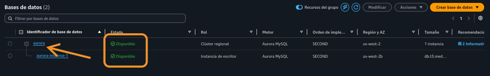
	
	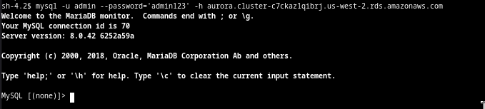

### Tarea 4: Crear una tabla e insertar registros de consulta

En esta tarea, aprenderá cómo crear una tabla en una base de datos, cargar datos y ejecutar una tarea.

1. Mostrar BBDD
	
	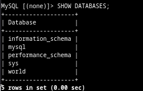
	
2. Crear tabla

	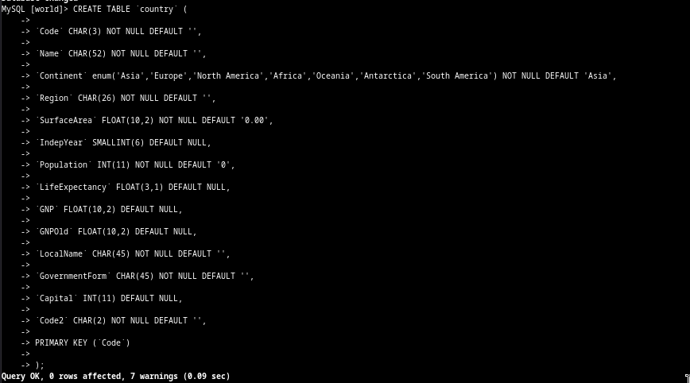

3. Insertar datos

	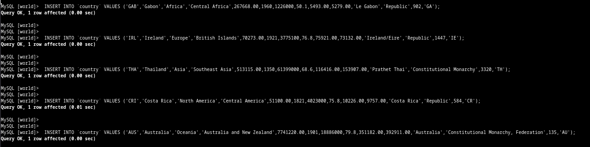
	
4. Corroborar datos ingresados

	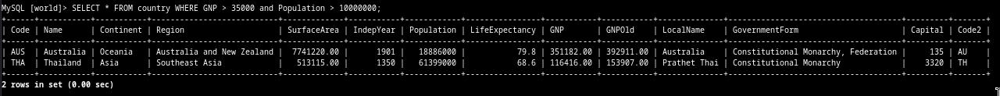