# Lab 275: Introducción a Amazon DynamoDB

 
## Información general sobre el laboratorio

Amazon DynamoDB es un servicio de base de datos NoSQL ágil y flexible para todas las aplicaciones que necesiten una latencia constante en milisegundos de un solo dígito a cualquier escala. Se trata de una base de datos completamente administrada que soporta modelos de clave-valor y de documentos. Su modelo de datos flexible y su desempeño de confianza lo convierten en un complemento perfecto para aplicaciones móviles, web, de juegos, de tecnología publicitaria y de Internet de las cosas (IoT), entre otras.

En este laboratorio, creará una tabla en DynamoDB para almacenar información sobre una biblioteca de música. Después, consultará la biblioteca de música y luego eliminará la tabla de DynamoDB.
Temas tratados

## Objetivo
En este laboratorio, deberá realizar lo siguiente:

1. crear una tabla de Amazon DynamoDB
2. ingresar datos en una tabla de Amazon DynamoDB
3. consultar una tabla de Amazon DynamoDB
4. eliminar una tabla de Amazon DynamoDB

 
### Tarea 1: Crear una nueva tabla

En esta tarea, creará una nueva tabla en DynamoDB llamada Música. Cada tabla requiere una clave de partición (o clave principal) que se utiliza para dividir datos de partición en los servidores de DynamoDB. Una tabla también puede tener una clave de ordenación. La combinación de una clave de partición y una clave de ordenación identifica de forma única cada elemento de una tabla de DynamoDB.

1. Vista general - Crear tabla

	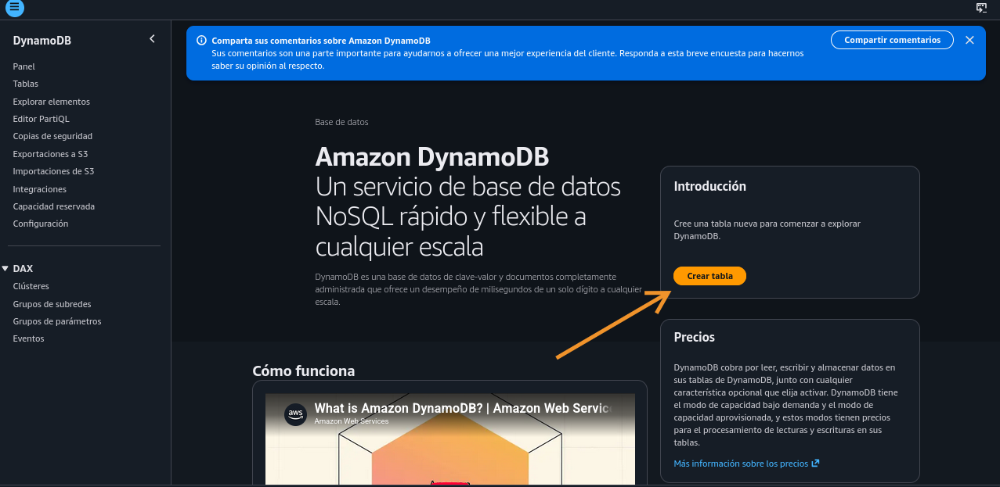
	
2. Configuración y estado
	
	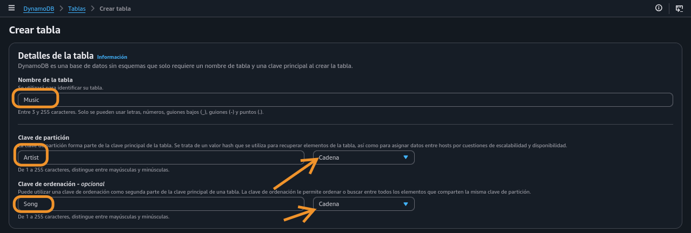
	
	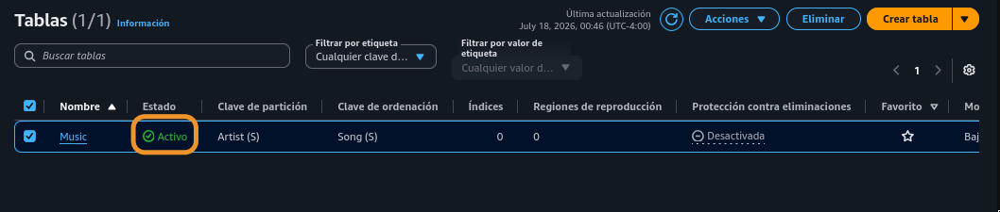
 

### Tarea 2: Agregar datos

En esta tarea, agregará datos a la tabla Music (Música). Una tabla es una colección de datos sobre un tema determinado.

Cada tabla contiene varios elementos. Un elemento es un grupo de atributos que se identifica de forma única entre todos los demás elementos. Los elementos de DynamoDB son similares en muchos sentidos a las filas de otros sistemas de base de datos. En DynamoDB, no existen límites con respecto a la cantidad de elementos que puede almacenar en una tabla.

Cada elemento se compone de uno o más atributos. Un atributo es un componente fundamental de los datos que no es necesario seguir dividiendo. Por ejemplo, un elemento en una tabla de Música contiene atributos como Canción y Artista. Los atributos de DynamoDB son similares a las columnas de otros sistemas de bases de datos, pero cada elemento (fila) puede tener atributos diferentes (columnas).

Cuando escribe un elemento en una tabla de DynamoDB, solo se requieren la clave de partición y la clave de ordenación, si se utiliza. Además de estos campos, la tabla no necesita un esquema. Esto significa que se pueden agregar atributos a un elemento que pueden ser diferentes a aquellos de otros elementos.

1. Crear elemento

	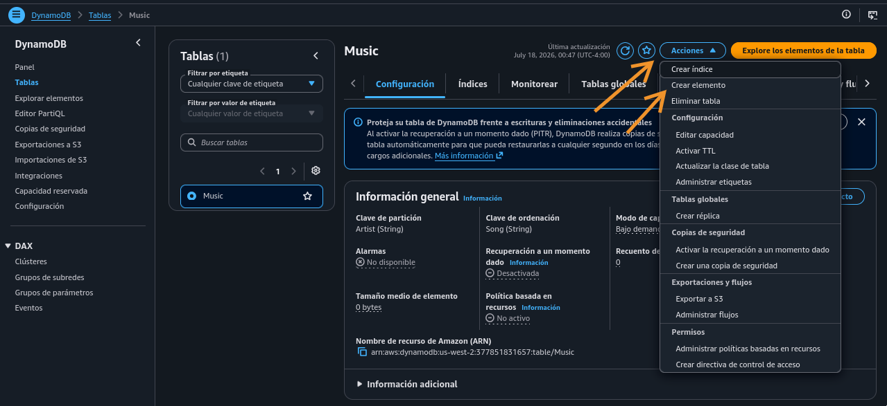
	
	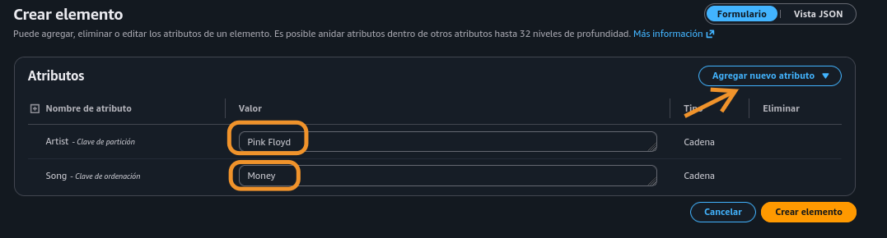
	
2. Atributo nuevo y crear

	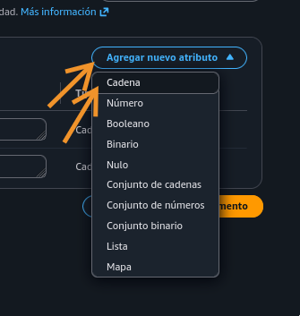

	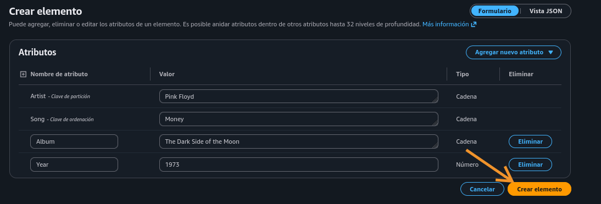
	
3. Segundo elemento

	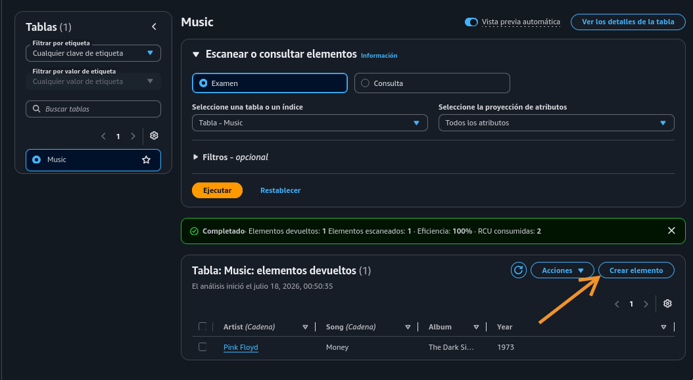
	
	* Aproveché de diferenciar entre vistas formulario y JSON (DynamoDB)
	
		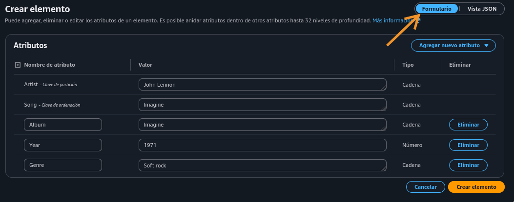
		
		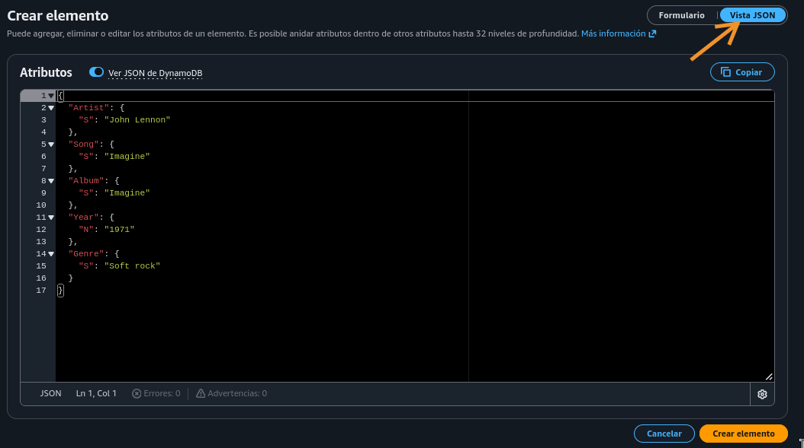
		
4. Tercer elemento, intentando en JSON

	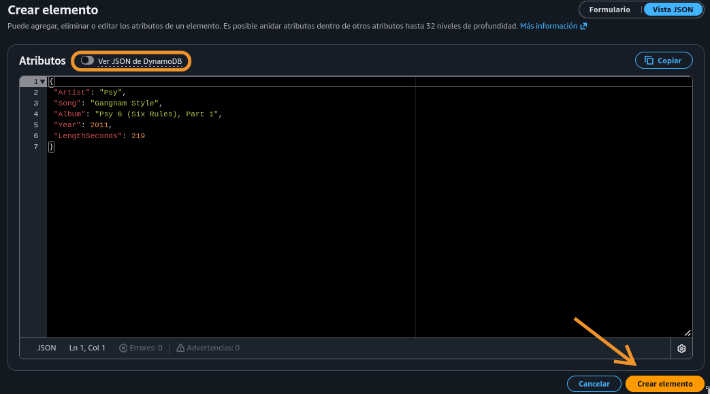
	
	
### Tarea 3: Modificar un elemento existente

Ahora observa que hay un error en sus datos. En esta tarea, modificará un elemento existente.

1. Entrando en elemento Psy

	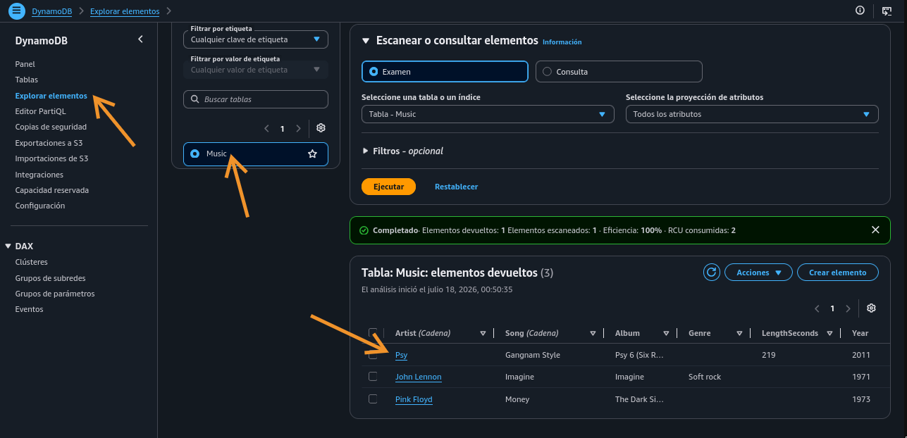
	
2. Modificando en Dynamo JSON

	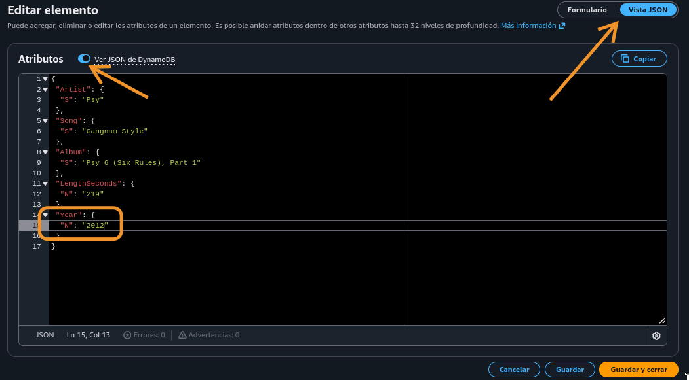

### Tarea 4: Consultar la tabla

Hay dos formas de consultar una tabla de DynamoDB: consulta y análisis.

Una operación de consulta busca elementos basados en la clave primaria y, de forma opcional, en la clave de ordenación. Está completamente indexada, por lo que funciona muy rápido.

1. Consulta por Clave de partición y de Ordenación

	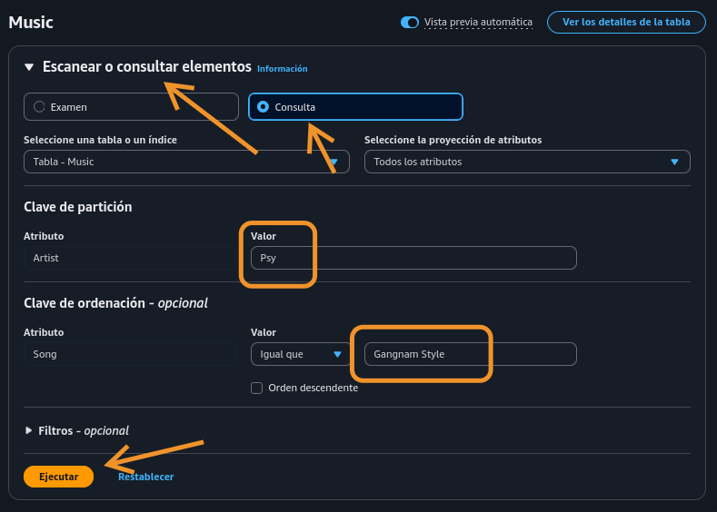
	
	* Resultado 
	
		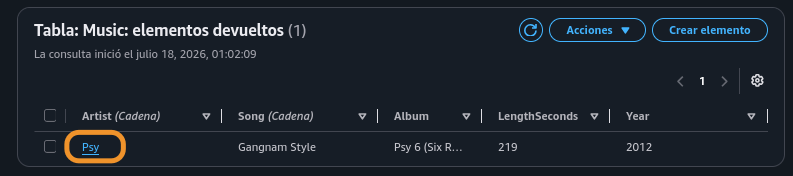

2. Escanear, analizar, examinar. Al parecer son la misma función, dependiendo de la versión y traducción de la Consola

	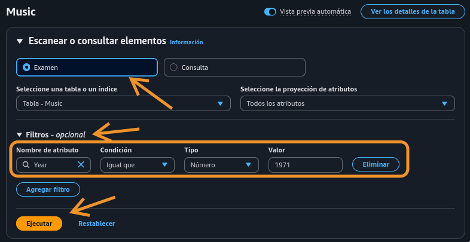
	
	* Resultado
	
		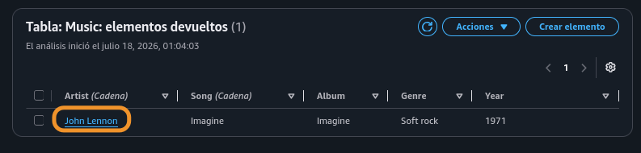
 

### Tarea 5: Eliminar la tabla

En esta tarea, eliminará la tabla Music (Música), lo que también eliminará todos los datos de la tabla.

1. Seleccionar tabla y actualizar configuración

	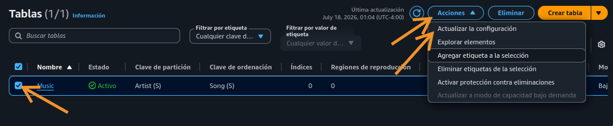
	
2. Eliminar tabla

	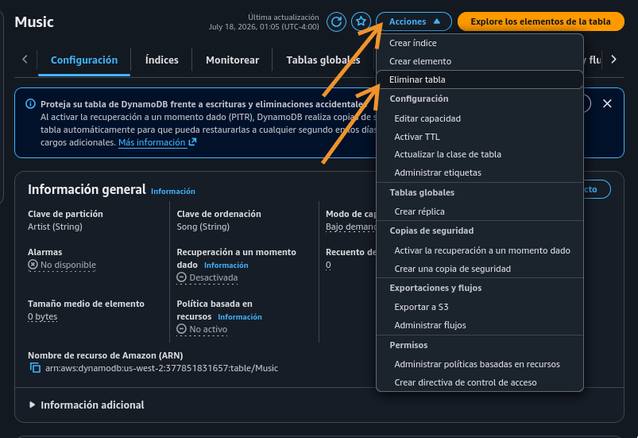
	
	* Confirmar
	
		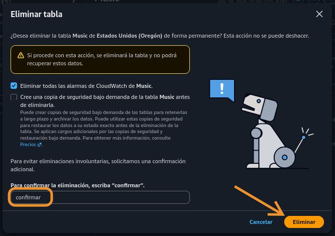