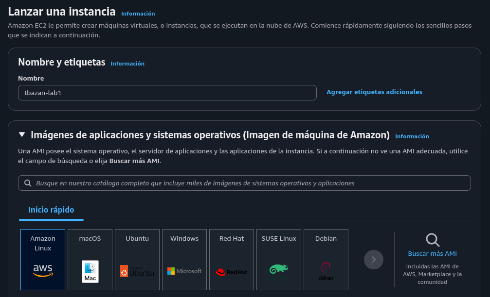
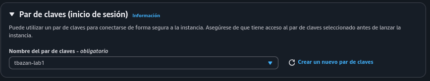

# Entorno de pruebas

## 1. Lanzar una instancia  

 
 
## 2. Elección de AMI

.png)

## 3. Tipo de instancia.png

## 4. Autenticación

Aquí tomé en cuenta las sugerencias de la guía de Laboratorio para usuarios de mac y Linux, que cito a continuación:
 
 
### Acceso mediante SSH a cualquier instancia EC2 que lance

***Sugerencia**: Cuando lance instancias EC2 en el entorno de pruebas, cree una clave de SSH (archivo .pem) en el momento del lanzamiento y descárguela. A continuación, utilice esa clave para conectarse. En los siguientes pasos, se describe cómo utilizar la clave de SSH para conectarse a la instancia.

#### Usuarios de macOS y Linux

Estas instrucciones son específicas para usuarios de Mac/Linux.
​

    Abra una ventana de terminal y cambie el directorio cd al directorio que contiene el archivo *.pem de su instancia de Amazon EC2.

Por ejemplo, si su archivo *.pem se guardó en su directorio de Downloads (Descargas), ejecute este comando:

cd ~/Downloads

    Ejecute este comando para cambiar los permisos de la clave a fin de que sean de solo lectura:

Por ejemplo, si su archivo *.pem era labuser.pem

chmod 400 labsuser.pem

    Ejecute el siguiente comando (reemplace <public-ip> con la dirección de su instancia de Amazon EC2).
       De manera alternativa, regrese a la consola de EC2 y seleccione Instances (Instancias). Marque la casilla junto a la instancia a la que desea conectarse y en la pestaña Description (Descripción) copie el valor de IPv4 Public IP (Dirección IP pública IPv4).

Nota: Algunas versiones de Linux pueden utilizar un usuario diferente para iniciar sesión.

ssh -i labsuser.pem ec2-user@<public-ip>

    Escriba yes cuando se le pregunte si permite la primera conexión a este servidor SSH remoto.
       Como utiliza un par de claves para la autenticación, no se le pedirá una contraseña.
       Como utiliza un par de claves para la autenticación, no se le pedirá una contraseña.

 
Practicar y explorar

El entorno del laboratorio ya se encuentra listo para que lo explore. Una vez que haya terminado, proceda a la sección de finalizar laboratorio.

 
Finalizar laboratorio

 ¡Felicitaciones! Ha completado el laboratorio.

    Elija  End Lab (Finalizar laboratorio) en la parte superior de esta página y luego presione Yes (Sí) para confirmar que desea finalizar el laboratorio.

Un panel muestra el mensaje DELETE has been initiated… You may close this message box now (Se ha iniciado la ELIMINACIÓN. Ya puede cerrar este cuadro de mensajes).

    Aparece brevemente el mensaje Ended AWS Lab Successfully (Finalizó el laboratorio de AWS correctamente), que indica que el laboratorio ha finalizado.